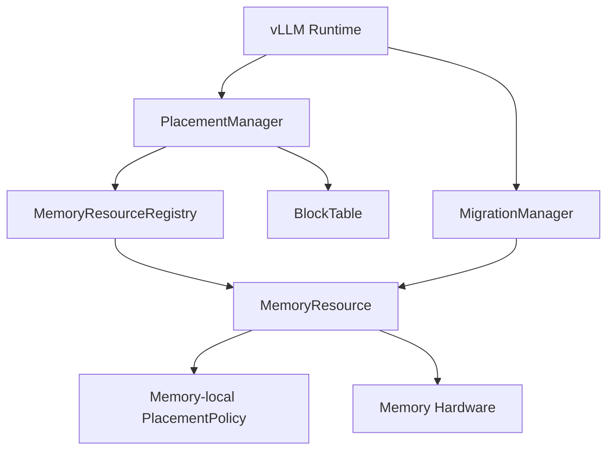
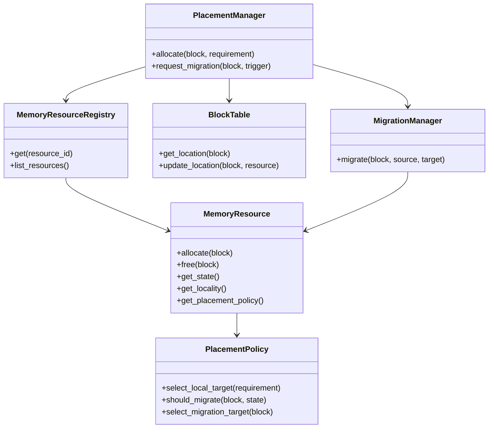
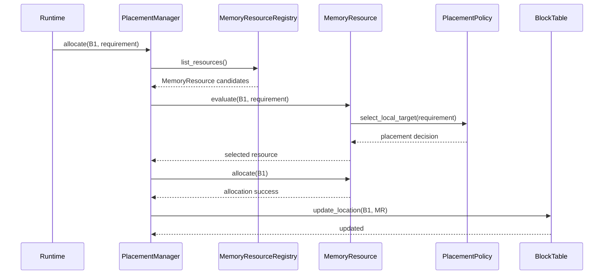
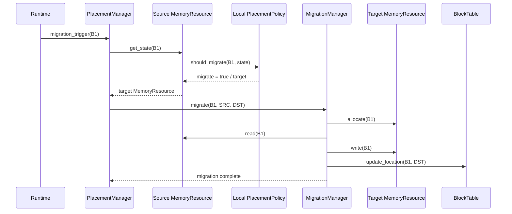
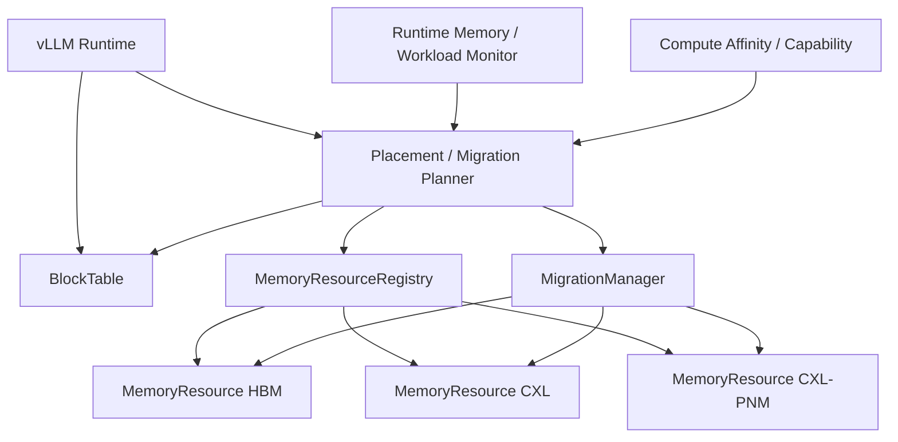
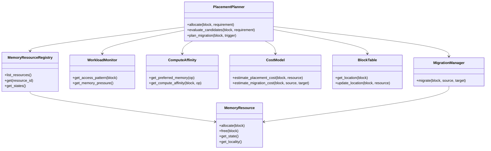
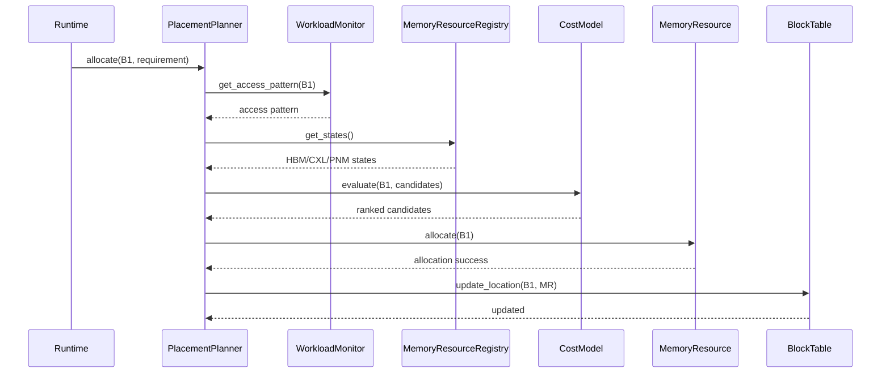
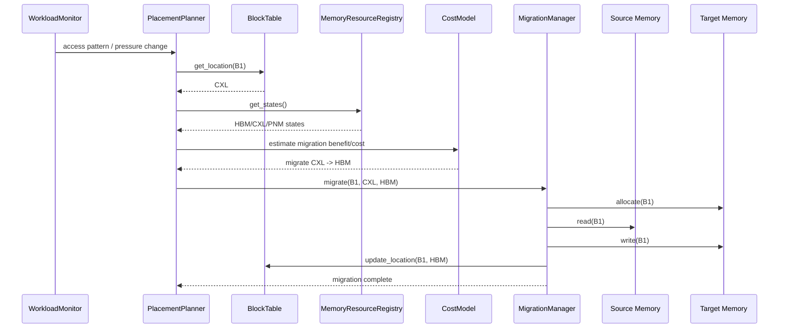

# DP3 — Memory Placement / Migration Abstraction Candidate Design

> **Design Question:** Runtime이 서로 다른 Memory Resource에 데이터를 어떻게 배치하고, workload/access pattern에 따라 어느 Memory로 이동시킬 것인가?

---

## 1. Position in Memory-Centric Runtime Design

```text
DP1: Memory Tiering Abstraction
    What is Memory?
        ↓
DP2: Compute-Capable Memory Abstraction
    What can Memory do?
        ↓
DP3: Memory Placement / Migration Abstraction
    Where should data be placed / moved?
```

DP3는 DP1에서 추상화한 Memory Resource와 DP2에서 정의한 Compute capability를 실제 Runtime의 **allocation / placement / migration decision**으로 연결하는 설계 포인트다.

---

# 2. Design Question

Runtime이 Block/Tensor를 할당하거나 이동할 때 다음을 결정해야 한다.

1. 어떤 Memory Resource에 데이터를 처음 배치할 것인가?
2. 현재 Memory에 계속 둘 것인가, 다른 Memory로 이동할 것인가?
3. Placement/Migration을 결정할 때 capacity, bandwidth, access pattern, locality, compute affinity 등을 어떻게 반영할 것인가?
4. Placement decision을 어느 abstraction이 담당할 것인가?
5. Migration을 언제 수행하고, 누가 migration cost를 감수할 것인가?

DP3의 핵심 후보 차이는 **Placement/Migration decision을 Memory Resource가 주도하는지, Runtime이 전체 Memory system을 보고 주도하는지**이다.

---

# 3. Candidate Overview

## Candidate 1 — Memory-Centric Placement

> **MemoryResource가 자신의 capacity/state와 data placement 특성을 기반으로 placement/migration을 주도하여, Memory-locality와 단순한 control path를 우선하는 구조.**

```text
Allocation Request
      ↓
Placement Manager
      ↓
MemoryResource candidates
      ↓
MemoryResource-local policy
      ↓
Selected Memory
      ↓
Allocation
```

핵심 철학은 **Memory가 자신의 상태와 특성을 가장 잘 알고 있으므로 Memory 쪽에서 placement를 결정한다**는 것이다.

### 예

```text
CXL-PNM MemoryResource
 ├── capacity
 ├── free space
 ├── bandwidth/state
 ├── locality
 └── placement_policy()
```

---

## Candidate 2 — Runtime-Centric Placement

> **Runtime이 전체 Memory Resource Pool을 관찰하고 workload, access pattern, locality, capacity, bandwidth, compute affinity 등을 종합하여 placement/migration을 결정하는 구조.**

```text
Allocation / Migration Request
             ↓
      Runtime Placement Planner
             ↓
    ┌────────┼─────────┐
    ↓        ↓         ↓
   HBM      CXL       PNM
    └────────┼─────────┘
             ↓
       Cost / Policy
             ↓
      Selected Memory
```

핵심 철학은 **개별 Memory가 아니라 전체 Memory system을 봐야 최적 placement를 결정할 수 있다**는 것이다.

---

# 4. Candidate 1 — Memory-Centric Placement

## 4.1 SW Module View



### Responsibility

| Module | Responsibility |
|---|---|
| PlacementManager | Allocation/migration request를 적절한 MemoryResource로 전달 |
| MemoryResourceRegistry | Runtime이 사용할 MemoryResource 관리 |
| MemoryResource | Memory operation + local placement capability 제공 |
| PlacementPolicy | 해당 Memory의 capacity/state/locality를 이용한 local decision |
| BlockTable | Block → Memory 위치 관리 |
| MigrationManager | 실제 data movement 및 metadata update |

---

## 4.2 Class Diagram



---

## 4.3 Allocation Sequence



### Allocation 의미

Candidate 1에서도 여러 MemoryResource 후보 중 하나를 선택할 수 있다. 핵심 차이는 **global planner가 모든 Resource의 cost를 통합 최적화하는 것이 아니라, 각 MemoryResource가 자신의 state/locality를 기준으로 placement 판단을 제공한다는 것**이다.

---

## 4.4 Migration Sequence



---

## 4.5 Candidate 1 Advantages — Why?

### ① Low Placement Decision Overhead

Memory Resource가 자신의 capacity와 상태를 중심으로 판단하므로 global Memory system 전체의 state를 매번 종합할 필요가 적다.

```text
Request
  ↓
MemoryResource
  ↓
Local Policy
  ↓
Decision
```

**왜 장점인가?**

Placement decision을 위한 control path가 짧아지고, global cost model이나 중앙 planner의 계산 비용을 줄일 수 있다.

### ② Memory Locality에 유리

Memory가 자신의 locality 특성을 직접 알고 있기 때문에 해당 Memory에서 효율적인 placement를 우선하기 쉽다.

**왜 장점인가?**

Memory-centric system에서 데이터 이동 자체가 비용이므로, local resource가 자신의 특성을 기준으로 결정하면 불필요한 remote placement를 줄이기 쉽다.

### ③ Predictable Placement / Migration Behavior

복잡한 global optimization보다 명시적인 local policy를 사용하므로 동일한 resource 상태에서 decision이 비교적 예측 가능하다.

### ④ 구조 및 디버깅 단순성

Global planner가 workload 전체를 모델링하지 않아도 되므로 policy의 책임 범위를 작게 유지하기 쉽다.

---

## 4.6 Candidate 1 Disadvantages — Why?

### ① Global Optimization에 불리

각 MemoryResource가 자신의 상태를 중심으로 판단하면 다른 Resource와 workload 전체를 비교한 결과를 반영하기 어렵다.

예:

```text
HBM: free 20 GB / high BW
CXL: free 200 GB / low BW
PNM: free 50 GB / GEMM capable
```

어떤 Block을 어디에 둘지가 workload의 향후 access와 compute까지 고려해야 한다면 local policy만으로 최적점을 찾기 어렵다.

### ② Workload-level Access Pattern 반영 제한

MemoryResource는 자신의 상태는 잘 알지만 application 전체의 access frequency, hot/cold 관계, 다른 Block과의 상호작용을 알기 어렵다.

### ③ Global Migration Coordination이 어려움

여러 Resource가 독립적으로 migration을 판단하면 전체 workload 관점에서 migration budget이나 migration history를 일관되게 최적화하기 어렵다.

### ④ Compute Affinity 반영 시 책임 증가

DP2의 compute capability까지 고려하려면 Memory-local policy가:

```text
Data location
+ Compute capability
+ Compute load
+ Access pattern
```

을 알아야 할 수 있다. 이 정보가 늘어나면 원래 단순했던 Memory abstraction이 점점 복잡해진다.

---

# 5. Candidate 2 — Runtime-Centric Placement

## 5.1 SW Module View



### Responsibility

| Module | Responsibility |
|---|---|
| Placement/Migration Planner | Global placement 및 migration decision |
| MemoryResourceRegistry | 전체 Memory Resource Pool 관리 |
| Runtime Monitor | access pattern, capacity, pressure, utilization 등 관찰 |
| Compute Affinity | DP2의 compute capability/affinity 정보 제공 |
| BlockTable | Block → Memory 위치 관리 |
| MigrationManager | 실제 data movement 및 metadata update |

---

## 5.2 Class Diagram



---

## 5.3 Allocation Sequence



---

## 5.4 Migration Sequence



---

## 5.5 Candidate 2 Advantages — Why?

### ① Global Memory Optimization

Planner가 HBM/CXL/PNM의 상태를 동시에 볼 수 있다.

따라서 capacity뿐 아니라 bandwidth, contention, queueing 등의 global state를 함께 고려할 수 있다.

### ② Workload-aware Placement

Runtime이 access frequency, hot/cold state, access pattern 등을 알고 있다면 placement에 직접 사용할 수 있다.

```text
Hot data → HBM
Cold data → CXL
Compute-heavy data → PNM
```

### ③ Compute Affinity 반영

DP2의 Compute capability를 placement decision과 연결할 수 있다.

```text
Data
 ↓
Preferred Compute
 ↓
Preferred Memory
```

따라서 Memory placement와 Compute placement를 함께 최적화할 가능성이 커진다.

### ④ Dynamic Rebalancing

Workload가 변하면 기존 placement를 재평가하고 migration할 수 있다.

```text
observe → evaluate → migrate → observe
```

---

## 5.6 Candidate 2 Disadvantages — Why?

### ① Placement/Migration Decision Overhead 증가

Global state와 workload 정보를 수집하고 여러 Resource를 비교해야 하므로 decision path가 길어진다.

### ② Runtime Architecture 복잡도 증가

Planner, monitor, cost model, migration policy 등이 필요해지고 이들 간 interface가 추가된다.

### ③ Migration Thrashing 위험

Runtime이 workload 변화에 지나치게 민감하게 반응하면:

```text
HBM → CXL → HBM → CXL → ...
```

이 발생할 수 있다. Migration cost가 placement benefit보다 커질 수 있다.

### ④ Policy / Cost Model의 정확성이 중요

capacity, bandwidth, access pattern, compute load, migration cost 등을 잘못 모델링하면 global optimization이 오히려 잘못된 placement를 선택할 수 있다.

---

# 6. QA Evaluation

| QA | Candidate 1 | Candidate 2 | Evaluation Rationale |
|---|:---:|:---:|---|
| **Placement Decision Efficiency** | ★★★ | ★★☆ | C1은 local decision으로 짧은 path를 유지하기 쉬움 |
| **Memory Locality Exploitation** | ★★★ | ★★☆ | C1은 Memory-local state/policy 중심 |
| **Global Resource Utilization** | ★★☆ | ★★★ | C2는 전체 Resource 상태를 동시에 고려 가능 |
| **Workload Adaptability** | ★★☆ | ★★★ | C2는 runtime access pattern을 직접 반영 가능 |
| **Compute Affinity Awareness** | ★★☆ | ★★★ | C2는 DP2 capability와 placement를 연결하기 쉬움 |
| **Runtime Complexity / Predictability** | ★★★ | ★★☆ | C1은 global planner/cost model 의존성이 낮음 |

> 별점은 절대 성능값이 아니라 **동일한 Memory system과 workload에서 architecture가 제공하는 상대적 특성**을 의미한다.

---

# 7. Fundamental Trade-off

```text
Candidate 1                              Candidate 2
Memory-Centric                          Runtime-Centric
      │                                      │
      ▼                                      ▼
Local policy                             Global policy
      │                                      │
      ▼                                      ▼
Low overhead / predictable             Adaptive / globally optimized
      │                                      │
      ▼                                      ▼
Limited global visibility               Higher decision complexity
```

## Candidate 1이 유리한 조건

- Memory topology가 비교적 단순한 경우
- Memory locality가 성능에 결정적인 경우
- placement decision overhead를 최소화해야 하는 경우
- workload 변화가 크지 않은 경우
- migration이 자주 발생하지 않는 경우

## Candidate 2가 유리한 조건

- HBM/CXL/PNM 등 여러 Memory Resource가 동시에 존재하는 경우
- workload access pattern이 동적으로 변화하는 경우
- Memory contention이 큰 경우
- Compute affinity를 placement에 반영해야 하는 경우
- migration을 통한 global optimization의 효과가 큰 경우

---

# 8. One-Sentence Characteristics

### Candidate 1

> **Memory가 자신의 상태와 locality를 중심으로 placement/migration을 결정하여 낮은 overhead와 예측 가능한 동작을 제공하는 구조.**

### Candidate 2

> **Runtime이 전체 Memory Resource와 workload/compute 정보를 종합하여 placement/migration을 동적으로 최적화하는 구조.**

### DP3 Fundamental Question

> **Local, low-overhead placement를 선택할 것인가, 아니면 global visibility를 기반으로 더 복잡한 Runtime optimization을 수행할 것인가?**
