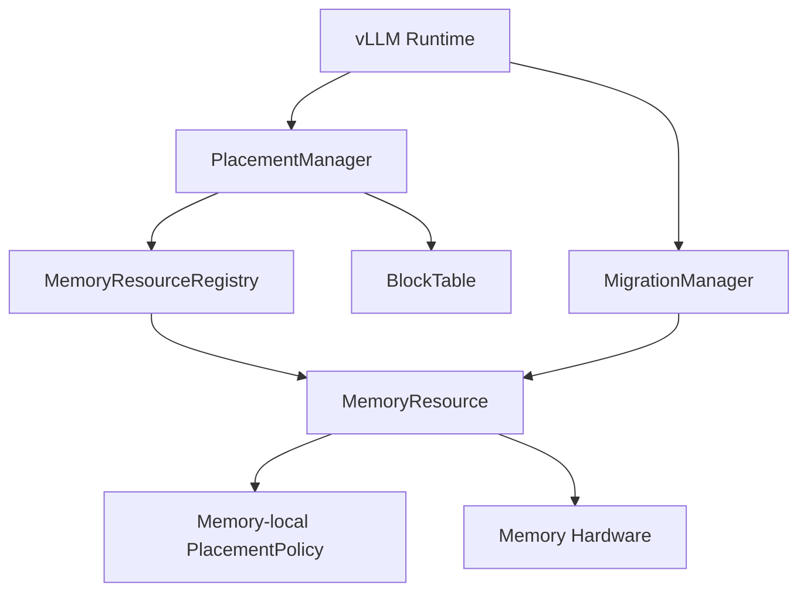
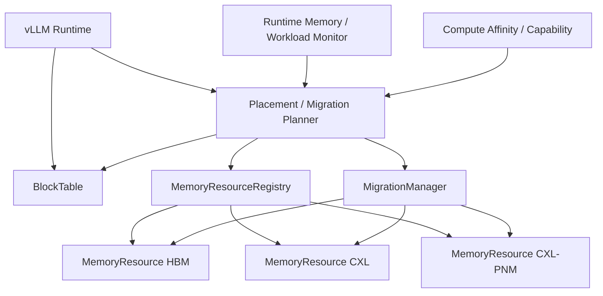

# DP3 — Memory Placement / Migration Abstraction Candidate Design

> **Design Question:** Runtime이 서로 다른 Memory Resource에 데이터를 어떻게 배치하고, workload/access pattern에 따라 어느 Memory로 이동시킬 것인가?

---

## 1. Position in Memory-Centric Runtime Design

```text
DP1: Memory Tiering Abstraction
    What is Memory?
        ↓
DP2: Compute-Capable Memory Abstraction
    What can Memory do?
        ↓
DP3: Memory Placement / Migration Abstraction
    Where should data be placed / moved?
```

DP3는 DP1에서 추상화한 Memory Resource와 DP2에서 정의한 Compute capability를 실제 Runtime의 **allocation / placement / migration decision**으로 연결하는 설계 포인트다.

---

# 2. Design Question

Runtime이 Block/Tensor를 할당하거나 이동할 때 다음을 결정해야 한다.

1. 어떤 Memory Resource에 데이터를 처음 배치할 것인가?
2. 현재 Memory에 계속 둘 것인가, 다른 Memory로 이동할 것인가?
3. Placement/Migration을 결정할 때 capacity, bandwidth, access pattern, locality, compute affinity 등을 어떻게 반영할 것인가?
4. Placement decision을 어느 abstraction이 담당할 것인가?
5. Migration을 언제 수행하고, 누가 migration cost를 감수할 것인가?

DP3의 핵심 후보 차이는 **Placement/Migration decision을 Memory Resource가 주도하는지, Runtime이 전체 Memory system을 보고 주도하는지**이다.

---

# 3. Candidate Overview

## Candidate 1 — Memory-Centric Placement

> **MemoryResource가 자신의 capacity/state와 data placement 특성을 기반으로 placement/migration을 주도하여, Memory-locality와 단순한 control path를 우선하는 구조.**

```text
Allocation Request
      ↓
Placement Manager
      ↓
MemoryResource candidates
      ↓
MemoryResource-local policy
      ↓
Selected Memory
      ↓
Allocation
```

핵심 철학은 **Memory가 자신의 상태와 특성을 가장 잘 알고 있으므로 Memory 쪽에서 placement를 결정한다**는 것이다.

### 예

```text
CXL-PNM MemoryResource
 ├── capacity
 ├── free space
 ├── bandwidth/state
 ├── locality
 └── placement_policy()
```

---

## Candidate 2 — Runtime-Centric Placement

> **Runtime이 전체 Memory Resource Pool을 관찰하고 workload, access pattern, locality, capacity, bandwidth, compute affinity 등을 종합하여 placement/migration을 결정하는 구조.**

```text
Allocation / Migration Request
             ↓
      Runtime Placement Planner
             ↓
    ┌────────┼─────────┐
    ↓        ↓         ↓
   HBM      CXL       PNM
    └────────┼─────────┘
             ↓
       Cost / Policy
             ↓
      Selected Memory
```

핵심 철학은 **개별 Memory가 아니라 전체 Memory system을 봐야 최적 placement를 결정할 수 있다**는 것이다.

---

# 4. Candidate 1 — Memory-Centric Placement

## 4.1 SW Structure



---

## 4.2 Allocation

```text
allocate(B1)
    ↓
PlacementManager
    ↓
MemoryResource 후보 확인
    ↓
각 MemoryResource의 local state/policy 확인
    ↓
선택
    ↓
MemoryResource.allocate(B1)
    ↓
BlockTable[B1] = selected Memory
```

---

## 4.3 Migration

```text
B1 currently in CXL
        ↓
Migration trigger
        ↓
MemoryResource state / local policy
        ↓
Migration target 결정
        ↓
HBM으로 이동
        ↓
BlockTable update
```

---

## 4.4 장점

### ① Low Placement Decision Complexity

Memory Resource가 자신의 capacity와 상태를 중심으로 판단하므로 전체 Memory system의 상태를 매번 종합할 필요가 적다.

### ② Memory Locality에 유리

Memory가 자신의 locality 특성을 알고 있으므로 해당 Memory에서 효율적인 placement를 우선하기 쉽다.

### ③ Predictable Control Path

복잡한 global optimization 없이 정해진 policy에 따라 결정할 수 있어 placement/migration latency를 예측하기 쉽다.

### ④ 구현 및 디버깅이 비교적 단순

placement responsibility가 Memory Resource 주변에 집중되므로 global planner의 복잡성을 줄일 수 있다.

---

## 4.5 단점

### ① Global Optimization에 불리

개별 Memory의 상태만으로 판단하면 다른 Memory의 상태와 workload 전체를 고려한 최적 선택이 어려워질 수 있다.

예를 들어:

```text
HBM: free 20 GB / high bandwidth
CXL: free 200 GB / low bandwidth
PNM: free 50 GB / GEMM capable
```

처럼 각 Resource의 장단점이 다르면 global cost를 비교하는 것이 필요하다.

### ② Workload-level Access Pattern 반영이 제한될 수 있음

MemoryResource가 자신의 상태는 잘 알지만 전체 application의 향후 access pattern이나 다른 Block과의 관계를 알기 어렵다.

### ③ Migration thrashing 방지에 불리할 수 있음

각 Resource가 local policy로 판단하면 전체 workload 관점의 migration history/cost를 일관되게 관리하기 어렵다.

### ④ Compute affinity를 global하게 반영하기 어려움

DP2의 compute capability까지 고려하려면 단순히 Memory 상태뿐 아니라:

```text
Data location
+ Compute capability
+ Compute load
+ Access pattern
```

을 함께 봐야 한다. 이 정보가 Memory-local policy에 흩어지면 정책이 복잡해질 수 있다.

---

# 5. Candidate 2 — Runtime-Centric Placement

## 5.1 SW Structure



---

## 5.2 Allocation

```text
allocate(B1)
    ↓
PlacementPlanner
    ↓
Block/workload information
    + Memory capacity/state
    + Access pattern
    + Compute affinity
    ↓
Candidate Memory evaluation
    ↓
Cost / Policy
    ↓
Selected Memory
    ↓
Allocation
    ↓
BlockTable update
```

---

## 5.3 Migration

```text
B1 currently in CXL
        ↓
Runtime monitor
        ↓
Access pattern / pressure change
        ↓
PlacementPlanner
        ↓
Evaluate HBM / CXL / PNM
        ↓
Migration cost vs expected benefit
        ↓
Migration decision
        ↓
Block move
        ↓
BlockTable update
```

---

## 5.4 장점

### ① Global Memory Optimization

전체 Memory Resource의 상태를 동시에 보고 결정할 수 있다.

따라서 capacity뿐 아니라 bandwidth, queueing, contention 등을 함께 고려할 수 있다.

### ② Workload-aware Placement 가능

Runtime이 access frequency, read/write pattern, hot/cold state 등을 알고 있다면 이를 placement decision에 직접 사용할 수 있다.

예:

```text
Hot KV → HBM
Cold KV → CXL
GEMM-heavy data → PNM
```

### ③ Compute Affinity 반영 가능

DP2에서 얻은 Compute capability와 연결하여:

```text
Data
 ↓
Preferred Compute
 ↓
Preferred Memory
```

관계를 placement에 반영할 수 있다.

### ④ Dynamic Rebalancing 가능

Workload가 변화하면 기존 placement를 다시 평가하고 migration할 수 있다.

즉 allocation을 한 번 결정하고 끝내는 것이 아니라:

```text
observe → evaluate → migrate → observe
```

cycle을 구성할 수 있다.

---

## 5.5 단점

### ① Placement/Migration Decision Overhead 증가

Global state와 workload 정보를 수집하고 여러 Resource를 비교해야 하므로 decision path가 길어진다.

### ② Runtime Architecture 복잡도 증가

Placement Planner, monitor, cost model, migration policy 등이 필요해진다.

### ③ Migration Thrashing 위험

Runtime이 workload 변화에 민감하게 반응하면 다음과 같은 문제가 발생할 수 있다.

```text
HBM → CXL → HBM → CXL → ...
```

Migration cost가 실제 성능 이득보다 커질 수 있다.

### ④ 정확한 모델링이 어려움

Capacity만 보는 것이 아니라 bandwidth, access pattern, compute load, migration cost 등을 종합해야 하므로 policy tuning이 어려워진다.

---

# 6. Candidate Trade-off

| QA | Candidate 1 | Candidate 2 |
|---|:---:|:---:|
| **Placement Decision Efficiency** | ★★★ | ★★☆ |
| **Memory Locality Exploitation** | ★★★ | ★★☆ |
| **Global Resource Utilization** | ★★☆ | ★★★ |
| **Workload Adaptability** | ★★☆ | ★★★ |
| **Compute Affinity Awareness** | ★★☆ | ★★★ |
| **Runtime Complexity / Predictability** | ★★★ | ★★☆ |

### Fundamental Trade-off

```text
Candidate 1                              Candidate 2
Memory-Centric                          Runtime-Centric
      │                                      │
      ▼                                      ▼
Local policy                             Global policy
      │                                      │
      ▼                                      ▼
Low overhead / predictable             Adaptive / globally optimized
      │                                      │
      ▼                                      ▼
Limited global visibility               Higher decision complexity
```

---

# 7. When Each Candidate Is Preferable

## Candidate 1

다음 조건에서 유리하다.

- Memory topology가 비교적 단순한 경우
- Memory-locality가 성능에 결정적인 경우
- placement decision overhead를 최소화해야 하는 경우
- workload 변화가 크지 않은 경우
- migration이 자주 발생하지 않는 경우

## Candidate 2

다음 조건에서 유리하다.

- HBM/CXL/PNM 등 여러 Memory Resource가 동시에 존재하는 경우
- workload access pattern이 동적으로 변화하는 경우
- Memory contention이 큰 경우
- Compute affinity를 placement에 반영해야 하는 경우
- migration을 통한 global optimization의 효과가 큰 경우

---

# 8. One-Sentence Characteristics

### Candidate 1

> **Memory가 자신의 상태와 locality를 중심으로 placement/migration을 결정하여 낮은 overhead와 예측 가능한 동작을 제공하는 구조.**

### Candidate 2

> **Runtime이 전체 Memory Resource와 workload/compute 정보를 종합하여 placement/migration을 동적으로 최적화하는 구조.**

### DP3 Fundamental Question

> **Local, low-overhead placement를 선택할 것인가, 아니면 global visibility를 기반으로 더 복잡한 Runtime optimization을 수행할 것인가?**
