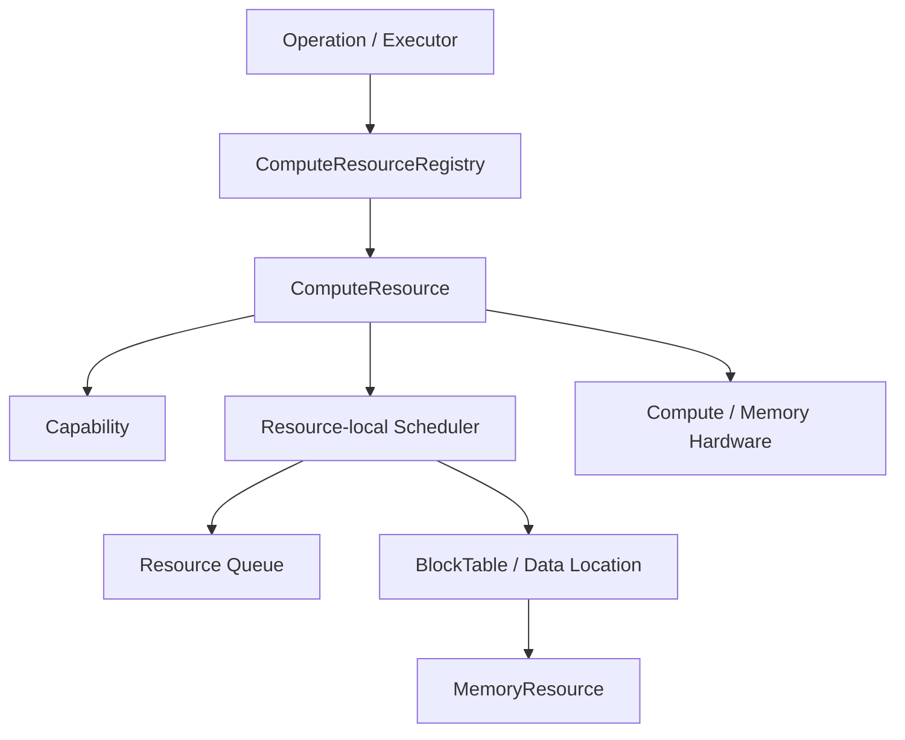
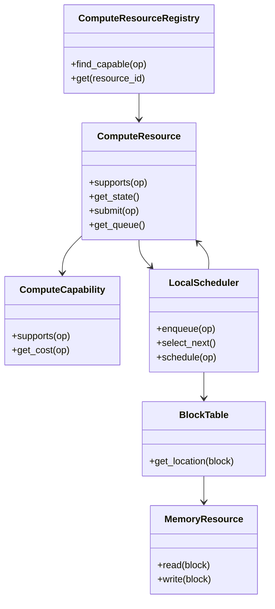
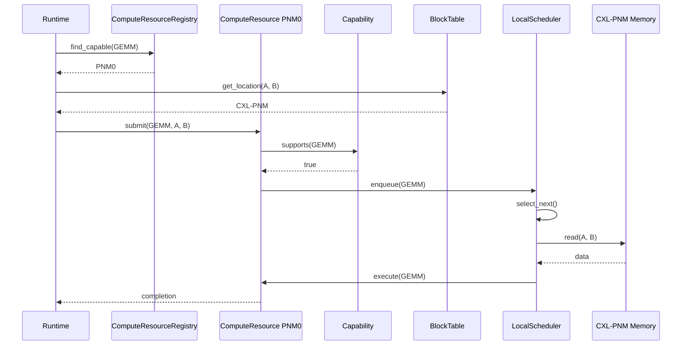
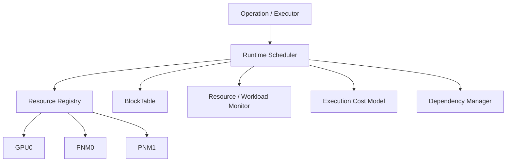
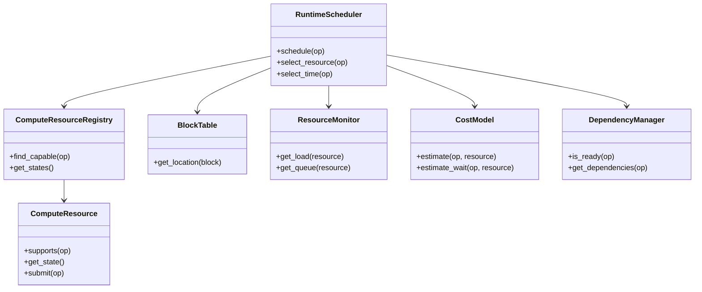
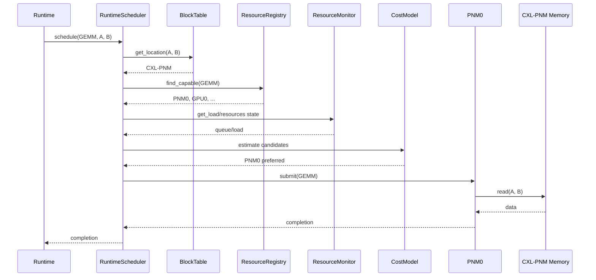

# DP4 — Compute Placement / Scheduling Abstraction Candidate Design

> **Design Question:** Workload의 연산을 적절한 Compute/Memory Resource에 배치하고, Resource 상태와 실행 의존성을 고려하여 **언제 실행할 것인가?**

---

## 1. Position in Memory-Centric Runtime Design

```text
DP1: Memory Tiering Abstraction
    What is Memory?
        ↓
DP2: Compute-Capable Memory Abstraction
    What can Memory do?
        ↓
DP3: Memory Placement / Migration Abstraction
    Where should data be?
        ↓
DP4: Compute Placement / Scheduling
    Where & when should computation run?
```

DP4는 DP2에서 정의된 Compute capability와 DP3에서 결정된 data placement를 실제 execution decision으로 연결하는 설계 포인트다.

---

# 2. Design Question

Runtime에서 연산 요청이 들어오면 다음을 결정해야 한다.

1. **어떤 Compute Resource에서 실행할 것인가?**
2. Memory-local Compute(PNM/PIM 등)를 사용할 것인가, 별도의 accelerator를 사용할 것인가?
3. 여러 Compute Resource가 같은 연산을 지원할 경우 어떤 Resource를 선택할 것인가?
4. 해당 연산을 **언제 실행할 것인가?**
5. Resource queue, dependency, priority, load, data locality를 어떻게 반영할 것인가?
6. Compute placement와 scheduling을 하나의 decision으로 처리할 것인가, 분리할 것인가?

핵심은 단순한 **Resource Management**보다 구체적으로 **Operation Placement + Execution Scheduling**을 결정하는 것이다.

---

# 3. DP4와 DP3의 경계

| Design Point | 핵심 질문 | 주요 결정 |
|---|---|---|
| **DP3** | Where should data be? | Data의 Memory placement / migration |
| **DP4** | Where & when should computation run? | Operation의 Compute placement / execution scheduling |

예:

```text
GEMM(A, B)
   │
   ├── DP3: A/B를 어느 Memory에 둘 것인가?
   │
   └── DP4: GEMM을 어느 Compute에서 언제 실행할 것인가?
```

DP2가 `CXL-PNM supports GEMM`이라는 **capability**를 제공한다면, DP4는 그 capability를 실제 workload execution에 사용할지 결정한다.

---

# 4. Candidate Overview

## Candidate 1 — Resource-Centric Scheduling

> **각 Compute/Memory Resource가 자신의 queue, load, locality와 capability를 중심으로 연산을 선택하고 실행하여 낮은 scheduling overhead와 높은 predictability를 우선하는 구조.**

```text
Operation Request
      ↓
Resource / Capability lookup
      ↓
Preferred Resource
      ↓
Resource-local Scheduler
      ↓
Resource Queue
      ↓
Execute
```

핵심 철학은 **Resource가 자신의 상태를 가장 잘 알고 있으므로 local scheduler가 실행 결정을 주도한다**는 것이다.

---

## Candidate 2 — Runtime-Centric Scheduling

> **Runtime이 여러 Compute/Memory Resource의 capability, data location, queue/load, dependency와 execution cost를 종합하여 연산의 실행 위치와 시점을 결정하는 구조.**

```text
Operation Request
      ↓
Runtime Scheduler / Planner
      ↓
┌─────────┬─────────┬─────────┐
↓         ↓         ↓
GPU0      PNM0      PNM1
└─────────┴─────────┴─────────┘
      ↓
Cost / Policy / Dependency
      ↓
Selected Resource + Time
      ↓
Execute
```

핵심 철학은 **전체 Resource와 workload를 함께 봐야 최적의 execution decision을 만들 수 있다**는 것이다.

---

# 5. Candidate 1 — Resource-Centric Scheduling

## 5.1 SW Module View



### Responsibility

| Module | Responsibility |
|---|---|
| ComputeResourceRegistry | Compute Resource와 capability 관리 |
| ComputeResource | 실제 Compute backend abstraction |
| Capability | 지원 operation 확인 |
| Resource-local Scheduler | Resource 내부 queue/load/dependency 기반 scheduling |
| BlockTable | Input/output data location 확인 |
| MemoryResource | Data access 제공 |

---

## 5.2 Class Diagram



---

## 5.3 Execution Sequence — CXL-PNM GEMM Example



### 핵심

Candidate 1에서는 capability와 scheduling 책임이 ComputeResource에 가깝게 위치한다. 특히 Memory-local Compute라면 해당 ComputeResource가 자신의 queue와 local data access 상황을 가장 직접적으로 활용할 수 있다.

---

## 5.4 Advantages — Why?

### ① 낮은 Scheduling Overhead

Global scheduler가 모든 Resource 상태를 수집하고 비교하지 않아도 되므로 operation dispatch path를 짧게 유지할 수 있다.

```text
Operation
  ↓
Resource
  ↓
Local Queue
  ↓
Execute
```

### ② 높은 Predictability

Resource별 local policy가 명확하면 queueing과 execution path를 예측하기 쉽다.

### ③ Data-local Compute에 유리

PNM/PIM처럼 Compute가 Memory에 가까이 붙어 있는 경우 local scheduler가 해당 Memory locality를 직접 활용할 수 있다.

### ④ 구현 복잡도 감소

Global scheduling model, cross-resource arbitration, global cost model을 최소화할 수 있다.

---

## 5.5 Disadvantages — Why?

### ① Global Resource Utilization 최적화 한계

각 Resource가 자신의 queue/load를 중심으로 판단하면 다른 Resource의 idle capacity를 충분히 활용하지 못할 수 있다.

### ② Cross-Resource Scheduling 어려움

GEMM을 PNM0과 GPU0이 모두 지원하는 경우 전체 system 관점에서 어느 쪽이 더 좋은지 판단하려면 global 정보가 필요하다.

### ③ Workload-level Dependency 반영 제한

여러 operation의 dependency와 전체 critical path를 local scheduler가 알기 어렵다.

### ④ Resource contention의 전역 최적화 어려움

여러 operation이 서로 다른 Memory/Compute Resource를 동시에 사용하면 전체 bandwidth/queue contention을 고려한 scheduling이 어렵다.

---

# 6. Candidate 2 — Runtime-Centric Scheduling

## 6.1 SW Module View



---

## 6.2 Class Diagram



---

## 6.3 Execution Sequence — CXL-PNM GEMM Example



### 핵심

Candidate 2는 **data location → capability → candidate resources → current resource state → cost/dependency → execution decision**을 Runtime Scheduler가 종합한다.

---

## 6.4 Advantages — Why?

### ① Global Scheduling Optimization

모든 Compute Resource를 동시에 비교할 수 있으므로 idle resource와 busy resource 사이의 load balancing이 가능하다.

### ② Data Location + Compute Placement Joint Decision

BlockTable의 data location과 Compute capability를 함께 보므로 data movement cost와 compute cost를 동시에 고려할 수 있다.

### ③ Dependency / Critical Path Optimization

Operation graph 전체를 볼 수 있으므로 critical operation을 우선 실행하는 정책을 구현하기 쉽다.

### ④ Dynamic Resource Selection

동일한 GEMM을 지원하는 PNM0, PNM1, GPU0 중 현재 workload 상태에 따라 다른 Resource를 선택할 수 있다.

---

## 6.5 Disadvantages — Why?

### ① Scheduling Decision Overhead 증가

각 operation마다 capability, location, resource state, dependency, cost 등을 종합해야 하므로 dispatch path가 길어진다.

### ② Runtime Scheduler 복잡도 증가

Scheduler, monitor, cost model, dependency manager 등 여러 module이 필요하다.

### ③ Cost Model 의존성

잘못된 cost estimation은 잘못된 Resource 선택으로 이어질 수 있다.

### ④ 중앙 Scheduler 병목 가능성

많은 operation이 동시에 들어오면 central scheduler가 control-plane bottleneck이 될 수 있다.

---

# 7. QA Evaluation

| QA | Candidate 1 | Candidate 2 | Evaluation Rationale |
|---|:---:|:---:|---|
| **Dispatch / Scheduling Efficiency** | ★★★ | ★★☆ | C1은 local decision으로 짧은 control path |
| **Data-local Compute Efficiency** | ★★★ | ★★★ | 둘 다 location-aware 가능하나 C1은 local path가 자연스러움 |
| **Global Resource Utilization** | ★★☆ | ★★★ | C2는 전체 Resource를 비교 가능 |
| **Workload / Dependency Adaptability** | ★★☆ | ★★★ | C2가 global execution graph를 활용하기 쉬움 |
| **Execution Predictability** | ★★★ | ★★☆ | C1은 local policy 기반으로 예측 용이 |
| **Runtime Complexity / Maintainability** | ★★★ | ★★☆ | C2는 scheduler/monitor/cost model 증가 |

> 별점은 절대적인 benchmark 성능값이 아니라 **architecture가 제공하는 상대적인 특성**을 의미한다.

---

# 8. Fundamental Trade-off

```text
Candidate 1                              Candidate 2
Resource-Centric                        Runtime-Centric
      │                                      │
      ▼                                      ▼
Local scheduling                         Global scheduling
      │                                      │
      ▼                                      ▼
Low overhead / predictable             Adaptive / globally optimized
      │                                      │
      ▼                                      ▼
Limited global visibility               Higher scheduler complexity
```

### Candidate 1이 유리한 환경

- PNM/PIM 등 Memory-local Compute가 주된 환경
- Compute Resource와 data locality 관계가 명확한 경우
- operation dispatch overhead가 중요한 경우
- execution pattern이 비교적 predictable한 경우

### Candidate 2가 유리한 환경

- GPU/PNM/PIM 등 heterogeneous Compute Resource가 공존하는 경우
- 동일 operation을 여러 Resource에서 실행할 수 있는 경우
- workload contention이 큰 경우
- dependency/critical path optimization이 중요한 경우

---

# 9. DP1~DP4 Architecture Relationship

```text
DP1 — Memory Abstraction
       ↓
  Memory Resource
       ↓
DP2 — Compute-Capable Memory
       ↓
  Memory ↔ Compute Capability
       ↓
DP3 — Memory Placement / Migration
       ↓
  Data Location
       ↓
DP4 — Compute Placement / Scheduling
       ↓
  Operation Location + Execution Time
```

DP4는 DP1~DP3에서 만들어진 abstraction을 실제 workload execution으로 연결하는 마지막 decision layer다.

---

# 10. One-Sentence Characteristics

### Candidate 1

> **각 Compute Resource가 자신의 상태와 data locality를 중심으로 연산을 선택·실행하여 낮은 scheduling overhead와 예측 가능한 실행을 제공하는 구조.**

### Candidate 2

> **Runtime이 전체 Compute/Memory Resource와 workload dependency를 종합하여 연산의 실행 위치와 시점을 동적으로 최적화하는 구조.**

### DP4 Fundamental Question

> **Resource-local execution의 낮은 overhead와 predictability를 선택할 것인가, 아니면 global visibility를 활용한 heterogeneous resource scheduling을 선택할 것인가?**
