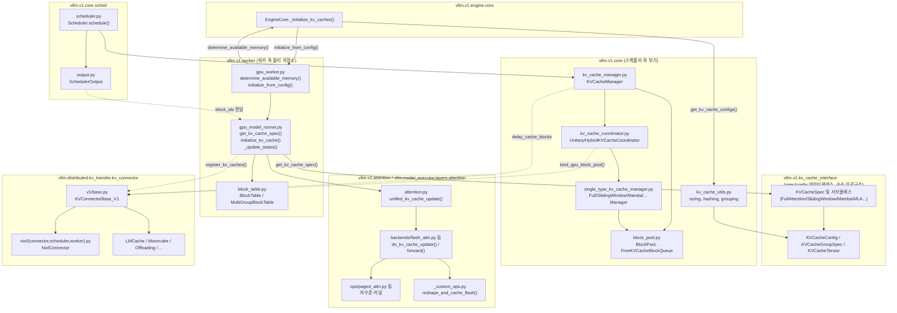
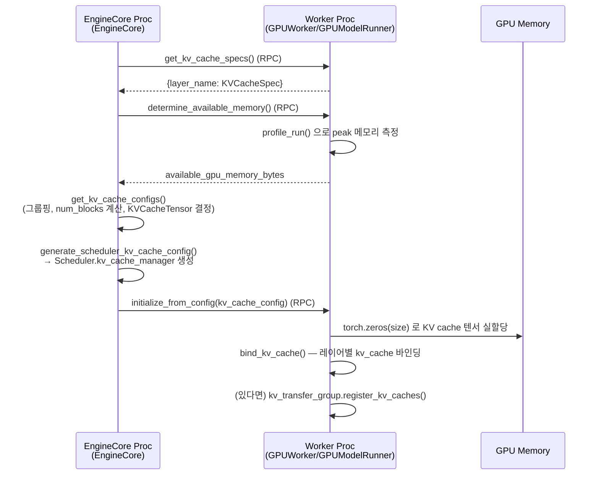
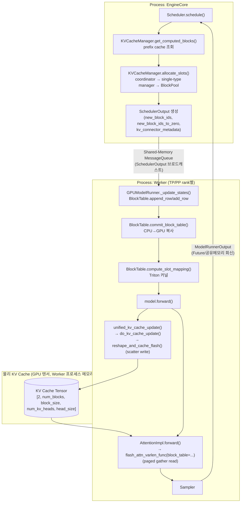

# vLLM KV Cache 처리 과정 분석

> 분석 대상 커밋: `23632f40` (V1 엔진 기준, `doc-mk/vllm-call-path-analysis.md`의 후속 문서)
>
> 본 문서는 vLLM이 KV cache를 어떻게 구성/할당/재사용/해제하는지, 그리고 실제 GPU 메모리
> 상의 KV cache에 attention 커널이 어떻게 read/write 하는지를 코드 레벨로 추적합니다.
> 요청 처리의 전체 흐름은 `doc-mk/vllm-call-path-analysis.md`를 참고하세요. 이 문서는
> 그 안에서 `Scheduler.schedule()` ↔ `Worker.execute_model()` 사이에 있는 **KV cache
> 전용 서브시스템**을 확대해서 다룹니다.

## 0. 전체 그림

KV cache 처리는 **스케줄러 측(논리적 블록 부기)** 과 **워커 측(물리적 GPU 텐서 +
attention 커널)** 으로 명확히 분리되어 있습니다.

- **스케줄러 측** (`vllm/v1/core/*`): 블록을 정수 ID로만 다루는 순수 부기(bookkeeping)
  계층. 실제 텐서를 만지지 않고, "어떤 요청이 어떤 블록 ID들을 쓰는지"만 관리합니다.
- **워커 측** (`vllm/v1/worker/*`, `vllm/v1/attention/*`): 실제 GPU 텐서를 할당하고,
  매 스텝 스케줄러가 넘겨준 블록 ID를 이용해 attention 커널이 KV를 쓰고 읽습니다.

이 두 계층은 매 스텝 `SchedulerOutput`(`vllm/v1/core/sched/output.py`)을 통해서만
통신합니다.

---

## 1. KV Cache 크기 결정 (Sizing)

### 1.1 메모리 프로파일링 (워커 측)

`GPUWorker.determine_available_memory()` (`vllm/v1/worker/gpu_worker.py:352`)

- `model_runner.profile_run()`을 더미 배치로 실행해 peak torch 메모리를 측정
- `available_kv_cache_memory_bytes = requested_memory - non_kv_cache_memory - cudagraph_memory_estimate`
- `requested_memory`는 `gpu_memory_utilization` 설정값 기반
- `cache_config.kv_cache_memory_bytes`가 명시적으로 지정된 경우 프로파일링 없이 그 값을 그대로 사용

### 1.2 레이어별 스펙 수집

`GPUModelRunner.get_kv_cache_spec()` (`gpu_model_runner.py:7003`)이 모델의
`compilation_config.static_forward_context`를 순회하며 레이어별 `KVCacheSpec`을
딕셔너리(`layer_name → spec`)로 구성합니다.

### 1.3 오케스트레이션 (EngineCore)

`EngineCore._initialize_kv_caches()` (`vllm/v1/engine/core.py:232`)의 순서:

1. `kv_cache_specs = self.model_executor.get_kv_cache_specs()` — 워커/PP-stage별 스펙 수집
2. `available_gpu_memory = self.model_executor.determine_available_memory()` — 워커별 collective RPC
3. `kv_cache_configs = get_kv_cache_configs(vllm_config, kv_cache_specs, available_gpu_memory)`
   (`vllm/v1/core/kv_cache_utils.py:1922`)
4. `generate_scheduler_kv_cache_config(...)` — TP/PP 워커 간 블록 수를 통일해 스케줄러용
   단일 `KVCacheConfig` 생성
5. `self.model_executor.initialize_from_config(kv_cache_configs)` → 각 워커의
   `GPUWorker.initialize_from_config()` (`gpu_worker.py:537`) → `model_runner.initialize_kv_cache(...)`

`get_kv_cache_configs()`가 실제로 하는 일:

- 레이어 스펙을 병합하고 `get_kv_cache_groups()`로 `KVCacheGroupSpec` 생성 (하이브리드
  모델 그룹핑 — §7 참고)
- `max_model_len=-1`(자동)인 경우 이진 탐색으로 최대 길이 추정 (`estimate_max_model_len`)
- 메모리 충분성 검증 (`check_enough_kv_cache_memory`)
- `num_blocks = available_memory // page_size // num_layers` 계산 (`get_num_blocks`)
- `KVCacheTensor` 목록 생성 — 워커가 실제로 할당할 연속 버퍼들의 크기/공유 레이어 정보

### 1.4 핵심 데이터 클래스 (`vllm/v1/kv_cache_interface.py`)

| 클래스 | 설명 |
|---|---|
| `KVCacheSpec` (base) → `FullAttentionSpec`, `SlidingWindowSpec`, `ChunkedLocalAttentionSpec`, `MLAAttentionSpec`, `SlidingWindowMLASpec`, `MambaSpec`, `CrossAttentionSpec`, `EncoderOnlyAttentionSpec`, `SinkFullAttentionSpec`, `UniformTypeKVCacheSpecs` | 레이어 하나의 KV 저장 요구사항 (attention 타입별로 다름). `page_size_bytes`, `max_memory_usage_bytes()` 제공 |
| `KVCacheTensor` | `{size(bytes), shared_by: [layer_names]}` — 워커가 만들 raw 버퍼 하나의 명세 |
| `KVCacheGroupSpec` | `{layer_names, kv_cache_spec, is_eagle_group}` — 같은 block table을 공유하는 레이어 집합 |
| `KVCacheConfig` | `{num_blocks, kv_cache_tensors, kv_cache_groups}` — 스케줄러와 워커 양쪽에 전달되는 최종 설정 |

---

## 2. Scheduler 측 KV Cache Manager (논리적 블록 부기)

### 2.1 클래스 계층 (`vllm/v1/core/`)

```
KVCacheManager (kv_cache_manager.py:106)
  └─ coordinator: KVCacheCoordinator (kv_cache_coordinator.py:28, ABC)
        ├─ KVCacheCoordinatorNoPrefixCache (276)  — prefix caching 비활성
        ├─ UnitaryKVCacheCoordinator (324)        — KV cache 그룹 1개
        └─ HybridKVCacheCoordinator (392)          — 그룹 2개 이상 (하이브리드 모델)
              └─ single_type_managers: SingleTypeKVCacheManager 목록
                    (single_type_kv_cache_manager.py)
                    ├─ FullAttentionManager (446)
                    ├─ SlidingWindowManager (507)
                    ├─ ChunkedLocalAttentionManager (644)
                    ├─ MambaManager (794)
                    ├─ CrossAttentionManager (1069)
                    └─ SinkFullAttentionManager (1118)
  └─ block_pool: BlockPool (block_pool.py:130)
```

`KVCacheManager`는 `Scheduler`(`vllm/v1/core/sched/scheduler.py`)가 사용하는 유일한
진입점입니다.

### 2.2 핵심 메서드

- **`get_computed_blocks(request)`** (line 183) — prefix cache 조회.
  `coordinator.find_longest_cache_hit(...)`로 위임
- **`allocate_slots(request, num_new_tokens, ...)`** (line 225) — 메인 할당 로직.
  `Scheduler.schedule()`에서 신규/재개 요청(line 467)과 실행 중 요청(line 744) 각각에서
  호출:
  1. `coordinator.remove_skipped_blocks` — sliding window로 더 이상 필요 없는 블록 해제
  2. `coordinator.get_num_blocks_to_allocate`로 필요 블록 수 계산 →
     `block_pool.get_num_free_blocks()`와 비교, 부족하면 `None` 반환 →
     스케줄러가 우선순위 낮은 실행 중 요청을 preempt 후 재시도
  3. `coordinator.allocate_new_computed_blocks` — prefix-hit로 찾은 블록을 커밋
  4. `coordinator.allocate_new_blocks` — 새 블록 할당
  5. `coordinator.cache_blocks` — 방금 꽉 찬 블록을 prefix cache 해시테이블에 등록
- **`free(request)`** (line 418) → 각 `SingleTypeKVCacheManager.free()`가 블록을
  **역순으로** `block_pool.free_blocks()`에 반환 (tail 블록부터 evict 후보가 됨 — LRU와
  결합해 재사용 가능성이 낮은 블록을 먼저 회수)
- **`get_num_common_prefix_blocks()`** (465) — cascade attention용

### 2.3 Prefix Cache 해싱 (`vllm/v1/core/kv_cache_utils.py`)

- `hash_block_tokens(hash_fn, parent_block_hash, curr_block_token_ids, extra_keys)`
  (line 539) — `hash(parent_hash, token_ids, extra_keys)` 형태의 체인 해시.
  블록 0은 `NONE_HASH`로 루트
- `get_request_block_hasher(block_size, hash_fn)` (635) — 새로 완성된 블록만 증분
  해싱해서 `Request.block_hashes`(`vllm/v1/request.py`)에 append하는 클로저
- `generate_block_hash_extra_keys()` (501) — LoRA 어댑터명, 멀티모달 피처
  식별자/오프셋, cache_salt, prompt-embedding 해시를 섞어서 서로 다른 컨텍스트의
  동일 토큰 블록이 잘못 충돌(alias)하지 않도록 함
- `BlockHashWithGroupId` — `block_hash + group_id`를 묶어서, 같은 토큰 내용이라도
  KV cache 그룹이 다르면(예: full-attn 그룹 vs sliding-window 그룹) 별개로 취급

**조회**: `BlockPool.get_cached_block(block_hash, kv_cache_group_ids)`
(`block_pool.py:184`)이 `cached_block_hash_to_block` 딕셔너리를 조회

### 2.4 Attention 타입별 Prefix-hit 탐색 알고리즘

| Manager | `find_longest_cache_hit` 동작 |
|---|---|
| `FullAttentionManager` | 좌→우로 첫 미스까지 단순 스캔 |
| `SlidingWindowManager` | 우→좌로 스캔, window만큼 연속 히트 필요, window 밖 블록은 `null_block`으로 채움 |
| `ChunkedLocalAttentionManager` | 현재 attention-chunk window 이전 블록을 null 처리 |
| `MambaManager` | 마지막 매칭 블록만 의미 있음 (recurrent state는 리스트가 아닌 단일 상태) |
| `HybridKVCacheCoordinator` | 모든 그룹에 대해 반복적으로 hit_length를 줄여가며 전 그룹이 합의하는 지점을 찾는 fixed-point 루프 (full-attn을 가장 먼저 평가해 초기 상한을 좁힘) |

---

## 3. Worker 측 물리적 KV Cache 저장소

### 3.1 텐서 할당

`GPUModelRunner.initialize_kv_cache(kv_cache_config)` (`gpu_model_runner.py:6866`,
`GPUWorker.initialize_from_config`에서 호출):

1. `initialize_attn_backend(kv_cache_config)` — KV cache 그룹별 attention 백엔드 클래스
   결정 (`self.attn_groups`)
2. `prepare_kernel_block_sizes(...)` — 커널이 요구하는 블록 크기(예: FlashAttn은 16의
   배수)가 매니저의 논리 블록 크기와 다르면 더 작은 "kernel block"으로 분할
3. `initialize_kv_cache_tensors(...)` → `_allocate_kv_cache_tensors()` (6581) —
   `KVCacheTensor` 명세마다 `torch.zeros(size, dtype=int8, device=cuda)`로 raw 버퍼
   **실제 GPU 메모리 할당**, `shared_by`에 나열된 모든 레이어가 이를 공유
4. `_reshape_kv_cache_tensors()` (6622) — raw 버퍼를 백엔드별 shape로 `view`/`as_strided`.
   일반 attention은 `[2, num_blocks, block_size, num_kv_heads, head_size]` (dim 0이
   K/V), Mamba는 `MambaSpec.shapes/dtypes`에 따른 별도 상태 텐서
5. `bind_kv_cache(...)` — 각 텐서를 해당 `Attention`/`MLAAttention` 모듈의
   `layer.kv_cache`에 바인딩, KV connector에도 등록 (`kv_transfer_group.register_kv_caches`,
   §5)

### 3.2 Block Table (물리 블록 ID ↔ 요청 매핑)

`vllm/v1/worker/block_table.py`:

- `BlockTable` — GPU int32 텐서 `[max_num_reqs, max_num_blocks_per_req]`로 "요청 행 →
  물리 블록 ID 목록"을 저장. 추가로 `slot_mapping` 버퍼(`[max_num_batched_tokens]`,
  int64)가 이번 스텝에 스케줄된 각 토큰이 정확히 어느 flat slot(`block_id * block_size
  + offset`)에 쓰여야 하는지 기록
- `compute_slot_mapping()` (141) — Triton 커널 `_compute_slot_mapping_kernel`(318)을
  실행해 `query_start_loc` + `positions` + block table로부터 슬롯 매핑을 계산
- `MultiGroupBlockTable` (223) — KV cache 그룹마다 `BlockTable` 하나씩 래핑

### 3.3 Attention 커널의 Write / Read

- **Write**: `unified_kv_cache_update()` (`vllm/model_executor/layers/attention/attention.py:663`)
  → `attn_layer.impl.do_kv_cache_update(...)` → 예)
  `FlashAttentionImpl.do_kv_cache_update()` (`vllm/v1/attention/backends/flash_attn.py:871`)
  가 `key_cache, value_cache = kv_cache.unbind(0)` 후 `reshape_and_cache_flash(...)`
  CUDA 커널(`vllm/_custom_ops.py:2713`)을 호출 — 각 토큰의 K/V를 `slot_mapping`이
  가리키는 물리 위치에 scatter-write
- **Read**: `FlashAttentionImpl.forward()` (`flash_attn.py:685`)가 `attn_metadata.block_table`
  (요청별 물리 블록 ID 목록)을 `flash_attn_varlen_func(..., block_table=...)`에 전달 —
  block ID로 K/V 페이지들을 gather하는 PagedAttention 방식의 read
- write(`do_kv_cache_update`)와 read(`forward`)는 별도 호출이며, `torch.compile`이
  순서를 재배열하지 않도록 명시적 데이터 의존성(`kv_cache_dummy_dep`)으로 묶여 있음
- 백엔드별로 `vllm/v1/attention/ops/{paged_attn,triton_unified_attention,
  triton_reshape_and_cache_flash,prefix_prefill,chunked_prefill_paged_decode}.py`에
  유사한 저수준 커널들이 존재

---

## 4. 매 스텝 Block Table 전달 (Scheduler → Worker)

`SchedulerOutput` (`vllm/v1/core/sched/output.py:180`)의 관련 필드:

| 필드 | 설명 |
|---|---|
| `scheduled_new_reqs[].block_ids` | 신규 요청의 그룹별 블록 ID 목록 (`kv_cache_manager.get_block_ids(...)`) |
| `scheduled_cached_reqs.new_block_ids` | 실행 중이던 요청에 **이번 스텝에 추가로** 할당된 블록 ID만 (증분 — 전체 히스토리는 워커의 영구 `BlockTable`에 이미 존재) |
| `num_common_prefix_blocks` | 그룹별 cascade attention용 |
| `new_block_ids_to_zero` | 새로 할당된 블록 중 워커가 0으로 초기화해야 하는 것 (Mamba/SSM 상태 정확성을 위해 필요) |
| `kv_connector_metadata` | 분산 prefill용 opaque 메타데이터 (§5) |

**워커 측 소비 흐름** (`GPUModelRunner._update_states()`):

```
Scheduler.allocate_slots()
  → coordinator/single-type manager → block_pool 에서 블록 ID 확보
  → SchedulerOutput{NewRequestData.block_ids, CachedRequestData.new_block_ids}
  → GPUModelRunner._update_states()
       ├─ 기존 요청: BlockTable.append_row(new_block_ids, req_index)
       └─ 신규/재개 요청: MultiGroupBlockTable.add_row(block_ids, row_idx)
  → BlockTable.commit_block_table(num_reqs)   # CPU에 스테이징된 테이블을 GPU로 복사
  → BlockTable.compute_slot_mapping(num_reqs, query_start_loc, positions)   # Triton
  → attention metadata builder 가 blk_table.get_device_tensor(num_reqs) 를
     AttentionMetadata.block_table 에 담아 백엔드로 전달
  → forward: do_kv_cache_update(scatter-write) + forward(paged gather-read)
```

---

## 5. 분산 Prefill / KV Connector (Disaggregated Prefill)

부수적 기능이 아니라 **할당 경로에 깊이 통합된 아키텍처**입니다.
`vllm/distributed/kv_transfer/kv_connector/`에 약 15개의 커넥터 구현체가 있습니다.

- 기반 ABC: `KVConnectorBase_V1` (`kv_connector/v1/base.py:170`)
  - 스케줄러 측 훅: `get_num_new_matched_tokens`, `update_state_after_alloc`, `request_finished`
  - 워커 측 훅: `start_load_kv`, `wait_for_layer_load`(317), `save_kv_layer`(331),
    `wait_for_save`(353), `get_finished`(363)
- `KVConnectorMetadata` — `SchedulerOutput.kv_connector_metadata`로 전달되는
  스텝별 opaque payload
- `SupportsHMA` (84) — Hybrid Memory Allocator(다중 그룹 KV cache, §7) 호환 커넥터 표시
  믹스인. `NixlConnector`가 구현
- 등록된 커넥터 (`kv_connector/factory.py:149`): `ExampleConnector`,
  `P2pNcclConnector`, `LMCacheConnectorV1`/`LMCacheMPConnector`, `NixlConnector`,
  `MultiConnector`(여러 커넥터로 fan-out), `MoRIIOConnector`,
  `OffloadingConnector`(CPU/host offload), `DecodeBenchConnector`,
  `MooncakeConnector`, `FlexKVConnectorV1`, `SimpleCPUOffloadConnector`,
  `HF3FSKVConnector`
- **NIXL**(RDMA 기반 P/D 분리의 레퍼런스 구현)은 스케줄러 로직(`NixlConnectorScheduler`)과
  워커 측 전송 로직(`NixlConnectorWorker`)을 분리, `NixlConnector`가 조율
- 통합 지점:
  - `Scheduler.__init__`에서 `self.connector.bind_gpu_block_pool(kv_cache_manager.block_pool)`
  - `KVCacheManager.allocate_slots(..., delay_cache_blocks=...)` — "원격 prefill
    워커로부터 아직 KV를 수신 중이라 caching을 지연한다"는 케이스가 코어 할당 경로에
    1급 파라미터로 존재 (bolt-on이 아니라 애초에 설계에 반영됨을 보여줌)
  - 워커 측: `GPUModelRunner.initialize_kv_cache()`가 `kv_transfer_group.register_kv_caches(kv_caches)`,
    `set_host_xfer_buffer_ops(copy_kv_blocks)` 호출 — 커넥터가 물리 KV 텐서를 직접
    read/write 할 수 있도록 등록

---

## 6. Eviction / Free Block 관리

`vllm/v1/core/block_pool.py` + `kv_cache_utils.py`:

- **`FreeKVCacheBlockQueue`** (`kv_cache_utils.py:162`) — O(1) 이중 연결 리스트로 구현된
  free-list. `popleft()`(214)로 head(=LRU, 가장 오래 미사용)를 꺼냄. 블록 해제 시
  요청의 블록을 역순으로 순회해 tail 블록이 먼저 evict 후보가 되도록 함
- **`BlockPool.get_new_blocks(num_blocks)`** (322) — free queue에서 pop, 만약 꺼낸
  블록이 여전히 캐시 해시를 갖고 있으면(재활용 대상) `_maybe_evict_cached_block()`(354)
  호출해 `cached_block_hash_to_block`에서 제거 — **실제 eviction은 할당 시점에 지연
  수행(lazy)**
- **`BlockPool.touch(blocks)`** (391) — prefix-cache hit로 재사용되는 블록의 ref_cnt
  증가 + free queue에서 제거 (evict 되지 않도록 보호)
- **`BlockPool.free_blocks(ordered_blocks)`** (408) — ref_cnt 감소, `ref_cnt == 0`이
  될 때만 free queue에 append (evict 가능 상태로 전환)
- **`BlockPool.evict_blocks(block_ids)`** (424) — KV connector 등이 특정 블록을
  명시적으로 evict할 때 쓰는 API (`KVCacheManager.evict_blocks()`로 노출)
- **`BlockPool.reset_prefix_cache()`** (443) — 전체 flush (RLHF 가중치 갱신/벤치마크용)
- **`KVCacheBlock`** (113) — 블록 메타데이터: `block_id`, `ref_cnt`, `_block_hash`,
  연결 리스트 포인터, `is_null`(sliding-window/mamba에서 스킵된 슬롯을 위한 placeholder,
  `block_id=0`)

---

## 7. 다중 KV Cache 그룹 (하이브리드 모델)

Full-attention + sliding-window + chunked-local(Llama4류) + Mamba/SSM +
cross-attention이 섞인 모델, 그리고 레이어별 hidden size가 다른 DeepseekV4류 MLA
모델을 지원하기 위한 메커니즘입니다.

### 7.1 그룹 구성 (`kv_cache_utils.py`)

- `_get_kv_cache_groups_uniform_spec()` (959) — 모든 레이어가 동일 스펙이면 그룹 1개
  (가장 흔한 경우)
- `_get_kv_cache_groups_uniform_type()` (976) — `UniformTypeKVCacheSpecs`, 타입은
  같지만 레이어별 hidden size가 다른 경우 (DeepseekV4)
- `_get_kv_cache_groups_uniform_page_size()` (1052) — 일반적인 **하이브리드** 케이스.
  레이어를 정확한 `KVCacheSpec`으로 버킷팅한 뒤, 모든 그룹의 레이어 수를 맞춰 재분할
  (`group_size = min(타입별 레이어 수)`, 패딩 낭비를 줄이기 위한 1.5x 휴리스틱). 예:
  full 10개 + sliding-window 20개 모델에서 그룹 3개 생성
- `unify_hybrid_kv_cache_specs()` (1319) — `--disable-hybrid-kv-cache-manager` 설정 시
  fallback: sliding-window/chunked-local 레이어를 `FullAttentionSpec`으로 변환해
  단일 그룹으로 통합 (메모리 절감 효과는 잃지만 연산 절감은 유지)

### 7.2 그룹별 디스패치

- **`KVCacheCoordinator`**: 그룹 1개면 `UnitaryKVCacheCoordinator`, 2개 이상이면
  `HybridKVCacheCoordinator`. 후자는 `verify_and_split_kv_cache_groups()`(436)로
  동일 스펙끼리 `attention_groups`를 버킷팅하고(전체 attn 그룹을 가장 먼저 배치 — 가장
  타이트한 상한이므로), `lcm_block_size`(각 그룹 블록 크기의 최소공배수)를 계산해
  그룹 간 prefix-hit 길이를 정렬
- **Single-type manager 매핑** (`single_type_kv_cache_manager.py:1142`,
  `spec_manager_map`):
  `FullAttentionSpec/MLAAttentionSpec → FullAttentionManager`,
  `SlidingWindowSpec/SlidingWindowMLASpec → SlidingWindowManager`,
  `ChunkedLocalAttentionSpec → ChunkedLocalAttentionManager`,
  `MambaSpec → MambaManager`, `CrossAttentionSpec → CrossAttentionManager`,
  `SinkFullAttentionSpec → SinkFullAttentionManager`
- **워커 측**: `MultiGroupBlockTable`이 그룹당 `BlockTable` 하나씩, `GPUModelRunner.
  attn_groups`가 동일한 그룹핑으로 그룹별 attention 백엔드/metadata builder를 선택
- 특수 메모리 계산: `SlidingWindowSpec.max_admission_blocks_per_request()`,
  `ChunkedLocalAttentionSpec.max_admission_blocks_per_request()`가 스타트업 사이징
  (`max_memory_usage_bytes`)과 런타임 admission 제한
  (`SingleTypeKVCacheManager.get_num_blocks_to_allocate(apply_admission_cap=True)`)
  양쪽에 동일하게 쓰임 (OOM/데드락 방지를 위한 재활용 인지 상한)

---

## 8. Module View — 모듈(패키지) 구조



### 모듈별 책임 요약

| 모듈 | 책임 |
|---|---|
| `vllm.v1.kv_cache_interface` | KV cache 스펙/설정을 표현하는 순수 데이터클래스 (로직 없음) |
| `vllm.v1.core.{kv_cache_manager,kv_cache_coordinator,single_type_kv_cache_manager,block_pool,kv_cache_utils}` | 스케줄러 측 블록 부기 — 실제 텐서는 만지지 않고 블록 ID만 관리, prefix-cache 해싱/조회, LRU eviction |
| `vllm.v1.core.sched.{scheduler,output}` | `KVCacheManager`를 사용해 매 스텝 블록 할당 결정, `SchedulerOutput`으로 워커에 전달 |
| `vllm.v1.engine.core` | 시작 시점 메모리 프로파일링→`KVCacheConfig` 생성→스케줄러/워커 양쪽 초기화 오케스트레이션 |
| `vllm.v1.worker.{gpu_worker,gpu_model_runner,block_table}` | 실제 GPU 텐서 할당, block table을 GPU에 반영, slot mapping 계산 |
| `vllm.v1.attention.*` / `vllm.model_executor.layers.attention` | attention 커널 레벨에서 KV cache에 실제 write(scatter)/read(paged gather) 수행 |
| `vllm.distributed.kv_transfer.kv_connector` | 분산 prefill/decode를 위해 노드 간 KV cache 블록을 전송 — 스케줄러/워커 양쪽에 훅으로 결합된 cross-cutting 컴포넌트 |

---

## 9. Component View — 스텝 단위 런타임 데이터 흐름

### 9.1 초기화 시점 (프로세스 기동 1회)



### 9.2 매 추론 스텝 (Decode/Prefill Loop)

기본 배포(`vllm serve`, `distributed_executor_backend="mp"`)에서의 프로세스 경계
포함:



### 9.3 핵심 관찰 포인트

- **논리 블록 ID와 물리 텐서는 서로 다른 프로세스에 존재**합니다. 스케줄러는 정수
  ID만 다루고, 실제 바이트는 워커 프로세스의 GPU 메모리에만 존재합니다. 매 스텝
  `SchedulerOutput`이 이 둘을 연결하는 유일한 통로입니다.
- **Prefix cache hit 여부는 스케줄러가 이미 결정**합니다 — 워커는 그저 전달받은
  block table로 gather/scatter만 수행할 뿐, 캐시 히트/미스 판단 로직은 갖지 않습니다.
- **Eviction은 지연(lazy) 수행**됩니다 — free-list에서 블록을 실제로 꺼내 재사용하는
  순간에만 이전 해시 엔트리를 지웁니다.
- **분산 prefill(KV connector)**은 이 파이프라인에 "제3의 텐서 소스"를 추가합니다:
  일부 블록은 로컬 GPU에서 계산되는 대신 원격 prefill 워커로부터 전송되어 채워지며,
  이 경우 `allocate_slots(delay_cache_blocks=True)`로 캐싱을 지연시킵니다.

---

## 10. 주요 클래스/파일 참조표

| 레이어 | 파일 | 핵심 클래스/함수 |
|---|---|---|
| 스펙/설정 | `vllm/v1/kv_cache_interface.py` | `KVCacheSpec`, `KVCacheConfig`, `KVCacheGroupSpec`, `KVCacheTensor` |
| 사이징 | `vllm/v1/core/kv_cache_utils.py` | `get_kv_cache_configs()`, `get_kv_cache_groups()`, `get_num_blocks()` |
| 오케스트레이션 | `vllm/v1/engine/core.py` | `EngineCore._initialize_kv_caches()` |
| 메모리 프로파일링 | `vllm/v1/worker/gpu_worker.py` | `GPUWorker.determine_available_memory()` |
| 스케줄러 부기 | `vllm/v1/core/kv_cache_manager.py` | `KVCacheManager.get_computed_blocks()`, `allocate_slots()`, `free()` |
| 코디네이터 | `vllm/v1/core/kv_cache_coordinator.py` | `UnitaryKVCacheCoordinator`, `HybridKVCacheCoordinator` |
| 타입별 매니저 | `vllm/v1/core/single_type_kv_cache_manager.py` | `FullAttentionManager`, `SlidingWindowManager`, `MambaManager` 등 |
| 블록 풀 | `vllm/v1/core/block_pool.py` | `BlockPool`, `FreeKVCacheBlockQueue`, `evict_blocks()` |
| 해싱 | `vllm/v1/core/kv_cache_utils.py` | `hash_block_tokens()`, `get_request_block_hasher()` |
| 스케줄러 출력 | `vllm/v1/core/sched/output.py` | `SchedulerOutput`, `NewRequestData`, `CachedRequestData` |
| 물리 할당 | `vllm/v1/worker/gpu_model_runner.py` | `initialize_kv_cache()`, `_allocate_kv_cache_tensors()`, `_update_states()` |
| 블록 테이블 | `vllm/v1/worker/block_table.py` | `BlockTable`, `MultiGroupBlockTable`, `compute_slot_mapping()` |
| Attention write/read | `vllm/v1/attention/backends/flash_attn.py` | `do_kv_cache_update()`, `forward()` |
| 커널 | `vllm/_custom_ops.py` | `reshape_and_cache_flash()`, `reshape_and_cache()` |
| KV Connector | `vllm/distributed/kv_transfer/kv_connector/v1/base.py` | `KVConnectorBase_V1` |
| KV Connector (NIXL) | `vllm/distributed/kv_transfer/kv_connector/v1/nixl/*.py` | `NixlConnector`, `NixlConnectorScheduler`, `NixlConnectorWorker` |

---

## 11. `vllm-call-path-analysis.md`와의 연결점

기존 call path 문서의 §2 다이어그램에서 다음 두 지점이 바로 본 문서의 상세 대상입니다.

- `scheduler_output = self.scheduler.schedule()` — 본 문서 §2, §4 (블록 할당 결정 및
  `SchedulerOutput` 구성)
- `self.model.forward(...)` 내부의 attention 레이어 호출 — 본 문서 §3 (KV cache
  scatter-write / paged gather-read)
