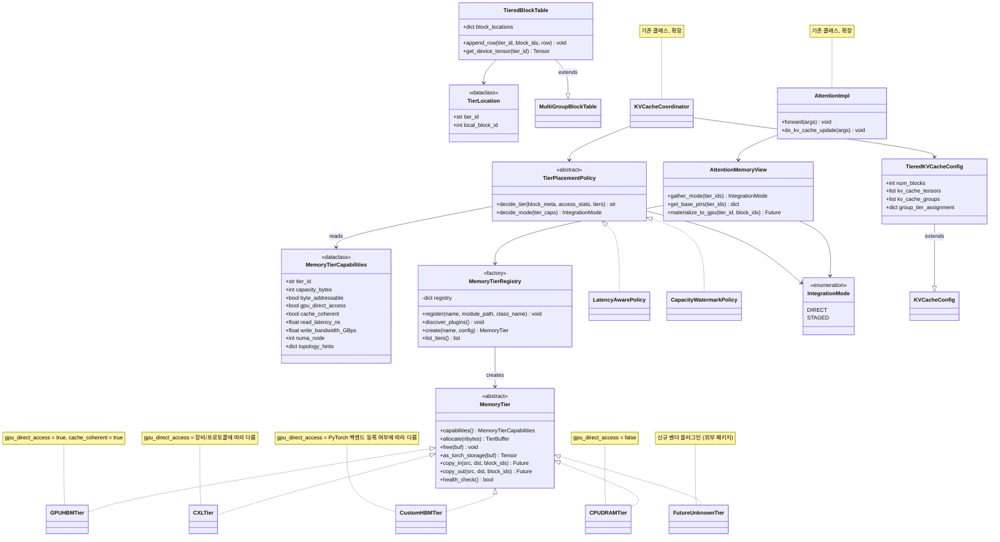
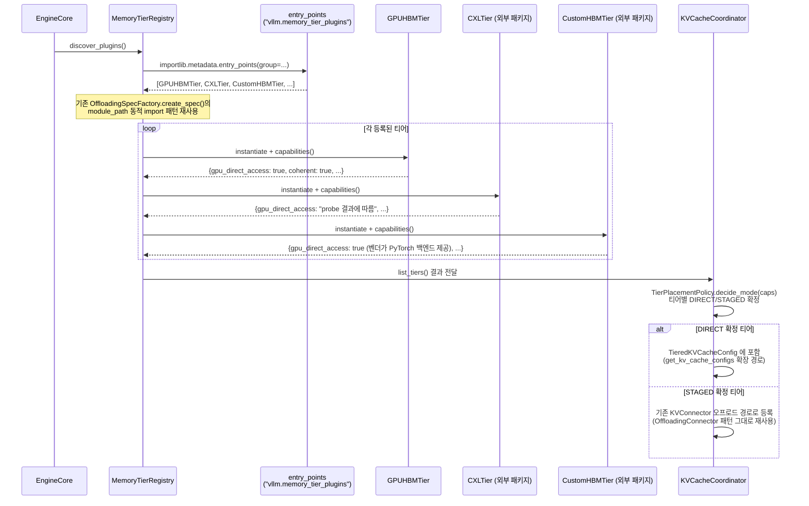
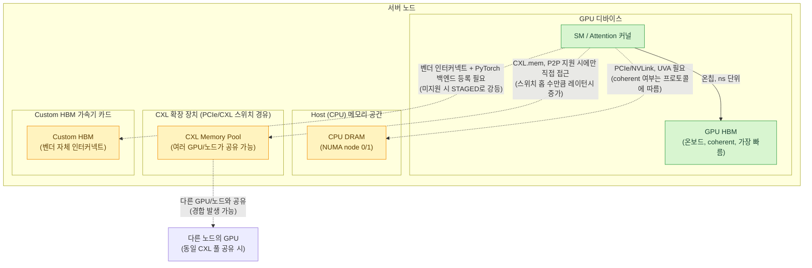
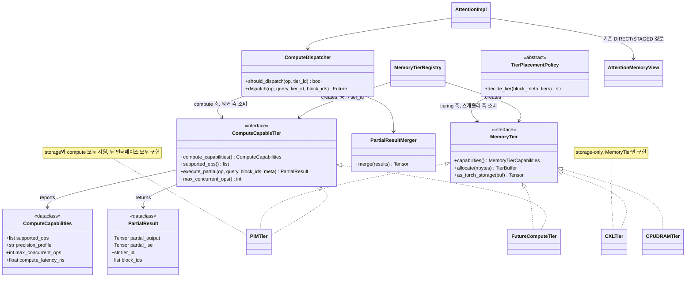
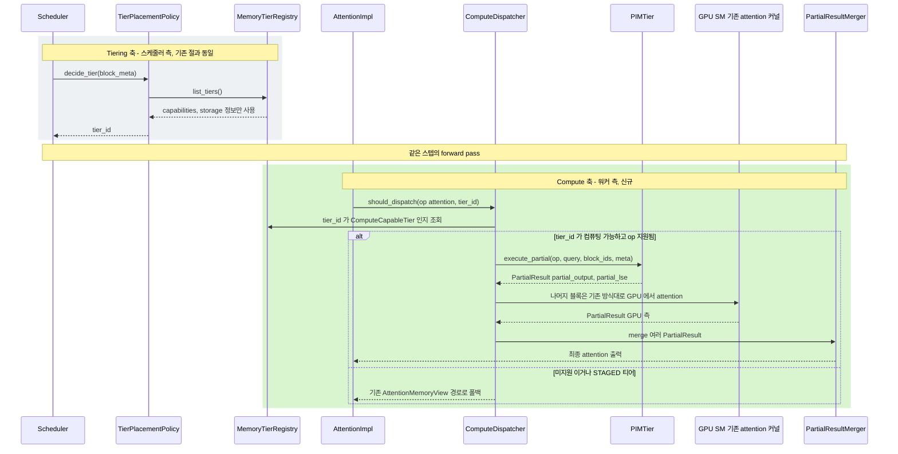
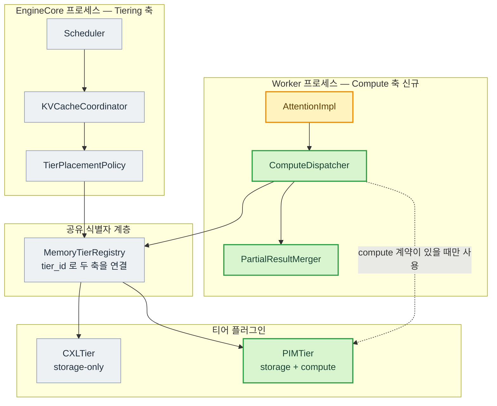
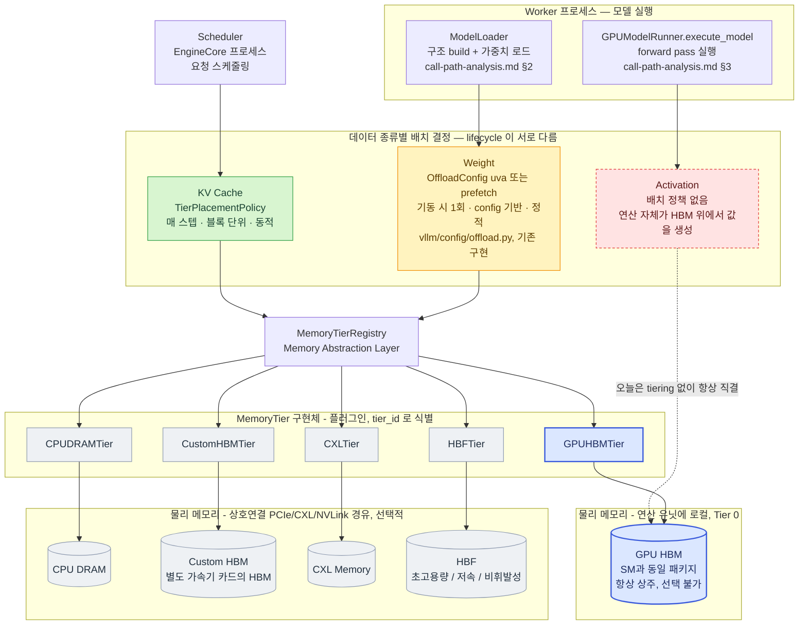

# vLLM KV Cache — 범용 메모리 추상화 레이어(MAL) 설계

> 선행 문서: `doc-mk/vllm-kv-cache-analysis.md` (현재 구조), `doc-mk/vllm-kv-cache-memory-tiering.md`
> (CXL 한정 옵션 A/B 분석)
>
> 이전 문서의 "옵션 B"는 CXL 하나를 염두에 두고 `TierAllocator`를 제안했습니다. 이번
> 문서는 이를 일반화합니다: **CXL이든, custom HBM이든, 향후 등장할 어떤 새 메모리든
> 코어 로직이 그 정체를 몰라도 되도록** 하는 **범용 Memory Abstraction Layer(MAL)**를
> 설계하고, class/sequence/component/deployment 다이어그램으로 표현합니다. 마지막에
> 이 설계가 실제로 부딪히는 제약을 정리합니다.

## 0. 설계 목표 재정의

기존 옵션 A(오프로드 커넥터 복제)와 옵션 B(CXL 전용 `TierAllocator`)는 "CXL이라는
특정 대상"을 기준으로 설계했습니다. 이번 요구사항은 다릅니다 — **메모리 종류가
무엇이든 상위 계층(스케줄러, KVCacheManager, attention 백엔드)이 "티어 A/B/C"로만
인지하고, 그 정체(CXL/CPU/custom HBM/향후 미지의 메모리)는 오직 플러그인 구현체
내부에만 존재**해야 합니다.

핵심 통찰: **옵션 A와 옵션 B는 사실 "같은 스펙트럼의 양 끝"입니다.**

- 옵션 A(오프로드) = 메모리가 GPU에서 직접 접근 불가능해서 매번 GPU로 복사해야 하는 경우
- 옵션 B(1급 승격) = 메모리가 GPU에서 직접 접근 가능해서 attention 커널이 바로 gather할 수 있는 경우

MAL은 이 둘을 **하나의 인터페이스 + 능력치(capability) 기반 자동 분기**로 통합합니다.
새 메모리 플러그인은 자신의 능력치만 선언하면, 프레임워크가 DIRECT(직접 gather)
모드로 편입시킬지 STAGED(오프로드) 모드로 편입시킬지 자동으로 결정합니다.

```
                    ┌─────────────────────────────┐
                    │   Memory Abstraction Layer   │
                    │  (모든 티어를 동일 인터페이스로) │
                    └──────────────┬───────────────┘
                                   │  capability 선언에 따라 자동 분기
                    ┌──────────────┴───────────────┐
                    ▼                               ▼
         DIRECT 모드                          STAGED 모드
    (attention 커널이 직접 gather)         (async 오프로드 후 GPU에서 연산)
    예: 미래의 GPU-coherent 신형 메모리      예: 현재의 CXL/CPU DRAM (P2P 미지원 시)
    → doc-3의 "옵션 B" 경로                 → doc-3의 "옵션 A" 경로
```

이미 존재하는 근거: `OffloadingSpecFactory.create_spec()`
(`vllm/v1/kv_offload/factory.py:32-52`)은 `spec_name`이 내장 레지스트리에 없으면
`spec_module_path`로 **완전히 vLLM 트리 밖의 임의 모듈을 동적 import**해서 씁니다.
즉 "새 메모리 벤더가 별도 pip 패키지로 자체 구현을 배포하고 vLLM 코드는 한 줄도 안
건드린다"는 패턴은 이미 검증되어 있습니다. MAL은 이 패턴을 STAGED 모드뿐 아니라
DIRECT 모드까지 일관되게 확장하는 설계입니다.

---

## 1. UML Class Diagram — MAL 핵심 인터페이스



### 핵심 설계 결정

- **`MemoryTierCapabilities`가 유일한 "정체 노출 지점"**입니다. `gpu_direct_access`,
  `cache_coherent` 두 플래그가 DIRECT/STAGED 모드를 가르는 기준입니다.
- **`TieredBlockTable`은 기존 `MultiGroupBlockTable`을 확장**합니다 — §7(하이브리드
  attention-type 그룹)에서 이미 "그룹별로 다른 block table"을 다루는 메커니즘이
  존재하므로, "그룹"의 정의에 "attention 타입"뿐 아니라 "티어"까지 포함하도록
  일반화하는 것이 자연스러운 재사용 경로입니다.
- **`AttentionMemoryView`가 attention 백엔드와 MAL 사이의 유일한 접점**입니다.
  attention 구현체는 `gather_mode()`가 `DIRECT`면 `get_base_ptrs()`로 여러 텐서를
  받아 직접 커널에 넘기고, `STAGED`면 `materialize_to_gpu()`를 먼저 await한 뒤
  평소처럼 GPU 텐서 하나만 다룹니다 — **백엔드 코드가 몰라도 되는 부분은 "어느
  티어인지"뿐, "직접 갈지 복사해서 갈지"는 알아야 함**이 이 설계의 현실적 한계입니다
  (§5의 제약 4 참고).

---

## 2. UML Sequence Diagram

### 2.1 시작 시점 — 티어 디스커버리 & 능력치 협상



### 2.2 런타임 — 블록 배치 결정 + Attention Gather

```mermaid
sequenceDiagram
    participant SCHED as Scheduler
    participant POLICY as TierPlacementPolicy
    participant BT as TieredBlockTable
    participant AMV as AttentionMemoryView
    participant ATTN as AttentionImpl (백엔드)
    participant DIRT as DIRECT 티어 (예: CustomHBM)
    participant STGT as STAGED 티어 (예: CXL)

    SCHED->>POLICY: decide_tier(block_meta, access_stats)
    POLICY-->>SCHED: tier_id (access 빈도/레이턴시 기준)
    SCHED->>BT: append_row(tier_id, block_ids, row)

    Note over SCHED,ATTN: forward pass 시작
    ATTN->>AMV: gather_mode(tier_ids_in_batch)
    alt 배치 내 티어가 모두 DIRECT
        AMV-->>ATTN: DIRECT
        ATTN->>AMV: get_base_ptrs(tier_ids)
        AMV-->>ATTN: {gpu: ptr0, custom_hbm: ptr1}
        ATTN->>DIRT: 커널이 직접 gather (P2P 접근)
        ATTN->>ATTN: 부분합 병합 (online softmax)
    else 배치 내 STAGED 티어 포함
        AMV-->>ATTN: STAGED
        ATTN->>AMV: materialize_to_gpu(tier_id, block_ids)
        AMV->>STGT: copy_out(...) 비동기 요청
        STGT-->>AMV: Future (GPU 버퍼로 복사 완료)
        AMV-->>ATTN: GPU 텐서 준비 완료
        ATTN->>ATTN: 기존과 동일한 단일-풀 gather
    end
```



**중요한 관찰**: 같은 배치 안에 DIRECT 티어 블록과 STAGED 티어 블록이 섞이면
(예: 어떤 요청은 GPU+CustomHBM만 쓰고, 다른 요청은 CXL도 걸침) attention 커널
호출 한 번으로 처리할 수 없고 분리 실행 후 병합해야 합니다. 이는 배치 구성 자체에
새로운 제약을 만듭니다 (§5의 제약 5).

---

## 3. UML Component Diagram — 통합 아키텍처

```mermaid
graph TB
    subgraph SCHED_LAYER["스케줄러 계층 (변경 최소)"]
        SCHEDULER["Scheduler"]
        KVMGR["KVCacheManager"]
    end

    subgraph MAL["🟢 Memory Abstraction Layer (신규)"]
        REGISTRY["MemoryTierRegistry<br/>(플러그인 디스커버리 + 팩토리)"]
        PLACEMENT["TierPlacementPolicy<br/>(DIRECT/STAGED 자동 분기)"]
        COORD_EXT["KVCacheCoordinator 확장<br/>(TieredKVCacheConfig 생성)"]
        AMV["AttentionMemoryView<br/>(백엔드용 게이트웨이)"]
    end

    subgraph PLUGINS["티어 플러그인 (각각 독립 배포 가능한 패키지)"]
        GPUTIER["GPUHBMTier<br/>(vLLM 내장, 기존 로직 이관)"]
        CXLTIER["CXLTier<br/>(외부 패키지 예시)"]
        HBMTIER["CustomHBMTier<br/>(외부 패키지 예시)"]
        FUTURETIER["??? Tier<br/>(미지의 향후 메모리)"]
    end

    subgraph FALLBACK["STAGED 모드 실행 엔진 (기존 코드 재사용)"]
        OFFLOADCONN["기존 OffloadingConnector 인프라<br/>(job queue, LRU/ARC eviction,<br/>비동기 전송 — 그대로 재사용)"]
    end

    subgraph WORKER_LAYER["Worker 계층 (attention 백엔드만 확장)"]
        BLOCKTABLE["TieredBlockTable"]
        ATTNBACKEND["AttentionImpl<br/>(백엔드별 DIRECT gather 지원 여부 상이)"]
    end

    SCHEDULER --> KVMGR --> COORD_EXT
    COORD_EXT --> PLACEMENT
    PLACEMENT --> REGISTRY
    REGISTRY --> GPUTIER
    REGISTRY -. "entry_points 로드<br/>(vllm 트리 밖 패키지)" .-> CXLTIER
    REGISTRY -. "entry_points 로드<br/>(vllm 트리 밖 패키지)" .-> HBMTIER
    REGISTRY -. "동일 인터페이스" .-> FUTURETIER

    PLACEMENT -- "DIRECT 확정" --> BLOCKTABLE
    PLACEMENT -- "STAGED 확정" --> OFFLOADCONN

    BLOCKTABLE --> AMV
    AMV --> ATTNBACKEND
    AMV -. "STAGED 티어는 여기로 위임" .-> OFFLOADCONN

    classDef existingBox fill:#eef1f4,stroke:#8d99ae,color:#22303e,stroke-width:1px;
    classDef newBox fill:#d8f5d0,stroke:#2f9e44,color:#1b4332,stroke-width:2px;
    classDef modifiedBox fill:#fff3bf,stroke:#f08c00,color:#5c3c00,stroke-width:2px;
    class SCHEDULER,KVMGR,GPUTIER,OFFLOADCONN existingBox
    class REGISTRY,PLACEMENT,AMV,CXLTIER,HBMTIER,FUTURETIER newBox
    class COORD_EXT,BLOCKTABLE,ATTNBACKEND modifiedBox
```



**이 다이어그램이 보여주는 핵심**: MAL을 도입해도 **STAGED 모드는 기존
`OffloadingConnector` 인프라를 그대로 재사용**합니다 — 완전히 새로 만드는 게 아니라
"기존 오프로드 인프라 + 새 DIRECT 경로"를 하나의 결정 지점(`TierPlacementPolicy`)
아래 통합하는 것입니다. 새 메모리(CXL, custom HBM, 미래의 무언가)는 모두 같은
`MemoryTier` 인터페이스만 구현하면 되고, `MemoryTierRegistry`가 entry_points로
vLLM 트리 밖에서 로드합니다.

---

## 4. UML Deployment Diagram — 물리 토폴로지 관점



이 다이어그램은 MAL의 `MemoryTierCapabilities`가 **정적 스펙만으로는 담아내기 어려운
것**을 보여줍니다: CXL 풀이 다른 GPU/노드와 공유되면 실측 레이턴시가 "현재 경합 상태"에
따라 달라지고, 이는 티어 하나에 고정된 `read_latency_ns` 값으로는 표현이 안 됩니다.

---

## 5. 제약사항 (Constraints)

### 5.1 GPU 직접 주소 지정 가능성 — DIRECT 모드의 진짜 관문

`gpu_direct_access` 플래그 하나로 추상화했지만, 실제로는 하드웨어/프로토콜 수준의
문제입니다. attention 커널이 어떤 메모리를 gather하려면 그 메모리가 **GPU의 가상
주소공간에 매핑**되어 있어야 합니다 (P2P DMA, UVA, 혹은 `cudaHostRegister`류
메커니즘). CXL.mem은 CXL 3.0의 P2P 기능이나 하드웨어 지원 여부에 따라 가능/불가능이
갈리고, custom HBM 가속기는 애초에 별도 주소공간을 쓰는 경우가 많습니다. **MAL은
이 판단을 캡슐화할 뿐 문제 자체를 없애지 못합니다** — capability가 `False`인 티어는
항상 STAGED로 강등되고, DIRECT 모드가 주는 "유효 KV 용량 확장" 이점을 못 누립니다.

### 5.2 PyTorch 디바이스 통합 제약

새 메모리를 텐서 레벨에서 다루려면 PyTorch가 그 메모리를 "디바이스"로 인식해야
합니다 — `PrivateUse1` 백엔드 등록, 혹은 `CUDAPluggableAllocator`/`MemPool`류의
커스텀 allocator 구현이 필요합니다. 현재 vLLM의 `CuMemAllocator`
(`vllm/device_allocator/cumem.py`)도 CUDA 전용입니다. **벤더가 자체 PyTorch 백엔드를
제공하지 않으면 MAL의 인터페이스가 아무리 잘 설계돼도 `as_torch_storage()`가 `None`을
반환할 수밖에 없고, 자동으로 STAGED로 떨어집니다.**

### 5.3 캐시 일관성(coherency)

CXL.mem처럼 GPU 캐시와 일관성이 보장되지 않는 프로토콜의 경우, write 후 명시적
flush/fence가 필요합니다. `do_kv_cache_update()`가 티어마다 다른 동기화 시맨틱을
가져야 하므로, **"어떤 티어인지 몰라도 된다"는 MAL의 약속이 attention write 경로에서는
완전히 지켜지기 어렵습니다** — 최소한 "동기화 필요 여부" 플래그는 attention 백엔드까지
새어 나갑니다.

### 5.4 Attention 커널의 이종 gather는 결국 백엔드별 개별 구현

MAL이 인터페이스를 통일해도, FlashAttention/FlashInfer/Triton/MLA 등 각 attention
백엔드가 "여러 base pointer를 gather"하는 커널을 실제로 구현해야 DIRECT 모드의
이점이 실현됩니다. **추상화 계층은 이 구현 작업량을 없애주지 않고, 오히려 "어떤
백엔드가 어떤 티어 조합을 지원하는지"라는 새 호환성 매트릭스를 만들어냅니다**
(예: 백엔드 A는 GPU+CustomHBM 조합만 지원, 백엔드 B는 GPU 단독만 지원 등). 이 매트릭스
관리 자체가 새로운 유지보수 부담입니다.

### 5.5 배치 구성 제약 — 이종 티어가 섞인 배치의 실행 분기

§2.2에서 본 것처럼, 같은 스텝의 배치 안에 DIRECT 전용 요청과 STAGED 경유 요청이
섞이면 attention 커널 호출을 분리해야 합니다. 이는 continuous batching의 단순함을
깨뜨립니다 — Scheduler가 "이번 스텝에 묶을 요청들"을 고를 때 **티어 조합까지 고려한
그룹핑**을 해야 커널 호출 분기 수를 최소화할 수 있습니다. 이는 §7(하이브리드
attention-type 그룹)에서 이미 존재하는 문제(그룹별로 분리 실행)와 구조적으로
동일하지만, 티어 축이 추가되면 그룹의 조합 수가 늘어납니다.

### 5.6 레이턴시 이질성에 따른 스케줄링 불확실성

Scheduler는 지금 "블록 하나 = 균일 비용"이라는 전제로 continuous batching을
스케줄링합니다. 티어마다 레이턴시가 다르면 같은 블록 수라도 실제 스텝 시간이
달라져 스케줄링 예측이 어려워집니다. `TierPlacementPolicy`가 배치 결정을 잘해도,
**Scheduler 자체의 비용 모델(현재는 토큰 수/블록 수 기반)을 티어별 가중치까지
반영하도록 갱신하지 않으면 정확한 SLA 보장이 어렵습니다.**

### 5.7 용량/토폴로지 디스커버리 & 동적 리소스 경합

CXL은 스위치 팬아웃 구조로 여러 GPU/노드가 하나의 풀을 공유할 수 있습니다
(§4의 deployment 다이어그램). NUMA 거리, 스위치 홉 수, 다른 GPU와의 대역폭 경합까지
고려해야 정확한 배치가 가능한데, `MemoryTierCapabilities`의 정적 필드(단일
`read_latency_ns` 숫자)만으로는 "현재 경합 상태에 따라 달라지는 실측 레이턴시"를
표현할 수 없습니다. 실사용에는 **정적 capability 선언 + 동적 프로빙/모니터링을
결합한 2단계 설계**가 필요합니다 — 이는 초기 MAL 설계 범위를 넘어서는 추가 작업입니다.

### 5.8 장애/핫플러그 대응

새 메모리 계층은 GPU HBM과 다른 장애 도메인을 가집니다 (디바이스 hot-unplug, ECC
오류, 링크 flap). MAL은 "이 티어가 갑자기 사라지면 그 안의 블록들을 어떻게 할지"에
대한 정책을 새로 정의해야 합니다 (해당 블록을 가진 요청을 recompute 시킬지, 다른
티어로 우선 강등할지 등). **기존 코드는 이런 시나리오를 아예 고려하지 않습니다** —
지금은 "GPU가 사라지면 프로세스 자체가 죽는다"가 암묵적 전제입니다.

### 5.9 외부 벤더 확장성은 STAGED 모드에서만 "설치만 하면 끝"

`OffloadingSpecFactory.create_spec()`의 `spec_module_path` 동적 import
(§0 참고)를 그대로 `MemoryTierRegistry`에 재사용하면, **STAGED 모드로만 동작하는
새 메모리는 vLLM 코드를 한 줄도 안 건드리고 별도 pip 패키지로 배포/설치**할 수
있습니다 — 이미 검증된 패턴이라 리스크가 낮습니다. 하지만 **DIRECT 모드로 편입되길
원하는 벤더는 §5.4의 attention 백엔드 커널까지 손대야 하므로, "플러그인 설치만으로
끝"이 되는 건 STAGED 모드뿐**입니다. 이 비대칭성을 벤더/사용자에게 명확히
전달해야 기대치 관리가 됩니다.

---

## 6. 요약 — MAL 도입으로 정말 달라지는 것

| | MAL 이전 (doc-3의 옵션 A/B 각각 별도 구현) | MAL 이후 |
|---|---|---|
| 새 메모리 추가 시 | CXL 전용 코드, custom HBM 전용 코드가 서로 다른 패턴으로 존재 | 동일한 `MemoryTier` 인터페이스 구현 + capability 선언만 하면 됨 |
| DIRECT vs STAGED 선택 | 설계 시점에 사람이 미리 결정 (옵션 A로 갈지 B로 갈지) | 런타임에 capability 기반 자동 분기 |
| 기존 오프로드 인프라 | 옵션 B에서는 재사용 안 됨 (완전 별개 경로) | STAGED 모드의 실행 엔진으로 그대로 재사용 |
| 벤더 확장성 | 벤더가 vLLM 코어를 이해하고 침투적으로 수정해야 함 | STAGED는 순수 플러그인, DIRECT는 백엔드 커널 작업만 추가 |
| 근본 제약(§5.1~5.8) | 옵션 B에서도 동일하게 존재했음 | **사라지지 않음** — MAL은 이 제약들을 "선언적으로 관리 가능하게" 만들 뿐, 하드웨어/커널 수준 문제 자체를 없애지는 못함 |

**결론**: MAL은 "새 메모리를 추가하는 절차"를 표준화하고 기존 오프로드 인프라를
재사용 가능하게 만드는 실질적 가치가 있지만, §5의 제약들은 추상화 레이어의
존재 여부와 무관하게 하드웨어/PyTorch 생태계 수준에서 풀어야 하는 문제로 남습니다.
즉 MAL은 **"엔지니어링 조직화 도구"**에 가깝고, **"성능/호환성 문제 자체의
해결책"은 아닙니다.**

---

## 7. 옵션 C — Compute-in-Memory(PIM) 확장: Tiering과 Compute를 분리된 축으로

§1~§6은 "데이터를 어디에 둘지"(tiering)만 다뤘습니다. CXL/custom HBM 중에는 자체
연산 능력을 가진(PIM, near-memory compute) 디바이스도 있을 수 있는데, 이건 "어디서
계산할지"라는 **별개의 축**입니다. 이 절은 두 축을 하나의 설계 포인트에 억지로
합치지 않고, **얇은 공통 베이스 + 두 개의 독립된 확장 인터페이스**로 분리하는
설계를 제시합니다.

### 7.1 설계 원칙

- **Tiering 축**은 스케줄러(EngineCore 프로세스)가 소비합니다 — "이 블록을 어느
  메모리에 둘까"는 `TierPlacementPolicy`가 결정하고, 이 결정에는 저장 용량/레이턴시/
  대역폭 정보만 있으면 됩니다.
- **Compute 축**은 워커(Worker 프로세스)가 소비합니다 — "이 연산을 어디서 실행할까"는
  attention forward pass 시점에 `ComputeDispatcher`가 결정하고, 이 결정에는 지원
  연산 종류/정밀도/동시 실행 슬롯 정보가 필요합니다.
- 두 축은 완전히 독립된 인터페이스(`MemoryTier` / `ComputeCapableTier`)로
  분리하되, **같은 `tier_id`를 공유**해서 정합성을 보장합니다. 순수 저장 전용
  디바이스는 `MemoryTier`만 구현하고, PIM처럼 저장+연산을 겸하는 디바이스는 두
  인터페이스를 모두 구현합니다 (Interface Segregation).
- 이 분리는 vLLM이 이미 갖고 있는 **스케줄러/워커 프로세스 경계**와 정확히
  일치합니다 (`doc-mk/vllm-call-path-analysis.md` §3) — 새로운 구조를 발명하는 게
  아니라 기존 경계에 두 축을 각각 얹는 것입니다.

### 7.2 UML Class Diagram — 두 인터페이스의 분리와 결합



`MemoryTierRegistry`가 **같은 `tier_id`로 두 인터페이스를 모두 생성**한다는 점이
핵심입니다 — `TierPlacementPolicy`와 `ComputeDispatcher`는 서로의 존재를 몰라도
되지만, 둘 다 같은 레지스트리를 참조하므로 "이 블록이 지금 어느 티어에 있는지"와
"그 티어가 연산도 할 수 있는지"가 항상 같은 진실 소스에서 나옵니다.

### 7.3 UML Sequence Diagram — 두 축이 같은 스텝 안에서 독립적으로 흐름



회색 블록(Tiering)과 초록 블록(Compute)이 **완전히 독립된 컴포넌트 조합으로
실행**되지만, 같은 스텝 안에서 순서대로 일어난다는 걸 보여줍니다. `ComputeDispatcher`가
연산을 못 위임할 상황이면 §2.2에서 이미 설계한 기존 DIRECT/STAGED 경로로 그냥
폴백합니다 — Compute 축이 없어도 Tiering 축만으로 시스템이 정상 동작한다는 뜻이고,
이게 두 축을 분리한 실질적 이득입니다.

### 7.4 UML Component Diagram — 두 축과 공유 식별자



### 7.5 축별 소유권 정리

| | Tiering 축 | Compute 축 |
|---|---|---|
| 소비 주체 | `Scheduler` (EngineCore 프로세스) | `AttentionImpl` (Worker 프로세스) |
| 트리거 시점 | 블록 할당 시 (`allocate_slots`) | forward pass 매 스텝 |
| 핵심 클래스 | `TierPlacementPolicy`, `KVCacheCoordinator` | `ComputeDispatcher`, `PartialResultMerger` |
| 필요한 capability | 용량/레이턴시/대역폭/coherency | 지원 연산/정밀도/동시 슬롯 수 |
| 실패 시 동작 | 다른 티어로 재배치 또는 recompute | 즉시 GPU SM 폴백 (§2.2 경로 재사용) |
| 순수 storage 티어의 참여 | O (항상) | X (구현 안 하면 자동 제외) |

### 7.6 Compute 축에서만 새로 생기는 제약 (§5의 9가지에 추가)

- **실행 단위 불일치**: PIM 디바이스가 처리 가능한 연산 단위(예: 고정 크기 배치,
  특정 시퀀스 길이)가 PagedAttention의 블록 단위와 정확히 맞아떨어지지 않을 수
  있음 — `execute_partial()`이 내부적으로 재정렬/패딩을 해야 할 수 있습니다.
- **이기종 수치 정밀도 정합성**: `PartialResultMerger`가 online-softmax 방식으로
  GPU 결과와 PIM 결과를 병합하려면, 두 연산 유닛의 accumulation 순서/정밀도가
  호환되어야 합니다 — 그렇지 않으면 병합 결과가 GPU 단독 연산과 미묘하게 달라질 수
  있습니다.
- **벤더 고유 ISA/커널 이식성**: `execute_partial()`의 실제 구현은 PIM 벤더의
  고유 프로그래밍 모델에 묶이므로, `supported_ops()` 목록 자체가 벤더마다 크게
  다를 수 있습니다.
- **동시 실행 슬롯 제한에 따른 큐잉**: `max_concurrent_ops`를 넘는 요청이 몰리면
  `ComputeDispatcher`가 자체적으로 큐잉/공정성 정책을 가져야 하는데, 이는 이미
  존재하는 Scheduler의 continuous batching 큐와는 별개의 새 큐입니다 — 두 큐
  사이의 우선순위 상호작용을 설계해야 합니다.
- **연산 실패라는 새로운 실패 모드**: 기존 §5.8은 "티어가 사라지면 데이터를
  잃는다"는 저장 실패만 다뤘습니다. Compute 축에서는 "디바이스는 살아있지만 연산이
  타임아웃/에러로 실패"하는 상황이 새로 생기고, 이때는 데이터 재구성이 아니라
  **해당 부분 연산만 즉시 GPU로 재실행**하는 폴백이 필요합니다.
- **관측성/디버깅 난이도 증가**: 하나의 attention 호출이 GPU와 PIM 두 개의 독립
  서브시스템에 걸쳐 실행되므로, end-to-end 레이턴시 프로파일링과 정확도 회귀
  디버깅이 단일 커널 호출보다 복잡해집니다.

---

## 8. 메모리 관리 관점의 통합 Module View — KV Cache + Weight + Activation

이전 버전의 이 절은 KV cache만 다뤘습니다. vLLM이 관리하는 GPU 메모리는 실제로는
**세 종류**입니다 — weight(가중치, 정적), KV cache(요청별, 동적, 스텝 간 유지),
activation(레이어 중간값, 순간적, 스텝 내에서만 존재). 아래 다이어그램은 상위
모듈을 Scheduler 하나가 아니라 **Scheduler(요청 스케줄링) + ModelLoader(가중치
로드) + GPUModelRunner(forward 실행)** 셋으로 시작해서, 세 데이터 종류가 각자
다른 배치 결정 경로를 거쳐 같은 물리 메모리 계층으로 수렴하는 구조를 보여줍니다.



### 8.1 왜 세 종류가 같은 정책을 못 쓰는가

세 데이터 종류는 lifecycle이 완전히 달라서, §7에서 tiering 축과 compute 축을
분리했던 것과 같은 이유로 **배치 결정 로직도 분리해야 합니다** — 다만 물리
계층(`MemoryTierRegistry` 아래)은 공유할 수 있습니다.

| | Weight | KV Cache | Activation |
|---|---|---|---|
| 생성 시점 | 엔진 기동 시 1회 | 요청마다, 토큰 생성될 때마다 | 매 forward pass, 레이어마다 |
| 존속 기간 | 프로세스 수명 전체 | 요청 종료까지 (초~분) | 커널 호출 하나 (μs~ms) |
| 결정 주체 | `ModelLoader`/config (정적) | `Scheduler`/`TierPlacementPolicy` (동적) | 사실상 없음 — PyTorch/CUDA 컴파일러 |
| 오늘 vLLM의 실제 구현 | `OffloadConfig` (uva/prefetch), MAL과 별개의 기존 코드 경로 | §1~§8의 MAL 설계 대상 | 오프로드 메커니즘 없음 |
| MAL로 통합 가능성 | 가능 — `WPOLICY`를 `MemoryTierRegistry`에 연결하는 어댑터만 있으면 됨 | 이미 설계됨 | 어려움 — activation offload/recompute는 KV cache 페이징과 근본적으로 다른 메커니즘(체크포인팅류) 필요 |

**결론**: 다이어그램에서 KV cache와 weight는 각자의 정책(`KVPOLICY`/`WPOLICY`)을
거쳐 같은 `MemoryTierRegistry`로 수렴하도록 그렸습니다 — 이건 실제로 타당한
통합입니다. 반면 activation은 점선으로 HBM에 직결시켰습니다 — 오늘 vLLM에는
activation을 다른 티어로 옮기는 메커니즘이 없고, 있다 해도 "블록 단위 페이징"이
아니라 "특정 중간 텐서를 다시 계산하거나 잠깐 다른 곳에 치워뒀다 가져오는" 전혀
다른 접근(activation checkpointing/recompute)이 필요하므로, 지금 설계한
`MemoryTier`/`TierPlacementPolicy` 인터페이스를 그대로 재사용하기 어렵습니다.

### 8.2 검토 — GPU HBM을 이 자리에 두는 게 맞는가

**결론: 리스트에 넣는 것 자체는 맞지만, "동급 선택지"로 나열하면 오해가 생깁니다.**
위 다이어그램에서 GPU HBM만 파란색(로컬)으로, 나머지 넷은 회색(원격)으로 구분한
이유가 이것입니다.

- **플러그인 관점에서는 맞습니다**: `MemoryTierRegistry` 입장에서 GPU HBM도 결국
  `GPUHBMTier`라는 하나의 `MemoryTier` 구현체로 등록되고, 다른 플러그인과 동일한
  인터페이스로 다뤄집니다 — §1의 class diagram에서도 `GPUHBMTier`를 `CXLTier` 등과
  나란히 그렸습니다. 이 자체는 일관성이 있습니다.
- **하지만 위상이 다릅니다**: GPU HBM은 attention/MLP 커널을 실행하는 SM과
  **물리적으로 같은 패키지**에 있는 유일한 메모리입니다. 나머지 넷(CPU DRAM,
  Custom HBM, CXL, HBF)은 전부 PCIe/CXL/NVLink 같은 **상호연결(interconnect)을
  거쳐야 도달 가능**한 메모리입니다. 이 차이가 바로 §5.1(GPU 직접 주소 지정
  가능성)과 §5.3(캐시 일관성)에서 다룬 `gpu_direct_access`/`cache_coherent`
  capability 축이 애초에 왜 필요했는지의 근원입니다 — "메모리 기술 이름"이 아니라
  "연산 유닛으로부터의 물리적 거리"가 DIRECT/STAGED를 가르는 진짜 기준입니다.
- **연산 시점 원칙과 그 예외**: activation과 (오늘의) KV cache는 "연산 시점엔
  반드시 HBM에 있다"는 원칙에서 벗어나지 않습니다. 하지만 **weight는 이미 예외가
  있습니다** — `UVAOffloadConfig`(`vllm/config/offload.py:16-32`)는 가중치를 HBM에
  미리 복사하지 않고, forward pass 시점에 CPU pinned memory를 UVA로 zero-copy
  접근합니다. 이게 바로 이 문서에서 설계한 "DIRECT 모드"(§0, §1)가 이미 vLLM에
  실제로 존재하는 사례입니다 — 다만 KV cache가 아니라 weight에 대해서만.
  (`PrefetchOffloadConfig`는 반대로 레이어를 미리 HBM에 복사해두는 방식이라
  "연산 시점엔 HBM에 있다" 원칙을 그대로 따릅니다 — STAGED 모드에 해당합니다.)
- **실무적 함의**: GPU HBM은 "선택 가능한 티어 중 하나"가 아니라, 최소한 일부
  데이터는 반드시 여기 있어야(activation은 전부, KV cache/weight는 최소 일부)
  연산 자체가 성립하는 **필수 baseline**입니다. 나머지 넷은 순수하게 optional한
  확장입니다. 그래서 module view에서 GPU HBM을 별도 그룹(로컬/Tier 0)으로
  분리하고, 나머지를 "원격" 그룹으로 묶는 편이 구조적으로 더 정확합니다.
- **"Custom HBM" 이름에 대한 참고**: 만약 이게 GPU 자신의 온보드 메모리가 아니라
  "다른 가속기 카드에 달린 HBM"을 의미한다면(일반적으로 그렇게 해석됩니다), 기술
  이름은 똑같이 "HBM"이어도 토폴로지상으로는 CXL-memory/HBF와 같은 **원격** 범주에
  속합니다. **분류 기준은 메모리 기술 이름이 아니라 연산 유닛으로부터의 위치**여야
  한다는 걸 보여주는 좋은 예시입니다.
- **HBF에 대한 참고**: HBF(HBM 인터포저 위에 NAND 플래시를 얹은 초고용량·비휘발성
  메모리)는 원격 그룹 안에서도 가장 STAGED 쪽에 가까울 가능성이 높습니다 — 용량은
  압도적으로 크지만 레이턴시가 CXL보다도 느릴 것으로 예상되어, DIRECT 모드보다는
  "콜드 티어" 역할(§1의 `CPUDRAMTier`보다 한 단계 더 차가운 계층)에 적합합니다.

요약하면, **다이어그램에 GPU HBM을 포함하는 것은 맞지만, 다른 4개와 나란히 한 줄로
그리기보다는 "로컬(필수, Tier 0)" vs "원격(선택적, Tier 1+)"이라는 두 그룹으로
나눠 그리는 게 이 시스템의 실제 제약을 더 정확히 반영합니다. Weight까지 포함해서
보면 이 구분이 더 뚜렷해집니다 — weight는 DIRECT(UVA)/STAGED(prefetch) 두 모드를
이미 실제로 오가고 있고, activation은 애초에 원격 티어라는 선택지 자체가 없습니다.**

---

## 9. 관련 문서

- `doc-mk/vllm-call-path-analysis.md` — 요청 처리 전체 call path (스케줄러/워커
  프로세스 경계의 근거)
- `doc-mk/vllm-kv-cache-analysis.md` — 현재 KV cache 구조 상세
- `doc-mk/vllm-kv-cache-memory-tiering.md` — CXL 한정 옵션 A/B (§1~§6이 이 둘을
  하나의 프레임워크로 통합/일반화, §7이 Compute-in-Memory 축을 추가로 분리)
