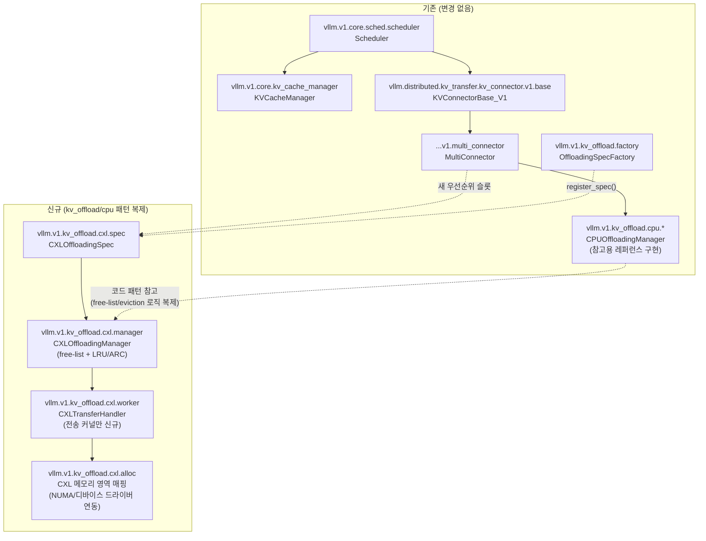
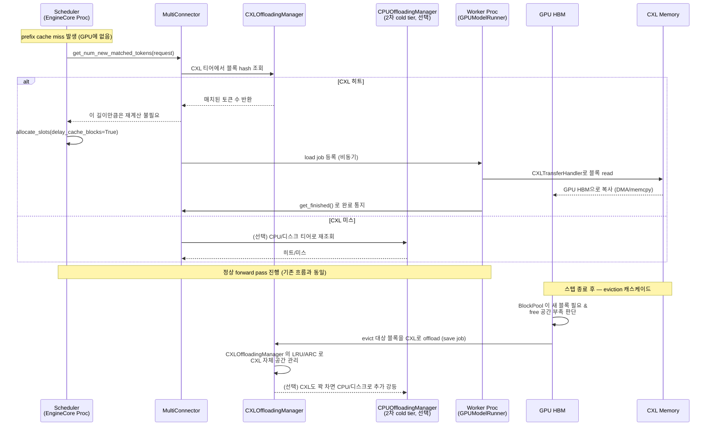
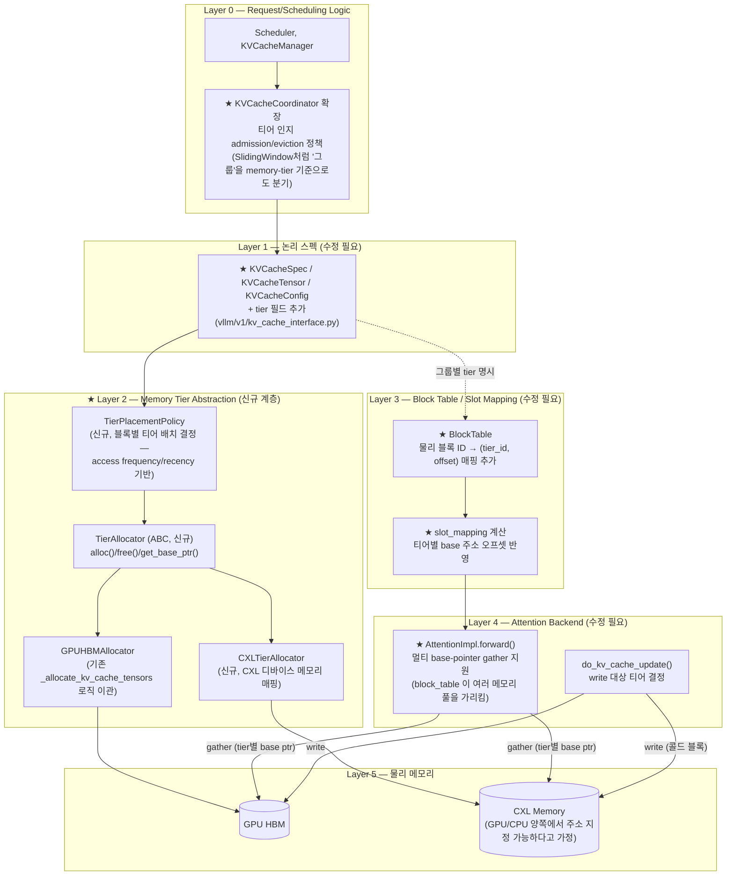
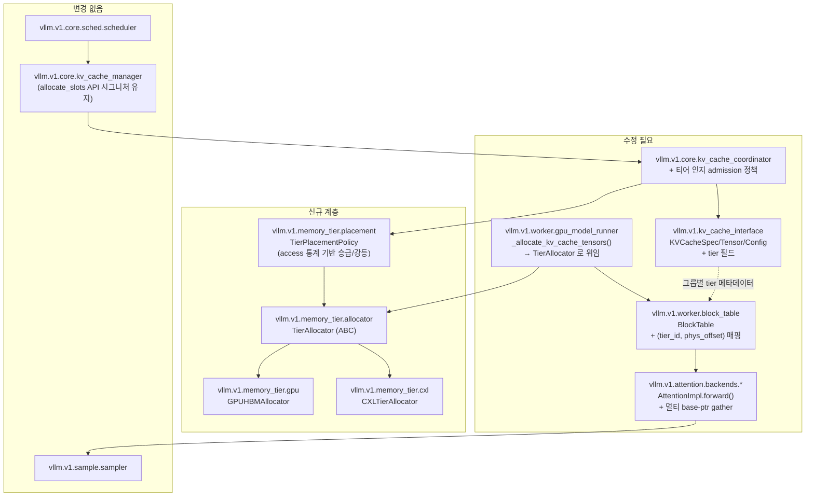
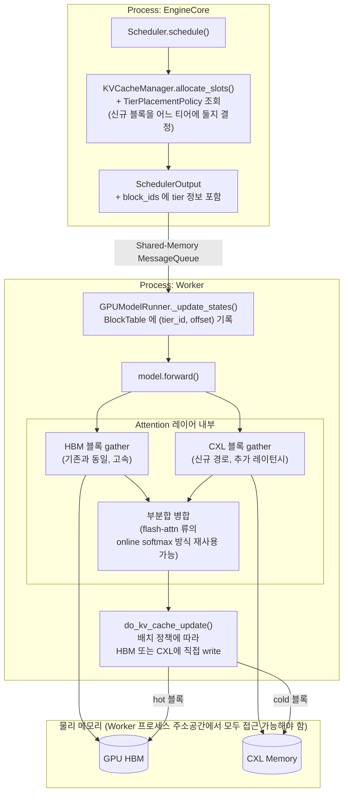

# vLLM KV Cache — 신규 메모리 계층(CXL 등) 통합 설계 분석

> 선행 문서: `doc-mk/vllm-call-path-analysis.md` (전체 call path),
> `doc-mk/vllm-kv-cache-analysis.md` (KV cache 현재 구조 상세 분석)
>
> 본 문서는 위 두 문서에서 확인한 **현재 구조가 CPU DRAM을 오직 "오프로드 대상"으로만
> 다루고, GPU가 KV cache의 유일한 1급(primary) 저장소**라는 사실을 출발점으로 삼아,
> CXL memory(또는 그에 준하는 새로운 메모리 계층)를 vLLM에 통합할 때 구조가 어떻게
> 바뀔 수 있는지를 **두 가지 설계 옵션**으로 분석합니다.

## 0. 전제 — 현재 구조 요약

`vllm-kv-cache-analysis.md`에서 확인한 사실 중 본 설계에 직결되는 부분만 다시 정리합니다.

- **디바이스 바인딩은 시스템 전체에서 단 한 곳**: `GPUModelRunner._allocate_kv_cache_tensors()`
  (`vllm/v1/worker/gpu_model_runner.py:6580`)가 `torch.zeros(size, device=self.device)`로
  KV cache의 주 텐서를 만듦. `self.device`는 워커 생성 시 정해지는 단일 값.
- **논리 계층(`vllm/v1/kv_cache_interface.py`, `vllm/v1/core/kv_cache_utils.py`)은
  디바이스 개념이 아예 없음** — 블록 크기/바이트 수/그룹 정보만 다루는 순수 메타데이터.
  이 덕분에 `SimpleCPUOffloadConnector`가 같은 `KVCacheConfig`/`KVCacheCoordinator`/
  `BlockPool` 클래스를 CPU용으로 재사용할 수 있었음.
- **CPU DRAM은 3가지 독립 구현으로 이미 "오프로드 대상"**: `OffloadingConnector`
  (`vllm/v1/kv_offload/cpu/*`, job 기반 비동기 + LRU/ARC), `SimpleCPUOffloadConnector`
  (`vllm/v1/simple_kv_offload/*`, BlockPool 재사용), `LMCacheConnectorV1`(외부 패키지
  위임). 모두 `KVConnectorBase_V1` 인터페이스의 플러그인.
- **attention 커널은 GPU 텐서만 직접 참조**함 (`FlashAttentionImpl.forward()`의
  `block_table`은 언제나 GPU 상주 텐서를 가리킴). CPU/오프로드 계층 데이터는 연산
  직전 반드시 GPU로 복사되어야 함 — "이종 메모리 직접 참조"는 현재 불가능.

이 전제 위에서, CXL 통합은 목적에 따라 근본적으로 다른 두 갈래로 나뉩니다.

| | **옵션 A — 오프로드 티어로 추가** | **옵션 B — 1급 메모리로 승격** |
|---|---|---|
| CXL의 역할 | GPU HBM ↔ CPU DRAM 사이(또는 CPU DRAM 대체) 오프로드 대상 | attention 커널이 block table로 직접 gather하는 대상 |
| 재사용 범위 | 기존 `KVConnectorBase_V1` 플러그인 구조 그대로 | 코어 할당/블록테이블/attention 백엔드까지 수정 |
| 리스크/난이도 | 낮음 — 격리된 추가 | 높음 — PagedAttention의 "균일 레이턴시 단일 풀" 전제를 깨는 근본 변경 |

두 옵션 모두 아래에서 module view / component view / layered architecture로 분석합니다.

---

## 1. 옵션 A — CXL을 오프로드 티어로 추가

### 1.1 설계 개요

기존 `OffloadingConnector` + `vllm/v1/kv_offload/cpu/*` 패턴을 그대로 모방해
`vllm/v1/kv_offload/cxl/*`를 새로 만듭니다. 스케줄러 측 job 생성/prefix lookup,
LRU/ARC eviction 정책, 비동기 완료 추적(`get_finished`) 로직은 **한 줄도 바꾸지 않고**
재사용하고, 오직 (1) 블록 풀이 할당되는 메모리 영역과 (2) GPU↔CXL 데이터 이동 커널만
CXL의 물리적 특성에 맞게 교체합니다.

### 1.2 Layered Architecture

```mermaid
graph TB
    subgraph L0["Layer 0 — Request/Scheduling Logic (변경 없음)"]
        L0A["Scheduler, KVCacheManager,<br/>KVCacheCoordinator (GPU 전용, 그대로)"]
    end

    subgraph L1["Layer 1 — KV Connector 확장 포인트 (기존 인터페이스 재사용)"]
        L1A["KVConnectorBase_V1<br/>(스케줄러 훅 + 워커 훅, 변경 없음)"]
        L1B["MultiConnector<br/>(여러 커넥터를 우선순위 체인으로 묶음, 변경 없음)"]
    end

    subgraph L2["Layer 2 — 오프로드 정책/부기 (신규, 기존 CPU 구현 패턴 복제)"]
        L2A["CXLOffloadingSpec<br/>(vllm/v1/kv_offload/cxl/spec.py, 신규)"]
        L2B["CXLOffloadingManager<br/>free-list + LRU/ARC eviction<br/>(cpu/manager.py 패턴 재사용)"]
    end

    subgraph L3["Layer 3 — 물리 전송 (신규, 커널만 교체)"]
        L3A["CXLTransferHandler<br/>(cpu/gpu_worker.py의<br/>SingleDirectionOffloadingHandler 패턴)"]
        L3B["CXL 메모리 매핑<br/>(NUMA-aware mmap 또는<br/>CXL.mem 디바이스 드라이버 경유)"]
    end

    subgraph L4["Layer 4 — 물리 메모리"]
        HBM[("GPU HBM<br/>(Tier 0, hot)")]
        CXLMEM[("CXL Memory<br/>(Tier 1, warm)")]
        DRAM[("CPU DRAM / Disk<br/>(Tier 2, cold, 선택적)")]
    end

    L0A --> L1A
    L1A --> L1B
    L1B -- "우선순위 1" --> L2A
    L1B -. "우선순위 2 (선택)" .-> L2B2["기존 CPUOffloadingSpec<br/>(cold tier로 강등)"]
    L2A --> L2B
    L2B --> L3A
    L3A --> L3B
    L3B --> CXLMEM
    L0A -. "직접 소유" .-> HBM
    HBM -- "evict (LRU)" --> CXLMEM
    CXLMEM -- "evict (추가 정책)" -.-> DRAM
```

**핵심 포인트**: Layer 0(스케줄러)은 CXL 존재 자체를 모릅니다. Layer 1(커넥터 인터페이스)
도 변경이 없습니다. 오직 Layer 2(정책/부기)와 Layer 3(물리 전송)만 신규 구현이 필요하며,
이는 기존 `kv_offload/cpu/*`의 클래스를 거의 그대로 복제-교체하는 수준입니다.

### 1.3 Module View



### 1.4 Component View — 런타임 계층 캐스케이드



### 1.5 필요한 변경/신규 작업 목록

| 구성요소 | 작업 |
|---|---|
| `vllm/v1/kv_offload/cxl/spec.py` (신규) | `CPUOffloadingSpec` 모방, 용량/디바이스 경로 설정을 `kv_connector_extra_config`로 노출 |
| `vllm/v1/kv_offload/cxl/manager.py` (신규) | `CPUOffloadingManager` 복제 — free-list, `LRUCachePolicy`/`ARCCachePolicy` 재사용 가능 |
| `vllm/v1/kv_offload/cxl/gpu_worker.py` (신규) | `SingleDirectionOffloadingHandler` 대응 — CXL 접근 방식(NUMA mmap, `cudaHostRegister` 유사 등록, 혹은 CXL.mem 커널 드라이버)에 맞는 전송 커널 구현 |
| `vllm/v1/kv_offload/factory.py` | `OffloadingSpecFactory.register_spec("cxl", CXLOffloadingSpec)` 한 줄 등록 |
| `Scheduler`, `KVCacheManager`, attention 백엔드 | **변경 없음** |
| 3-tier 구성 시 | `MultiConnector`로 `[CXLOffloadingSpec, CPUOffloadingSpec]` 우선순위 체이닝 (기존 클래스 조합만으로 가능한지는 `MultiConnector`의 fan-out 순서/정책 구현을 추가 검증 필요) |

**리스크**: 없음에 가까움 — 격리된 신규 모듈 추가이므로 기존 서빙 경로에 영향이 없고,
`--kv-transfer-config`로 옵트인.

---

## 2. 옵션 B — CXL을 1급(primary) 메모리로 승격

### 2.1 설계 개요

"자주 안 쓰는 블록을 필요할 때 GPU로 복사"가 아니라, **attention 커널이 CXL에 있는
블록을 (GPU로 복사하지 않고) 직접 gather**하도록 만드는 시나리오입니다. 이는 PagedAttention의
근본 전제 — "모든 물리 블록은 균일한 레이턴시를 가진 단일 메모리 풀(GPU HBM) 안에
있다" — 를 깨뜨리므로, §1과 달리 코어 계층까지 수정이 필요합니다.

### 2.2 Layered Architecture — 새 추상화 계층 도입



★ 표시가 실제 코드 변경이 필요한 지점입니다.

### 2.3 Module View



### 2.4 Component View — 런타임 흐름 (Tier-aware forward pass)



**성능상 중요한 설계 결정**: CXL 블록을 gather할 때 매 attention 호출마다 개별
레이턴시가 발생하므로, 단순히 "block_table이 CXL 주소도 가리킬 수 있게" 만드는 것만으론
부족합니다. 실제로는 (a) FlashAttention류의 online-softmax 분할 계산 구조를 활용해
HBM 블록과 CXL 블록을 **별도 커널 호출로 분리 처리 후 병합**하거나, (b) CXL 블록은
연산 시작 전 별도 prefetch 스테이지에서 미리 HBM으로 끌어와 두는(옵션 A와 유사하지만
스케줄러가 "티어"를 인지하고 미리 스케줄링) 하이브리드 방식이 현실적입니다. 완전한
"매 스텝 동적 이종 gather"는 연구 단계 수준의 난이도입니다.

### 2.5 필요한 변경 작업 목록

| 구성요소 | 변경 내용 | 난이도 |
|---|---|---|
| `vllm/v1/kv_cache_interface.py` | `KVCacheTensor`/`KVCacheConfig`에 `tier` 필드 추가, `KVCacheGroupSpec`에 tier 배치 정책 훅 | 중 |
| `vllm/v1/core/kv_cache_coordinator.py` | §7의 하이브리드 그룹 메커니즘(attention-type별 분기)을 memory-tier 축으로도 확장 — 사실상 기존 하이브리드 코디네이터 설계를 재사용 가능 | 중 |
| `vllm/v1/worker/gpu_model_runner.py` | `_allocate_kv_cache_tensors()`를 `TierAllocator` 위임 구조로 리팩터링 (현재 유일한 하드코딩 chokepoint) | 중 |
| `vllm/v1/worker/block_table.py` | `BlockTable`이 블록 ID뿐 아니라 티어 정보까지 인코딩, `compute_slot_mapping` 커널이 티어별 base 주소 오프셋 반영 | 높음 |
| `vllm/v1/attention/backends/*.py` | `AttentionImpl.forward()`/`do_kv_cache_update()`가 멀티 base-pointer를 다루도록 커널 수정 (백엔드마다 별도 작업 — FlashAttention, FlashInfer, Triton 등) | 매우 높음 |
| 신규: `vllm/v1/memory_tier/` | `TierAllocator` ABC, `GPUHBMAllocator`, `CXLTierAllocator`, `TierPlacementPolicy` | 신규 설계 |
| KV Connector 계층 | 옵션 A의 오프로드 커넥터들과 공존 가능 (승급/강등이 안 된 콜드 블록은 여전히 커넥터로 CPU/디스크까지 이어질 수 있음) | 낮음 (호환) |

**리스크**: 코어 서빙 경로(attention 커널, block table)를 직접 건드리므로 회귀 위험이
크고, 백엔드마다 별도 구현이 필요해 유지보수 비용이 급증합니다. CXL의 실제 레이턴시
특성(수백 ns~수 us 수준의 추가 지연)이 attention 커널 성능에 미치는 영향에 대한
사전 벤치마킹 없이는 설계 방향(동적 gather vs. prefetch-then-compute)을 확정하기
어렵습니다.

---

## 3. 옵션 비교 및 권장 경로

| 기준 | 옵션 A (오프로드 티어) | 옵션 B (1급 메모리) |
|---|---|---|
| 코드 변경 범위 | `kv_offload/cxl/*` 신규 모듈 1개 | `kv_cache_interface`, `block_table`, 모든 attention 백엔드 |
| 기존 서빙 경로 영향 | 없음 (옵트인 플러그인) | 있음 (코어 경로 리팩터링) |
| 구현 기간 (상대적) | 짧음 — 기존 CPU 오프로드 패턴 복제 | 김 — 백엔드별 커널 작업 + 신규 추상화 설계 |
| 성능 이득 | GPU HBM 용량 부족 시 더 많은 요청을 prefix-cache로 서빙 가능 (기존 CPU 오프로드와 동일한 이득 + 더 큰 용량/다른 레이턴시 특성) | 이론상 유효 KV 용량 자체를 확장 (스왑 없이 더 긴 컨텍스트/더 많은 동시 요청) — 단, 커널 오버헤드에 따라 이득이 상쇄될 수 있음 |
| 리스크 | 낮음 | 높음 (PagedAttention 전제를 깨는 근본 변경) |

**권장**: 단계적 접근이 합리적입니다.

1. **1단계 (옵션 A)**: `CXLOffloadingSpec`을 `OffloadingConnector`의 새 백엔드로 추가.
   기존 `CPUOffloadingManager`/`LRUCachePolicy`/`ARCCachePolicy`를 그대로 재사용하고
   전송 커널만 CXL에 맞게 구현. 기존 서빙 경로에 전혀 영향을 주지 않으면서 CXL의
   실측 레이턴시/대역폭 특성을 실제 워크로드로 검증할 수 있습니다.
2. **2단계 (측정 후 판단)**: 1단계에서 측정한 CXL 왕복 레이턴시가 attention 연산
   대비 충분히 작다면(예: prefetch로 은닉 가능한 수준), 옵션 B의 "prefetch-then-compute"
   하이브리드(§2.4의 (b) 방식)를 우선 시도 — 이는 사실상 옵션 A의 스케줄링을
   더 적극적으로(티어를 인지하고 미리 당겨오는 방식) 개선하는 것과 같아서, 완전한
   커널 수준 이종 gather(§2.4의 (a) 방식)보다 리스크가 낮습니다.
3. **3단계 (선택)**: 완전한 동적 이종 gather는 CXL의 실제 배포 환경(로컬 CXL.mem vs.
   네트워크 풀링된 CXL)과 벤치마크 결과가 명확히 이득을 보일 때만 검토합니다.

---

## 4. 관련 문서

- `doc-mk/vllm-call-path-analysis.md` — 요청 처리 전체 call path
- `doc-mk/vllm-kv-cache-analysis.md` — 현재 KV cache 구조 상세 (본 문서의 §0가 여기서
  도출됨)
