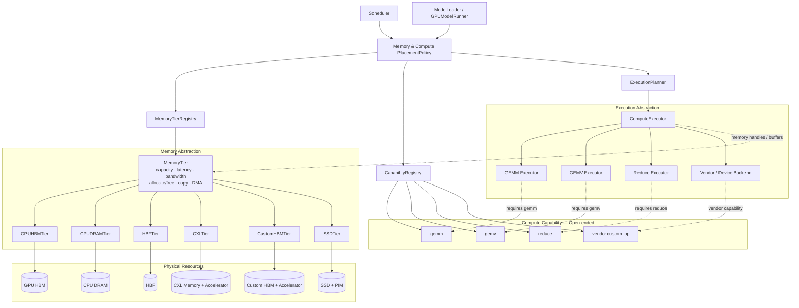
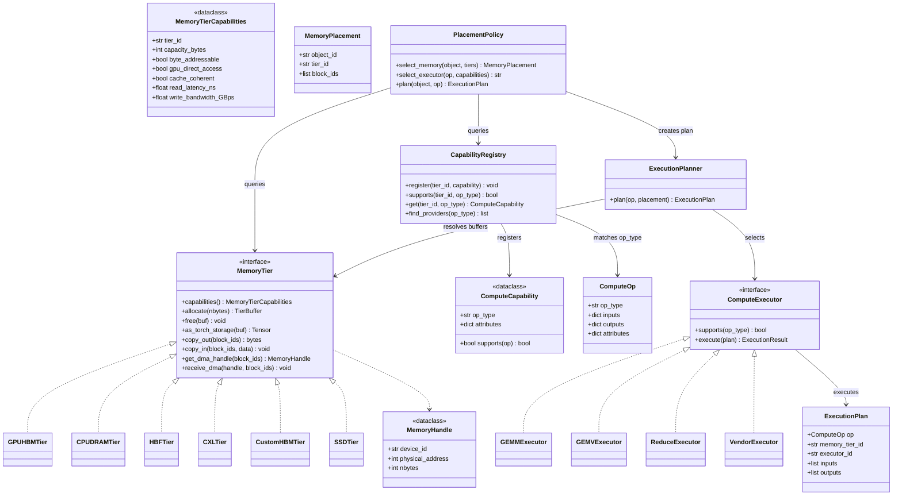
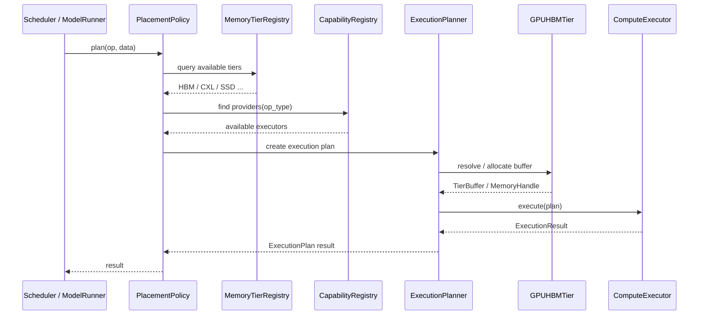
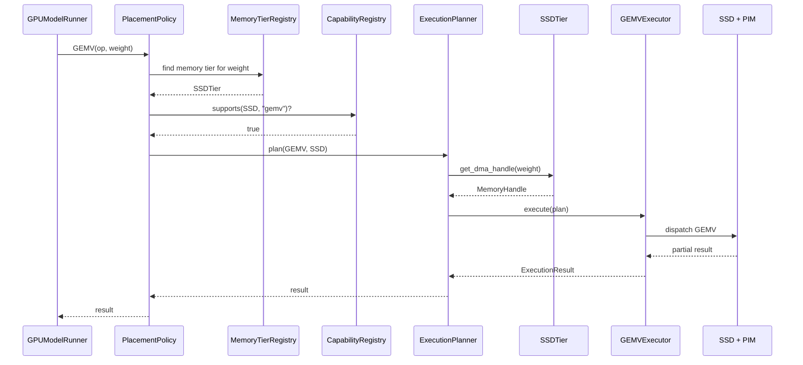
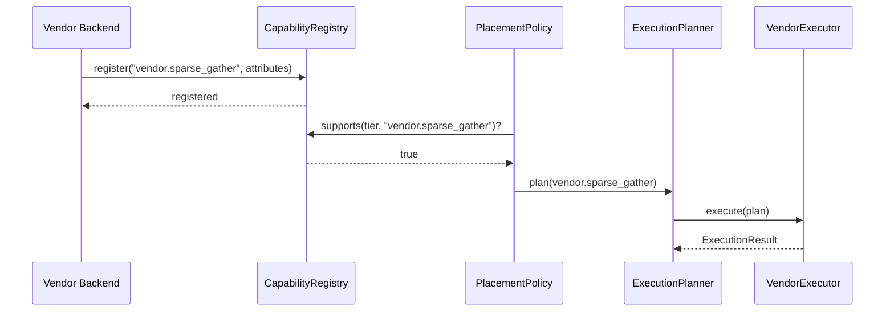

# 메모리 추상화 Layer — Capability-Oriented 구조 설계

> 선행 문서: `doc-mk/vllm-memory-abstraction-level-candidates.md`
>
> 본 문서는 기존 두 후보 구조의 장점을 결합하여, **Memory abstraction과 Compute abstraction을 분리하고 Capability를 개방적으로 확장**하는 세 번째 구조를 제안합니다.
>
> 핵심 방향은 다음과 같습니다.
>
> - `MemoryTier`는 **memory access / allocation / data movement**를 추상화
> - 하드웨어 고유 연산은 `MemoryTier`의 책임으로 넣지 않고 **Execution Capability**로 분리
> - Capability는 닫힌 `ComputeOp` 클래스 계층이 아니라 **open-ended op identifier + attributes**로 확장 가능
> - `PlacementPolicy`가 memory placement와 compute placement를 capability 정보와 함께 판단
> - 상위 모듈(`Scheduler`, `ModelLoader`, `GPUModelRunner`)은 구체적인 HW 구현을 직접 알지 않도록 유지

---

## 0. 설계 배경

차세대 이기종 메모리 시스템에서는 단순한 메모리 용량/대역폭 추상화만으로는 부족합니다.

예를 들어 다음과 같은 자원이 동시에 존재할 수 있습니다.

- GPU HBM — 로컬, Tier 0
- CPU DRAM — 범용 원격 메모리
- HBF — 대용량 원격 메모리
- CXL Memory — 원격 메모리 + 특정 연산 가속기 결합 가능
- Custom HBM — 고대역폭 메모리 + 특정 연산 기능 결합 가능
- SSD + PIM — 대용량 저장공간 + GEMV 등의 near-data processing 가능

따라서 Runtime은 다음 세 가지 질문을 독립적으로 판단할 수 있어야 합니다.

1. **어디에 데이터를 둘 것인가?** → Memory Placement
2. **어떤 연산을 어디서 수행할 수 있는가?** → Compute Capability
3. **실제 데이터 이동/연산을 어떻게 수행할 것인가?** → Execution

이를 하나의 `MemoryTier.execute_op()`에 넣으면 Memory abstraction이 Compute/Accelerator abstraction까지 흡수하게 되므로, 장기적인 HW 확장성이 떨어질 수 있습니다.

---

## 1. 설계 목표

### 1.1 Memory와 Compute의 책임 분리

`MemoryTier`는 다음만 책임집니다.

- capacity
- addressing
- latency / bandwidth
- allocation / free
- copy-in / copy-out
- DMA / memory handle
- memory synchronization

반면 GEMM/GEMV/Reduce 등의 연산은 별도의 `ComputeExecutor`가 책임집니다.

### 1.2 Capability의 개방적 확장

새로운 HW가 새로운 연산을 제공할 때 vLLM core의 `ComputeOp` hierarchy를 수정하지 않아도 되도록 합니다.

예:

```text
ComputeOp("gemm")
ComputeOp("gemv")
ComputeOp("reduce")
ComputeOp("embedding_lookup")
ComputeOp("vendor.custom_op")
```

새 capability는 문자열/등록된 identifier와 attributes만으로 추가할 수 있습니다.

### 1.3 상위 모듈 변경 최소화

상위 모듈은 `CXL`, `SSD`, `PIM`, 특정 vendor API를 직접 참조하지 않고 다음 abstraction만 사용합니다.

```text
MemoryTierRegistry
MemoryTier
CapabilityRegistry
ExecutionPlanner
```

---

## 2. Module View



### 2.1 Module 책임

| Module | Responsibility |
| --- | --- |
| `MemoryTierRegistry` | 시스템에 존재하는 memory tier 등록/조회 |
| `MemoryTier` | memory access와 data movement abstraction |
| `CapabilityRegistry` | memory/device가 제공하는 compute capability 관리 |
| `Memory & Compute PlacementPolicy` | 데이터 위치와 연산 위치를 jointly 결정 |
| `ExecutionPlanner` | 선택된 capability와 memory placement를 실행 계획으로 변환 |
| `ComputeExecutor` | 실제 compute dispatch |
| `Vendor / Device Backend` | HW-specific implementation |

---

## 3. Class Diagram



### 3.1 핵심 Class 관계

#### `MemoryTier`

Memory 자체에 대한 공통 계약입니다. Compute-specific method를 포함하지 않습니다.

```python
class MemoryTier:
    capabilities()
    allocate()
    free()
    copy_in()
    copy_out()
    get_dma_handle()
    receive_dma()
```

따라서 새로운 memory를 추가할 때 기존 `MemoryTier` contract만 만족하면 됩니다.

#### `ComputeCapability`

특정 memory/device에서 수행 가능한 연산을 선언합니다.

```python
ComputeCapability(
    op_type="gemm",
    attributes={
        "dtype": ["fp16", "bf16"],
        "max_m": 4096,
        "max_n": 4096,
    },
)
```

Capability 자체는 open-ended이므로 `gemm`, `gemv` 외의 새로운 operation도 추가할 수 있습니다.

#### `ComputeOp`

닫힌 inheritance hierarchy가 아니라 operation description입니다.

```python
ComputeOp(
    op_type="vendor.custom_op",
    inputs={...},
    outputs={...},
    attributes={...},
)
```

따라서 새로운 operation을 추가할 때 core `ComputeOp` class hierarchy를 수정할 필요가 없습니다.

#### `ComputeExecutor`

실제 execution을 담당합니다. MemoryTier가 compute를 직접 수행하지 않도록 책임을 분리합니다.

---

## 4. Sequence Diagram — 일반 GPU HBM Execution



---

## 5. Sequence Diagram — CXL Memory + GEMM


핵심은 `CXLTier`가 GEMM을 **직접 execute하지 않는다는 것**입니다. `CXLTier`는 CXL memory resource와 data movement를 추상화하고, `GEMMExecutor`가 해당 capability를 이용하여 실제 연산을 dispatch합니다.

---

## 6. Sequence Diagram — SSD + PIM GEMV



이 구조에서는 SSD+PIM이 추가되더라도 상위 `GPUModelRunner`가 `SSDTier`나 PIM API를 직접 알아야 할 필요가 없습니다.

---

## 7. 새로운 Vendor Operation 추가

Capability-oriented 구조의 핵심 장점은 새로운 HW가 새로운 operation을 제공할 때입니다.

예를 들어 새로운 accelerator가 `vendor.sparse_gather`를 지원한다고 가정합니다.



**Core `MemoryTier`나 `ComputeOp` inheritance hierarchy를 수정하지 않고도 capability를 추가할 수 있습니다.**

---

## 8. Candidate 1 / Candidate 2와의 비교

| 평가 기준 | Candidate 1: Uniform | Candidate 2: Specialized Interface | Candidate 3: Capability-Oriented |
| --- | ---: | ---: | ---: |
| 신규 Memory 온보딩 | ★★★★★ | ★★★ | ★★★★★ |
| 상위 모듈 변경량 | ★★★★★ | ★★★ | ★★★★★ |
| HW 고유 기능 표현 | ★★★ | ★★★★★ | ★★★★★ |
| Interface 복잡도 | ★★★★★ | ★★ | ★★★★ |
| 신규 Compute primitive 확장 | ★★ | ★★★★★ | ★★★★★ |
| Memory / Compute 분리 | ★★ | ★★★ | ★★★★★ |
| Vendor extensibility | ★★ | ★★★ | ★★★★★ |
| 장기 확장성 | ★★★ | ★★★ | ★★★★★ |

---

## 9. 설계상의 핵심 Trade-off

### 9.1 장점

1. **Memory abstraction의 안정성**
   - 새로운 compute primitive가 추가되어도 `MemoryTier` interface가 변경되지 않음

2. **HW vendor extensibility**
   - `vendor.custom_op`와 같은 open-ended capability 지원 가능

3. **Memory와 Compute의 독립적인 진화**
   - 새로운 memory tier와 새로운 accelerator를 독립적으로 추가할 수 있음

4. **상위 vLLM 모듈 변경 최소화**
   - Scheduler / ModelRunner가 특정 HW API에 의존하지 않음

5. **Joint placement 가능**
   - memory capacity/bandwidth뿐 아니라 compute capability까지 고려하여 placement 결정 가능

### 9.2 단점

1. **Runtime planning complexity 증가**
   - capability lookup과 execution planning 계층이 추가됨

2. **Operation semantics 표준화 필요**
   - `op_type`만 자유롭게 허용하면 backend 간 semantic mismatch가 발생할 수 있음

3. **Capability validation 필요**
   - dtype, shape, alignment, coherence 등의 조건을 runtime에서 확인해야 함

4. **추상화 비용**
   - 단순 GPU HBM access까지 execution planner를 거치게 만들 경우 불필요한 overhead가 생길 수 있음

따라서 실제 구현에서는 **일반 memory access path는 기존 vLLM 경로를 최대한 유지하고, compute-capable memory를 사용할 때만 ExecutionPlanner/CapabilityRegistry를 활성화하는 방식**이 적절합니다.

---

## 10. 권장 Architecture

최종적으로 다음의 책임 분리를 권장합니다.

```text
MemoryTier
    = Where / How can I access memory?

ComputeCapability
    = What operation can this resource perform?

ExecutionPlanner
    = Where should this operation execute?

ComputeExecutor
    = How is this operation actually executed?

PlacementPolicy
    = Which memory + compute combination is globally optimal?
```

즉, 본 구조의 핵심은 **"Memory abstraction을 범용화하되, HW capability를 버리지 않고 별도의 open-ended capability layer로 승격"**하는 것입니다.

이렇게 하면 CXL/HBM/HBF/SSD/PIM 등 새로운 memory resource가 추가되더라도 상위 vLLM stack의 interface를 안정적으로 유지하면서, 향후 새로운 memory-attached accelerator와 custom compute primitive까지 확장할 수 있습니다.
