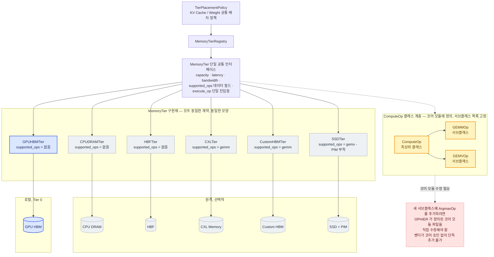
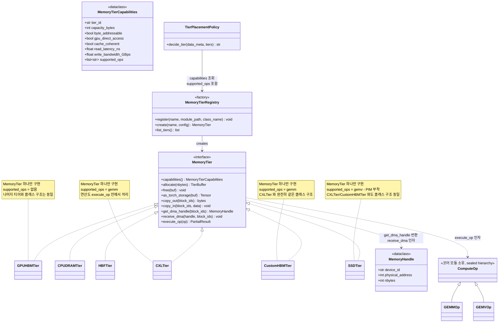
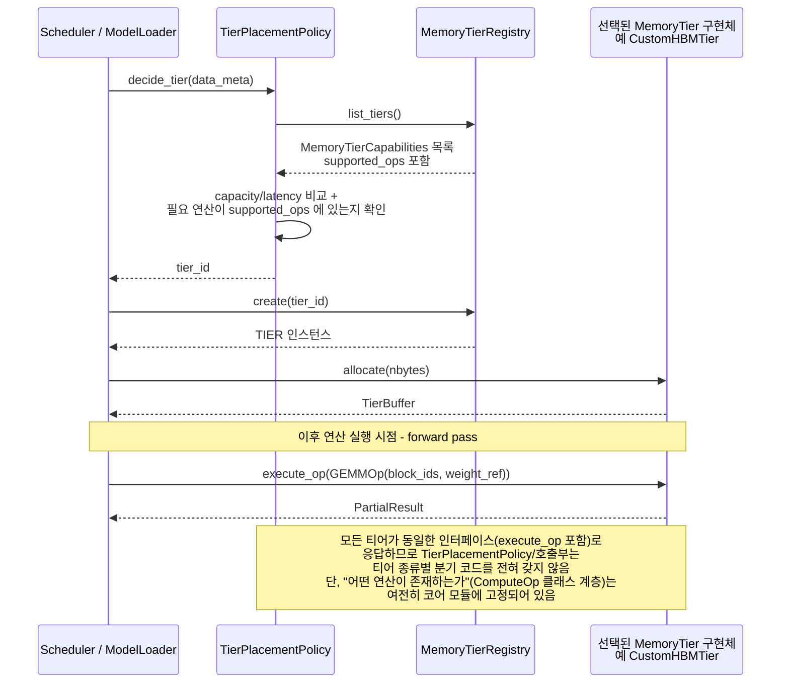
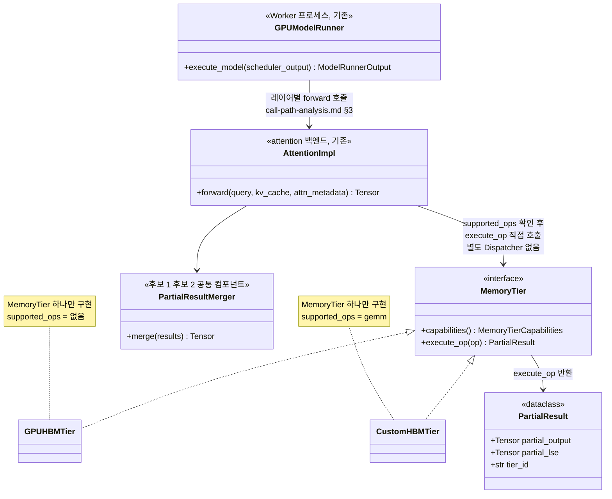
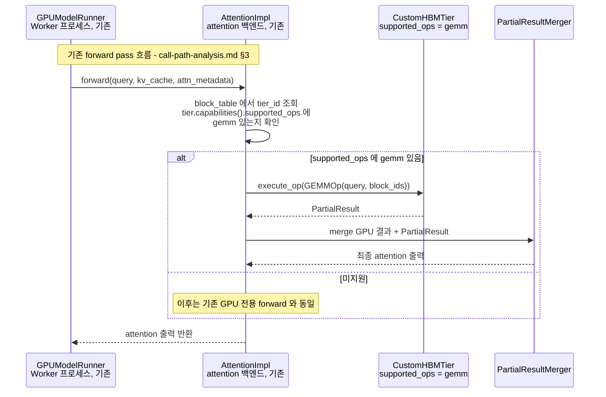
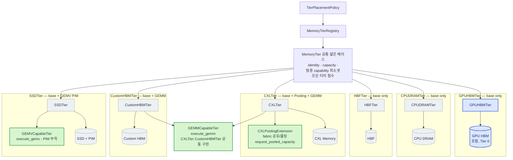
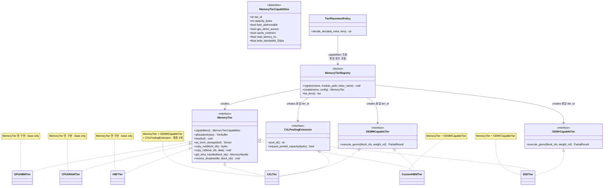
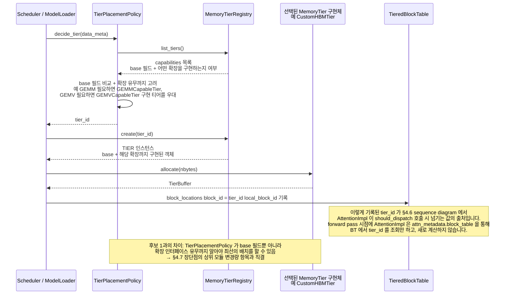
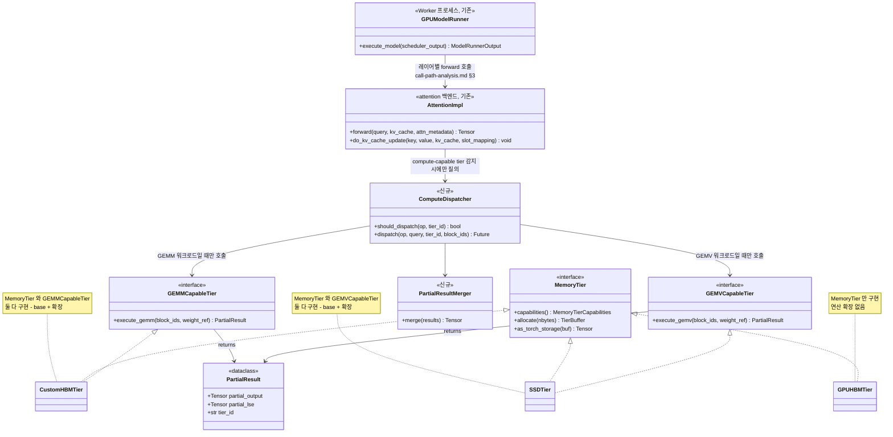
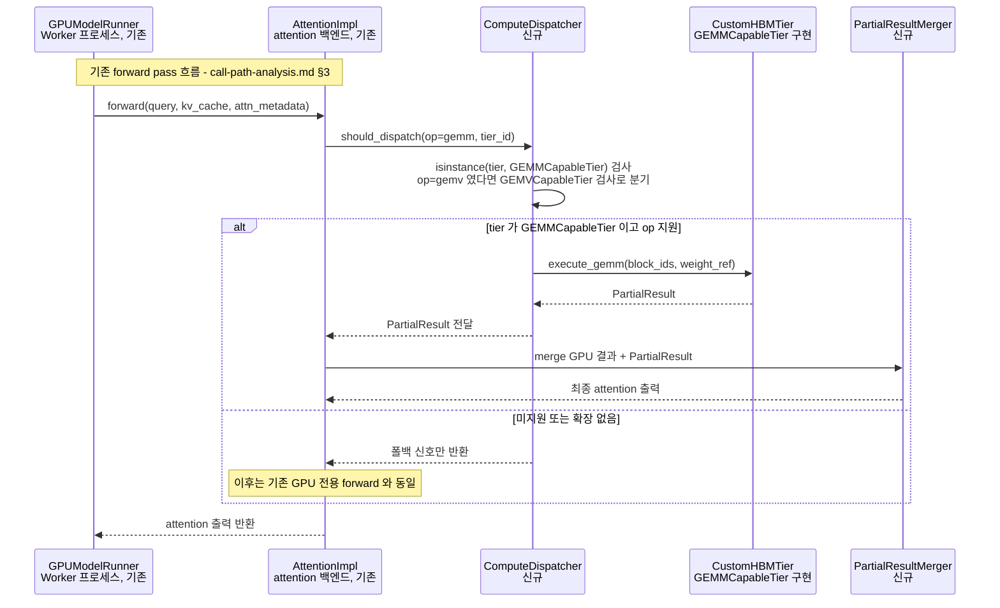

# 메모리 추상화 Layer — 추상화 수준에 대한 후보 구조 설계

> 선행 문서: `doc-mk/vllm-kv-cache-memory-abstraction-layer.md` (MAL 기본 설계,
> §8 통합 module view)
>
> 본 문서는 위 문서에서 만든 module view를 출발점으로, **메모리 추상화 계층의
> 추상화 수준을 어떻게 가져갈 것인가**라는 설계쟁점에 대해 두 후보 구조
> (범용성 강조 / 하드웨어 특화 강조)를 설계하고 비교합니다.

## 0. 배경 재정리

- 차세대 이기종 메모리(CXL, Custom HBM, HBF 등)를 지원해야 함
- 이기종 메모리가 혼재된 시스템에서 **개별 자원만 관리하는 게 아니라 자원 간
  상호 인지 기반의 통합 관리**가 필요함
- **상위 모듈(Scheduler, ModelLoader, GPUModelRunner 등) 변경을 최소화**하기 위한
  공통 추상화 interface가 필요함

## 1. 설계쟁점 검토

### 1.1 제시하신 설계쟁점(DP-1)

> 메모리 추상화 layer의 추상화 수준을 어떻게 가져갈 것인가?

**타당한 쟁점입니다.** HAL(Hardware Abstraction Layer) 설계에서 가장 고전적이고
근본적인 축이고, 배경의 두 목표에 직접 연결됩니다.

- 추상화 수준이 낮을수록(범용) → 신규 메모리 온보딩이 쉽고 상위 모듈이 안정적
  (배경의 세 번째 목표에 유리)
- 추상화 수준이 높을수록(특화 반영) → 하드웨어 고유 기능을 살릴 수 있음(배경의
  첫 번째 목표에 유리)

즉 이 쟁점은 **배경의 목표 1(이기종 지원)과 목표 3(상위 모듈 안정성)이 서로
당기는 힘**을 어떻게 배분할지의 문제이고, 두 후보 구조로 스펙트럼의 양 끝을
탐색하는 건 합리적인 접근입니다.

### 1.2 별도로 봐야 할 가능성이 있는 쟁점(DP-2) — 참고용

배경의 목표 2("자원 간 상호 인지 기반의 통합 관리")는 사실 DP-1과는 **독립적인
축**일 수 있습니다. DP-1은 "인터페이스가 얼마나 범용적인가"의 문제이고, 목표 2는
"여러 티어의 상태를 **누가, 어디서** 종합적으로 판단하는가"의 문제이기 때문입니다
— 예를 들면:

- 중앙집중형: `TierPlacementPolicy` 하나가 모든 티어의 상태를 모아서 판단 (지금
  §8까지 그린 구조가 이쪽)
- 분산 자율형: 티어들끼리 서로의 상태를 프로토콜로 주고받으며 자율적으로 데이터를
  재배치 (예: 티어 A가 자기 용량이 부족해지면 티어 B에게 직접 이관을 제안)

이 축은 DP-1(범용 vs 특화)과 직교하기 때문에, "범용 인터페이스 + 중앙집중 조정",
"특화 인터페이스 + 분산 자율 조정" 등 4가지 조합이 모두 가능합니다. 이번 문서는
요청하신 대로 **DP-1에 대한 두 후보 구조**에 집중하고, DP-2(조정 주체의 위치)는
필요하시면 별도 문서로 다루는 걸 제안드립니다.

---

## 2. 두 후보의 공통 전제

두 후보 모두 다음은 동일하게 유지합니다 (`vllm-kv-cache-memory-abstraction-layer.md`
§8과 동일):

- 상위 스택: `Scheduler`(KV cache) / `ModelLoader`(Weight) / `GPUModelRunner`(Activation)
  → 각 도메인별 배치 정책 → `MemoryTierRegistry`
- 지원 메모리: GPU HBM(로컬, Tier 0, 필수) + CPU DRAM / Custom HBM / CXL Memory /
  HBF / SSD(원격, 선택적) — CXL·CustomHBM은 GEMM, SSD는 PIM 부착으로 GEMV를
  지원하는 연산 가능 메모리
- 평가 기준: ① 신규 메모리 온보딩 난이도, ② 상위 모듈 변경량, ③ 하드웨어 고유
  기능 활용도, ④ 구현/유지보수 복잡도, ⑤ 성능 상한

두 후보는 `MemoryTierRegistry` **아래쪽**(플러그인 인터페이스가 얼마나 균일한가)
에서만 갈라집니다.

---

## 3. 후보 1 — 범용성 강조 구조 (Uniform Capability Model)

> **개정 노트**: 최초 버전의 후보 1은 "연산 가능 메모리의 연산 기능은 아예
> 지원하지 못함"으로 정의되어 있었습니다. 그러나 연산 가능 메모리 지원이
> 기능 요구사항(FR)이라면, 두 후보 모두 이 FR을 만족해야 하고 후보 1과 후보 2는
> "지원하느냐 마느냐"가 아니라 "**어떻게** 지원하느냐"로 비교되어야 합니다.
> 아래는 이를 반영한 정의입니다.

### 3.1 설계 철학

모든 티어가 **정확히 하나의 인터페이스**(`MemoryTier`)만 구현합니다. 하드웨어
고유 기능(연산, pooling, batch-read 등)을 위한 **별도 인터페이스는 만들지
않습니다** — 대신 `MemoryTierCapabilities`에 `supported_ops`라는 데이터
필드로 "이 티어가 어떤 연산을 지원하는지"를 선언하고, 실행은 모든 티어가
공유하는 단일 진입점 `execute_op(op)` 하나로 이뤄집니다.

`op`의 타입 `ComputeOp`는 **코어 모듈에 정의된 닫힌 클래스 계층(sealed class
hierarchy)**입니다 — `GEMMOp`, `GEMVOp`처럼 정해진 서브클래스들만 존재하고,
이 서브클래스 목록은 `ComputeOp`가 정의된 그 코어 모듈 파일 안에서만 늘어날
수 있습니다. 즉 "연산이 존재한다"는 사실 자체는 어떤 티어든 알릴 수 있어
FR은 만족되지만, **새 서브클래스를 이 계층에 추가하는 건 항상 코어 모듈 수정을
필요로 합니다.** 이게 후보 1과 후보 2를 가르는 유일하고 핵심적인 차이입니다 —
뒤에서 다시 정리합니다(§3.7, §5).

### 3.2 Module View



§4.2(후보 2)와 **같은 티어 구성**(GPU HBM/CPU DRAM/HBF/CXL/CustomHBM/SSD,
CXL·CustomHBM은 GEMM, SSD는 PIM 부착으로 GEMV)으로 맞췄습니다 — 그래야 두
후보를 같은 상황에 놓고 비교할 수 있습니다. 차이는 오직 **표현 방식**입니다:
후보 2에서는 `CXLTier`/`CustomHBMTier`가 `GEMMCapableTier`라는 **별도 타입**을
구현하고 `SSDTier`는 `GEMVCapableTier`라는 **다른 타입**을 구현해서 클래스
계층 자체가 갈라지지만, 여기서는 모든 `MemoryTier` 구현체 박스가 **같은 크기,
같은 모양**입니다 — 인터페이스 계약이 하나뿐이라 플러그인 사이에 구조적
차이가 없습니다. `CXLTier`/`CustomHBMTier`/`SSDTier`가 연산을 지원하는 것도
`supported_ops`라는 **데이터**만 다를 뿐, 별도 인터페이스를 구현하지 않습니다.
대신 "새 연산 종류 자체"는 노란 박스(`ComputeOp` 클래스 계층 — 최상위 클래스
하나에 정해진 서브클래스들만 매달린 구조)에 중앙집중되어 있고, 이 계층에 새
서브클래스를 추가하려면 코어 모듈을 직접 수정해야 한다는 제약이 남습니다 —
빨간 점선 박스가 그 제약을 보여줍니다.

### 3.3 Class Diagram



모든 구현체가 `MemoryTier` **단 하나만** 실현(realize)한다는 게 후보 1의
클래스 구조에서 가장 뚜렷한 특징입니다 — 연산 지원 여부와 무관하게 인터페이스가
여러 개로 갈라지지 않습니다. `CXLTier`/`CustomHBMTier`(둘 다 GEMM)와
`SSDTier`(GEMV)의 차이도, `GPUHBMTier`(연산 없음)와의 차이도 오직
`capabilities()`가 반환하는 **데이터**(`supported_ops`)뿐이고, 실행 경로는
`execute_op(op)` 하나로 공유됩니다 — §4.3(후보 2)에서는 이 세 종류가
`GEMMCapableTier`/`GEMVCapableTier`/(확장 없음)라는 **서로 다른 타입**으로
갈라지는 것과 나란히 비교하면 두 후보의 차이가 가장 선명하게 드러납니다.
`ComputeOp`(및 그 서브클래스들)는 이 인터페이스가 참조하는 유일한 "외부"
클래스 계층이며, 이게 §3.7에서 다룰 트레이드오프의 핵심입니다.

`copy_out(block_ids)`/`copy_in(block_ids, data)`는 연산과 무관한 기본 데이터
이동 원시 동작입니다 — "자기 자신의 메모리에서 내보내기/받기"만 할 뿐, 어디로
보내는지는 모릅니다. 이 두 메서드는 반환값 `bytes`가 **호출자의 메모리 공간에
실제로 만들어지는** 것을 전제하므로, 데이터가 host DRAM 같은 중간 지점을
거치는 경로에서만 씁니다. `get_dma_handle(block_ids)`/`receive_dma(handle,
block_ids)`는 그와 다른 원시 동작으로, 실제 바이트 대신 물리 주소 등을 담은
가벼운 `MemoryHandle`만 주고받습니다 — 두 티어가 같은 상호연결(fabric)에
있어서 호출자를 거치지 않고 디바이스끼리 직접 옮길 수 있는 경로에서 씁니다.
이 네 메서드가 `vllm-memory-coordination-locus-candidates.md`의
`TierDataMover`가 실제 티어 간 이관을 실행할 때 상황에 따라 골라 쓰는
메서드들이고, DP-1의 두 후보 모두 동일하게 가져야 하는 기본 계약입니다.

### 3.4 Sequence Diagram — 배치 결정 + 연산 실행 흐름



배치 결정과 연산 실행이 **같은 인터페이스, 같은 진입점**으로 이어지는 게
핵심입니다 — 후보 2(§4.4, §4.6)처럼 "확장 인터페이스를 인지하는 별도 상위
모듈(`ComputeDispatcher`)"이 따로 필요하지 않습니다. 대신 `execute_op`가
받는 `op`의 타입(`ComputeOp`의 서브클래스)은 코어 모듈에 정의된 클래스
계층 안에 있어야 합니다.

#### `TierPlacementPolicy.decide_tier()` 상세 판단 로직

위 시퀀스의 3단계("`capacity/latency` 비교 + 필요 연산이 `supported_ops`에
있는지 확인")가 실제로 뭘 하는지 의사코드로 풀면 이렇습니다:

```python
def decide_tier(self, data_meta: DataMeta, tiers: list[MemoryTier]) -> str:
    # 1. Tier 0(GPU HBM)에 여유가 있으면 그냥 거기 — supported_ops 는 아예 안 봄
    gpu_tier = self._get(tiers, "gpu_hbm")
    if gpu_tier.free_bytes() >= data_meta.size:
        return gpu_tier.tier_id

    # 2. 원격 배치가 필요한 상황. 용량이 되는 티어만 후보로 추린다.
    candidates = [t for t in tiers if t.free_bytes() >= data_meta.size]

    # 3. 이 데이터에 결부된 연산 힌트가 있으면(예: MoE 전문가 가중치의 gemm,
    #    decode activation 의 gemv), 그 연산을 지원하는 티어를 "우대"한다 —
    #    필수 조건이 아니라 우선순위 필터일 뿐이라, 해당하는 티어가 하나도
    #    없으면 그냥 원래 후보군으로 되돌아간다.
    if data_meta.hint_op:
        op_capable = [t for t in candidates if data_meta.hint_op in t.capabilities().supported_ops]
        if op_capable:
            candidates = op_capable

    # 4. 남은 후보 중 latency 가 가장 낮은 티어를 선택
    return min(candidates, key=lambda t: t.capabilities().read_latency_ns).tier_id
```

`hint_op`을 **"반드시 만족해야 하는 조건"이 아니라 "동점일 때 우선순위를
매기는 힌트"**로 설계한 이유는, 연산 오프로드는 배치 자체를 실패시킬 이유가
못 되기 때문입니다 — 오프로드할 티어가 없으면 그냥 GPU로 데이터를 당겨와서
평소처럼 계산하면 그만입니다. 네 가지 상황으로 실제 동작을 짚어보면:

| 상황 | `data_meta` | 1단계(GPU 여유?) | 3단계(op 우대) | 결과 |
|---|---|---|---|---|
| **A. 평범한 prefill KV 블록** | `hint_op=None` | 여유 있음 | (도달 안 함) | `GPUHBMTier` — 연산 고려 자체가 발동하지 않음 |
| **B. GPU가 꽉 찬 뒤에 온 KV 블록** | `hint_op=None` | 없음 | 건너뜀(`hint_op` 없음) | 남은 후보 중 latency 최저 티어(예: `CPUDRAMTier`) — 순수 성능만으로 결정 |
| **C. MoE 전문가 가중치, 원격 배치 확정** | `hint_op="gemm"` | 없음(가중치가 커서 GPU엔 못 올림) | `CXLTier`/`CustomHBMTier`만 남음(둘 다 `supported_ops`에 gemm) | 그중 latency 낮은 쪽, 예 `CustomHBMTier` — 나중에 그 자리에서 GEMM 오프로드 가능 |
| **D. decode 단계 activation, GEMV 오프로드를 노림** | `hint_op="gemv"` | 없음 | `SSDTier`가 마침 여유 없어 `op_capable`이 빈 리스트 → 3단계 결과가 원래 후보군으로 되돌아감 | latency 기준 최선(예: `HBFTier`) — GEMV 오프로드는 못 하고, 필요할 때 그냥 GPU로 당겨와 계산(배치 실패는 아님) |

A는 "연산 고려가 아예 발동하지 않는" 경우, B는 "연산 힌트가 없어서
`supported_ops`를 쳐다볼 이유가 없는" 경우, C는 "연산 힌트가 실제로 후보를
좁히는" 경우, D는 "연산 힌트는 있지만 맞는 티어가 없어서 조용히 무시되는"
경우입니다 — `supported_ops` 검사는 이 4단계 로직 중 딱 한 줄(3단계)이고,
나머지는 순수 용량/레이턴시 판단이라는 게 핵심입니다.

### 3.5 Class Diagram — 연산 실행 시점, Worker 프로세스 연결 (§4.5와 나란히 비교)

§4.5(후보 2)와 같은 장면 — 배치가 끝난 뒤 forward pass 시점에 실제로 연산이
어떻게 호출되는가 — 를 후보 1 버전으로 그린 것입니다. 가장 중요한 차이를
미리 말하면: **후보 1에는 `ComputeDispatcher`에 대응하는 별도 클래스가
없습니다.**



§4.5와 나란히 놓고 보면 빠진 게 뚜렷합니다 — `ComputeDispatcher`도,
`should_dispatch()`/`dispatch()`라는 별도 진입점도 없습니다.
`AttentionImpl`이 `tier.capabilities().supported_ops`를 직접 확인하고
`tier.execute_op(op)`를 직접 부릅니다. `PartialResultMerger`(연산 결과를
GPU 결과와 합치는 유틸리티)만 두 후보 공통으로 남아 있는데, 이건 DP-1(추상화
수준)과 무관하게 "부분 결과를 어떻게 합칠 것인가"라는 별개 문제라서 그렇습니다.

### 3.6 Sequence Diagram — 연산 실행 호출 순서 (§4.6과 나란히 비교)



§4.6과 겉모양(참가자 수, `alt`/`else` 구조)은 거의 똑같아 보이지만, **누가
그 판단을 내리는가**가 다릅니다 — §4.6에서는 `ATTN->>DISP:
should_dispatch(...)`처럼 판단 자체가 `ComputeDispatcher`라는 **별도
객체에게 위임**되고, 그 객체 내부에서 `isinstance(tier, GEMMCapableTier)`
같은 타입 검사가 (연산 종류만큼 분기하며) 일어납니다. 여기서는 `ATTN->>ATTN: ...supported_ops 에
gemm 있는지 확인`처럼 판단이 **`AttentionImpl` 자신의 self-message
한 줄**입니다 — 위임할 별도 객체 자체가 필요 없습니다. 이게 §3.5에서
"`ComputeDispatcher`에 대응하는 클래스가 없다"고 한 것의 실행 시점 버전입니다.

### 3.7 장단점

| 항목 | 평가 |
|---|---|
| 연산 가능 메모리 지원 (FR) | **만족** — `supported_ops` 데이터 필드 + `execute_op` 공통 진입점으로 커버 |
| 신규 메모리(티어) 온보딩 난이도 | **낮음** — `MemoryTier` 하나만 구현, `supported_ops`에 지원 연산만 나열하면 됨 |
| 상위 모듈 변경량 | **거의 없음** — `TierPlacementPolicy`/호출부는 항상 같은 진입점(`execute_op`)만 사용, 티어별 분기 없음 |
| 신규 연산(하드웨어 고유 기능) 확장 자유도 | **낮음** — 새 연산 종류는 `ComputeOp` 클래스 계층에 서브클래스로 추가되어야 등장 가능. 이 계층은 코어 모듈에 정의되어 있어, 벤더가 코어 승인 없이 독자적으로 새 연산을 추가할 수 없음 |
| 구현/유지보수 복잡도 | **낮음** — 인터페이스가 하나뿐이고, `ComputeOp` 서브클래스도 한 모듈에 모여 있어 "이 시스템에 어떤 연산이 존재하는지" 파악하기 쉬움 |

---

## 4. 후보 2 — 하드웨어 특화 구조 (Extensible Capability Model)

### 4.1 설계 철학

모든 티어가 구현해야 하는 **얇은 공통 베이스**(identity + 범용 capability 최소셋)는
유지하되, 하드웨어가 고유 기능을 가진 경우 **선택적 확장 인터페이스**를 추가로
구현할 수 있게 합니다. 상위 모듈은 기본적으로 공통 베이스만 보고 동작하지만,
특정 확장 인터페이스를 인지하는 상위 모듈(예: `ComputeDispatcher`)은 그 확장을
활용해 하드웨어 고유 기능을 끌어냅니다.

이건 사실 `vllm-kv-cache-memory-abstraction-layer.md` §7에서 이미 축소판으로
설계한 패턴입니다 — `ComputeCapableTier`가 PIM 하나를 위한 선택적 확장이었습니다.
**후보 2는 그 패턴을 PIM 하나가 아니라 모든 하드웨어 고유 기능으로 일반화한
것**입니다.

### 4.2 Module View



**티어 하나당 서브그래프 하나**로 묶어서, 그 티어가 갖는 확장(들)과 실제
물리 메모리까지 같은 박스 안에 넣었습니다 — 박스 제목(`CXLTier — base +
Pooling + GEMM`)만 봐도 그 티어의 구성이 바로 보입니다. `GEMMCapableTier`만
유일하게 박스 밖, `CXLTier`와 `CustomHBMTier` 서브그래프 사이에 홀로 놓여
있는데, **이게 의도적입니다** — 두 티어가 진짜로 같은 인터페이스 하나를
공유한다는 걸 "두 박스 사이에 낀 공통 노드"로 시각화한 것입니다.

`CXLPoolingExtension`은 CXL fabric에 물린 메모리 풀에서 **용량 자체를
동적으로 더 요청**(`request_pooled_capacity`)하는 기능입니다 — 정적으로
고정 분할된 용량을 벗어나, 필요할 때 풀에서 더 받아오고 안 쓸 때 반환할 수
있다는 뜻입니다. `capabilities()` 조회나 자기 몫 안에서의 `allocate()`로는
표현이 안 되는, "내 몫 자체를 늘려달라는 요청"이라는 새로운 동작이라 확장
인터페이스가 필요합니다.

`HBFTier`는 이전 버전에 있던 `HBFBatchReadExtension`을 제거하고 `base only`로
옮겼습니다 — 배치 순차읽기 최적화는 새로운 연산이 아니라, 이미 여러
`block_ids`를 받는 기본 메서드 `copy_out(block_ids)`를 **`HBFTier` 내부에서
물리 주소 순으로 정렬해 한 번에 읽도록 구현**하는 문제이기 때문입니다. 호출부가
보는 시그니처는 다른 티어와 완전히 동일하므로 새 인터페이스가 필요 없습니다 —
상위 모듈에 힌트를 주고 싶다면 `MemoryTierCapabilities`에
`sequential_access_preferred` 같은 데이터 필드 하나로 충분합니다(후보 1
스타일의 "데이터로 표현"이 후보 2 안에서도 맞는 경우가 있다는 예시입니다).

새로 추가한 `SSDTier`는 이 모듈뷰에서 **"연산 가능 메모리"가 하나의 획일적인
능력이 아니라는 걸 보여줍니다.** `CXLTier`와 `CustomHBMTier`는 같은
`GEMMCapableTier`를 구현하지만, `SSDTier`는 PIM이 붙어 있어서 GEMM이 아니라
**GEMV**만 지원하므로 완전히 별개의 `GEMVCapableTier`를 구현합니다(그래서
`GEMVCapableTier`는 `GEMMCapableTier`처럼 박스 밖으로 나올 필요 없이
`SSDTier` 서브그래프 안에 완전히 갇혀 있습니다 — 공유하는 티어가 하나뿐이라서
입니다). 이걸 후보 2 방식대로 표현하면, 하나의 뭉뚱그린 `ComputeCapableTier`
대신 **연산 종류별로 인터페이스가 갈라지는 게 자연스럽습니다** —
`ComputeDispatcher`도 이제 `GEMMCapableTier`와 `GEMVCapableTier` 둘 다
인지해야 하므로 확장이 늘수록 상위 모듈이 커진다는 후보 2의 트레이드오프
(§4.7)가 그대로 드러납니다. `ComputeDispatcher`가 이 확장들을 실제로 어떻게
호출하는지는 §4.5·§4.6에서 다룹니다. 또한 `CXLTier`는 `CXLPoolingExtension`과
`GEMMCapableTier` **두 개의 확장을 동시에 구현**하는 유일한 티어입니다 —
확장을 여러 개 조합하는 실제 사례를 보여줍니다.

`GPUHBMTier`/`CPUDRAMTier`/`HBFTier`는 확장이 없는 "평범한" 티어로, 나머지는
각자 다른 확장(또는 조합)을 가진 "특화" 티어로 **의도적으로 비대칭 모양**으로
그렸습니다 — 후보 1과 달리 플러그인마다 구조가 달라지는 게 이 설계의
본질입니다.

### 4.3 Class Diagram — 후보 2 자체 (§3.3과 나란히 비교)

§3.3(후보 1)과 동일한 범위 — `MemoryTier` 베이스, `MemoryTierRegistry`,
`TierPlacementPolicy` — 에 확장 인터페이스를 더한 버전입니다. §4.2 모듈뷰와
같은 티어 6종·같은 GEMM/GEMV 분리를 그대로 반영합니다. 후보 1에서는 모든
구현체가 `MemoryTier` 하나만 realize 했지만, 여기서는 티어마다 realize하는
인터페이스 수가 다릅니다.



후보 1의 클래스 다이어그램(§3.3)과 나란히 놓고 보면, `MemoryTier <|.. X` 관계
자체는 여섯 티어 모두 동일하지만 **그 외에 realize하는 인터페이스 수가
0개(후보 1은 항상 0개, 즉 추가 없음) vs 0~2개(후보 2, `CXLTier`가 GEMM +
Pooling 둘 다 구현)로 갈린다**는 게 유일하고 결정적인 구조 차이입니다.

### 4.4 Sequence Diagram — 후보 2 자체, 배치 결정 흐름 (§3.4와 나란히 비교)

§3.4(후보 1)와 같은 종류의 흐름 — "데이터를 어느 티어에 배치할지 결정"하는
장면 — 을 후보 2 버전으로 그린 것입니다. 여기서 `tier_id`가 어떻게
결정되고, 이후 forward pass 시점에 `AttentionImpl`이 그걸 어떻게 다시
읽어오는지(질문하신 부분)까지 이어서 표시했습니다.



#### `TierPlacementPolicy.decide_tier()` 상세 판단 로직 (§3.4와 같은 4가지 상황)

§3.4에서 후보 1의 `decide_tier()`를 의사코드로 풀었던 것과 **완전히 같은
네 가지 상황(A~D)**에 대해, 후보 2 버전은 이렇게 동작합니다:

```python
def decide_tier(self, data_meta: DataMeta, tiers: list[MemoryTier]) -> str:
    gpu_tier = self._get(tiers, "gpu_hbm")
    if gpu_tier.free_bytes() >= data_meta.size:
        return gpu_tier.tier_id

    candidates = [t for t in tiers if t.free_bytes() >= data_meta.size]

    # 연산 힌트마다 "어떤 타입을 볼지"가 다르므로 분기가 연산 종류만큼 늘어난다
    if data_meta.hint_op == "gemm":
        op_capable = [t for t in candidates if isinstance(t, GEMMCapableTier)]
        if op_capable:
            candidates = op_capable
    elif data_meta.hint_op == "gemv":
        op_capable = [t for t in candidates if isinstance(t, GEMVCapableTier)]
        if op_capable:
            candidates = op_capable
    # 연산이 하나 더 늘면(예: conv) elif 가 하나 더 늘어난다

    return min(candidates, key=lambda t: t.capabilities().read_latency_ns).tier_id
```

A~D 결과는 후보 1과 동일합니다(같은 상황이니 당연합니다 — 무엇을 하는지는
같고 어떻게 하는지만 다릅니다). 코드 모양의 차이는 딱 한 곳입니다: 후보
1(§3.4)은 `if data_meta.hint_op in tier.capabilities().supported_ops:`
**한 줄**로 연산 종류에 상관없이 끝나지만, 후보 2는 **연산 하나마다
`elif isinstance(t, XCapableTier)` 분기가 하나씩 필요**합니다 — `hint_op`
문자열과 타입을 서로 매핑해줄 방법이 후보 2에는 없어서, 이 매핑을
`decide_tier()` 안에 직접 하드코딩할 수밖에 없기 때문입니다. 연산이 GEMM,
GEMV 둘뿐일 때는 크게 안 보이지만, §4.7에서 다루는 "상위 모듈 변경량"이
정확히 이 지점에서 시작됩니다 — 연산이 하나 늘 때마다 `TierPlacementPolicy`
본체를 다시 열어서 `elif`를 추가해야 합니다.

### 4.5 Class Diagram — ComputeDispatcher가 Worker와 어떻게 연결되는가 (§3.5와 나란히 비교)

아래 다이어그램은 §4.2의 확장 인터페이스들 중 **연산(compute) 확장만**
떼어내서, 그게 실제 모델 실행 경로(Worker 프로세스,
`GPUModelRunner`/`AttentionImpl`)와 어떻게 이어지는지를 명확히 합니다.
GEMM과 GEMV가 별개 인터페이스이므로, `ComputeDispatcher`는 **둘 다** 알아야
합니다.



**여기서 확인해야 할 관계 하나**: `ComputeDispatcher`는 `GPUModelRunner`를 대체하는
새 실행 경로가 아니라, 기존 `AttentionImpl.forward()` **내부에서 호출되는 하나의
추가 분기**입니다. `GPUModelRunner.execute_model()` → `AttentionImpl.forward()`로
이어지는 기존 흐름(`call-path-analysis.md` §3)은 그대로 유지되고,
`ComputeDispatcher`는 그 안에서 "이번 배치의 KV 블록이 연산 가능한 티어에 있는지"만
추가로 확인하는 위치에 끼어듭니다. §3.5(후보 1)와 비교하면, 후보 1엔 이
박스 자체가 없고 `AttentionImpl`이 `MemoryTier`를 직접 부릅니다 — 여기선
`ComputeDispatcher`가 `GEMMCapableTier`·`GEMVCapableTier` 두 타입을 **둘 다
알아야 하는 존재**로 끼어 있다는 게 구조적으로 다른 지점입니다.

### 4.6 Sequence Diagram — ComputeDispatcher의 호출 순서 (연결 구조만, §3.6과 나란히 비교)



§3.6과 참가자 구성·`alt`/`else` 모양은 비슷해 보이지만, 판단이 일어나는
위치가 다릅니다 — 여기서는 `ATTN->>DISP: should_dispatch(...)`로 판단
자체를 **별도 객체에 위임**하고, `DISP->>DISP: isinstance(...)` 로 그
객체 내부에서 **연산 종류별로 어떤 타입을 검사할지 분기**합니다. §3.6은
`ATTN->>ATTN: ...supported_ops 에 gemm 있는지 확인` 한 줄로 끝났던 것과
비교하면, "판단을 위임할 객체가 있는가"와 "그 판단이 연산마다 분기되는가"
둘 다 §4.7의 "상위 모듈 변경량"·"구현 복잡도" 차이로 이어집니다.

**의도적으로 생략한 부분**: 이 다이어그램은 "누가 누구를 호출하는가"라는 연결
구조만 보여줍니다. 다음과 같은 질문들은 답하지 않습니다 — PIM 연산이 GPU 연산과
동시에(비동기로) 진행되는지 순차적으로 기다리는지, `execute_partial()`이 레이어
단위로 매번 호출되는지 스텝 단위로 한 번만 호출되는지, PIM이 느려서 타임아웃되면
언제 어떻게 재시도/폴백하는지, CUDA stream/이벤트로 어떻게 동기화하는지. 이런
질문은 "MAL의 추상화 수준"(DP-1)이 아니라 **"연산 실행 모델을 어떻게 통합할
것인가"**라는 별개의 설계쟁점(DP-3 후보)에 속합니다 — §7.6에서 나열한 실행 단위
불일치/정밀도 정합성/동시 슬롯 큐잉/연산 실패 폴백 같은 제약들이 바로 그 DP-3가
풀어야 할 문제들의 예고편입니다. 이 문서에서는 "그런 분기점이 존재한다"까지만
보여주고, 더 깊이 들어가지 않습니다.

### 4.7 장단점

| 항목 | 평가 |
|---|---|
| 신규 메모리 온보딩 난이도 | **중간~높음** — 베이스는 쉽지만, 고유 기능을 살리려면 "새 확장 인터페이스를 만들 것인가"를 매번 판단해야 함 |
| 상위 모듈 변경량 | **있음** — 확장을 활용하려는 상위 모듈(`ComputeDispatcher` 등)은 확장별로 분기 코드가 필요, 목표 3(상위 모듈 안정성)과 정면으로 부딪힘 |
| 하드웨어 고유 기능 활용도 | **높음** — CXL pooling, PIM 연산, HBF batch-read를 실제로 활용 가능 |
| 구현/유지보수 복잡도 | **높음** — 확장 인터페이스가 늘어날수록 "어떤 백엔드/상위모듈이 어떤 확장 조합을 지원하는지" 매트릭스가 생김 (§5.4, §7.6에서 이미 지적한 문제) |
| 성능 상한 | **높음** — 하드웨어 투자 대비 이득을 최대로 뽑아낼 수 있음 |

---

## 5. 두 후보 비교

### 5.1 평가 기준별 비교표

| 평가 기준 | 후보 1: 범용성 강조 | 후보 2: 하드웨어 특화 |
|---|---|---|
| 연산 가능 메모리 지원 (FR) | 만족 — `ComputeOp` 클래스 계층 경유 | 만족 — 확장 인터페이스 경유 |
| 신규 메모리(티어) 온보딩 난이도 | 낮음 | 중간~높음 |
| 신규 연산(하드웨어 고유 기능) 확장 자유도 | **낮음** — 코어 모듈에 정의된 `ComputeOp` 클래스 계층에 서브클래스를 추가해야 함, 벤더 단독 확장 불가 | **높음** — 벤더가 자체 확장 인터페이스를 정의해 코어 승인 없이 독립 배포 가능 |
| 상위 모듈 변경량 (목표 3) | 거의 없음 — 항상 같은 진입점(`execute_op`) | 확장 활용 시 필요 (확장별 분기) |
| 구현/유지보수 복잡도 | 낮음 — 인터페이스 1개, `ComputeOp` 서브클래스도 한 모듈에 모여 있음 | 높음 (확장 조합 매트릭스) |
| 코드 재사용성 | 최대 | 확장 부분은 재사용 어려움 |

두 후보 모두 연산 가능 메모리라는 FR은 만족합니다 — 더 이상 "지원하느냐"의 문제가
아닙니다. 다만 참고로, 두 후보가 상호 배타적이지 않다는 점은 짚어둘 만합니다 —
**후보 1을 기본 골격으로 채택하고, 특정 티어에 한해서만(예: 처음엔 PIM만) 후보
2의 확장 패턴을 국소적으로 도입**하는 절충도 가능합니다. 실제로 지금
`vllm-kv-cache-memory-abstraction-layer.md` §7의 `ComputeCapableTier`가 정확히
이 절충의 실제 사례입니다 — 후보 1의 얇은 베이스 위에, PIM이라는 한 가지 케이스에만
후보 2 스타일의 확장을 얹은 것입니다.

### 5.2 QA(품질 속성) 관점 비교

위 §5.1 표의 "신규 메모리 온보딩 난이도"·"확장 자유도"·"상위 모듈 변경량"·
"구현/유지보수 복잡도"·"코드 재사용성" 다섯 항목은 사실 전부 하나의 품질
속성, **Modifiability(수정 용이성)**로 수렴합니다. 여기에 이 문서 전체에서
다룬 두 관찰 — §3.3/§4.3의 타입 안전성 논의, §3.6/§4.6의 디스패치 구조
차이 — 을 더해 **Modifiability**, **Reliability(결함 조기 발견성)**,
**Performance** 세 가지 QA로 다시 비교합니다.

#### Modifiability — "누가 고칠 권한이 있는가"와 "몇 곳을 고쳐야 하는가"는 다른 질문

이 둘을 하나의 점수로 합치면 왜곡됩니다 — 두 후보에서 정반대 방향으로
갈리기 때문입니다.

| Modifiability 하위 축 | 후보 1 | 후보 2 | 근거 |
|---|---|---|---|
| 신규 **티어** 추가(이미 아는 능력) | ★★★ | ★★★ | 둘 다 새 클래스 하나, 상위 코드 무변경(§3.2, §4.2) |
| 신규 **연산** 추가 — 거버넌스(승인 없이 확장 가능한가) | ★☆☆ | ★★★ | 후보1은 `ComputeOp`가 코어 모듈 소유라 새 서브클래스에 코어 PR 필요(§3.1). 후보2는 벤더가 자기 패키지에 새 확장 인터페이스만 정의하면 됨(§4.1) |
| 신규 **연산** 추가 — 변경 범위(실제로 몇 곳을 고쳐야 하는가) | ★★☆ | ★☆☆ | 후보1은 `decide_tier()`·`AttentionImpl`이 무변경(§3.4, §3.6). 후보2는 `decide_tier()`에 `elif` 추가 + `ComputeDispatcher`에 새 접속 추가 필요(§4.4, §4.6) |

후보1은 "고칠 수 있는 사람은 적지만 고쳐야 할 곳도 적고", 후보2는 "고칠 수
있는 사람은 많지만 고쳐야 할 곳도 많습니다" — 이게 서로 상쇄되므로 "확장
자유도" 하나로는 어느 쪽이 더 낫다고 말하기 어렵고, 조직 구조(코어 팀 승인이
병목인가, 벤더별 조율 비용이 더 문제인가)에 따라 답이 달라집니다.

#### Reliability — 결함 조기 발견성

| | 후보 1 | 후보 2 |
|---|---|---|
| 별점 | ★☆☆ | ★★★ |
| 근거 | "이 티어가 이 연산을 받는다"는 관계가 타입이 아니라 `supported_ops`라는 런타임 데이터에만 있음 — 잘못된 조합은 티어 구현자가 `else: raise`를 빠뜨리면 조용히 통과됨 | `execute_gemm` 같은 메서드 존재 자체가 타입 계약 — `mypy`가 대부분 CI 시점에 잡고, 최악의 경우도 즉시 `AttributeError` |

```python
# 후보 1 — 문법적으로 유효, 런타임까지 가야 실패(그나마 구현자가 챙겼을 때만)
result = ssd_tier.execute_op(GEMMOp(block_ids, weight_ref))

# 후보 2 — SSDTier에 execute_gemm이 없어 그 줄에서 즉시 실패
result = ssd_tier.execute_gemm(block_ids, weight_ref)   # AttributeError, 혹은 mypy 사전 차단
```

#### Performance

| | 후보 1 | 후보 2 |
|---|---|---|
| 별점 | ★★☆ | ★★★ |
| 근거 | 디스패치가 2단계(티어 조회 + `execute_op` 내부의 op 타입 분기) | 디스패치가 1단계(메서드 이름 자체가 티어+연산을 동시에 특정) |

```python
# 후보 2 — 디스패치 1회
tier.execute_gemm(block_ids, weight_ref)

# 후보 1 — 디스패치 2회
tier.execute_op(op)                 # 1) 티어의 execute_op 조회
# execute_op 내부:
#   if isinstance(op, GEMMOp): ...  # 2) op 타입 분기
```

정적 바인딩(후보2, 메서드 이름이 곧 연산)과 동적 바인딩(후보1, 조회 후
타입으로 재분기)의 실제 메커니즘 차이입니다. 다만 이 차이가 실제 GEMM/GEMV
실행 시간과 비교하면 어느 정도인지가 관건입니다 — `isinstance` 체크 1회는
수십~수백 ns인데, prefill의 대형 GEMM(수십 μs~수 ms)에 비하면 6자리 가까이
작아 사실상 무시할 수준입니다. 다만 decode 단계의 작은 GEMV(수 μs)처럼
호출당 작업량이 작아질수록 이 고정 오버헤드가 차지하는 비중이 상대적으로
커집니다 — 그래도 최대 한 자릿수 % 안쪽이라 결정적 요인은 아니지만,
"완전히 동일"은 부정확하므로 근소하게 후보2 쪽에 둡니다.

---

## 6. 관련 문서

- `doc-mk/vllm-kv-cache-memory-abstraction-layer.md` — MAL 기본 설계 (§1 class
  diagram이 후보 1의 원형, §7 `ComputeCapableTier`가 후보 2 패턴의 축소 사례,
  §8이 두 후보 모두의 공통 상위 전제)
- `doc-mk/vllm-kv-cache-memory-tiering.md` — CXL 한정 옵션 A/B
- `doc-mk/vllm-call-path-analysis.md` — 요청 처리 전체 call path, ModelLoader
  위치(§2)
