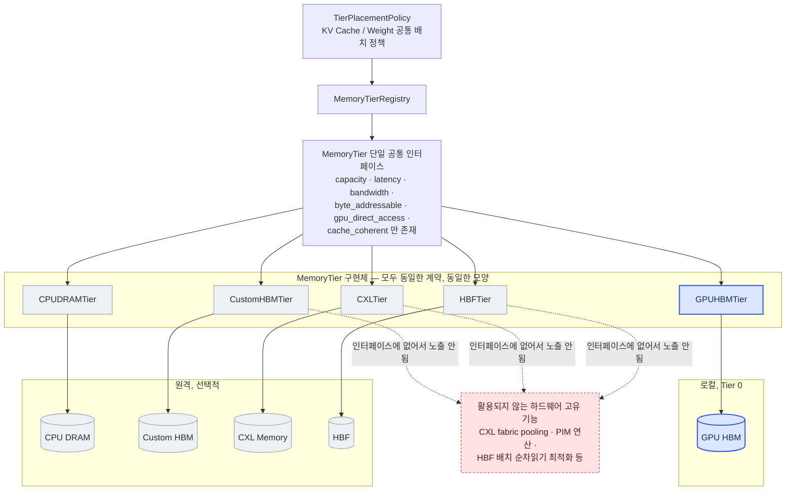
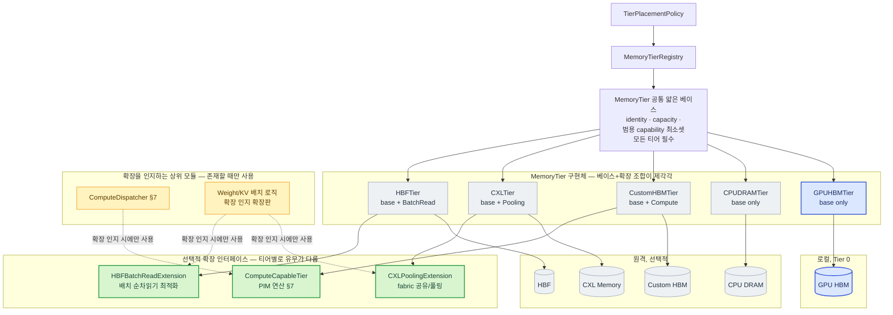

# 메모리 추상화 Layer — 추상화 수준에 대한 후보 구조 설계

> 선행 문서: `doc-mk/vllm-kv-cache-memory-abstraction-layer.md` (MAL 기본 설계,
> §8 통합 module view)
>
> 본 문서는 위 문서에서 만든 module view를 출발점으로, **메모리 추상화 계층의
> 추상화 수준을 어떻게 가져갈 것인가**라는 설계쟁점에 대해 두 후보 구조
> (범용성 강조 / 하드웨어 특화 강조)를 설계하고 비교합니다.

## 0. 배경 재정리

- 차세대 이기종 메모리(CXL, Custom HBM, HBF 등)를 지원해야 함
- 이기종 메모리가 혼재된 시스템에서 **개별 자원만 관리하는 게 아니라 자원 간
  상호 인지 기반의 통합 관리**가 필요함
- **상위 모듈(Scheduler, ModelLoader, GPUModelRunner 등) 변경을 최소화**하기 위한
  공통 추상화 interface가 필요함

## 1. 설계쟁점 검토

### 1.1 제시하신 설계쟁점(DP-1)

> 메모리 추상화 layer의 추상화 수준을 어떻게 가져갈 것인가?

**타당한 쟁점입니다.** HAL(Hardware Abstraction Layer) 설계에서 가장 고전적이고
근본적인 축이고, 배경의 두 목표에 직접 연결됩니다.

- 추상화 수준이 낮을수록(범용) → 신규 메모리 온보딩이 쉽고 상위 모듈이 안정적
  (배경의 세 번째 목표에 유리)
- 추상화 수준이 높을수록(특화 반영) → 하드웨어 고유 기능을 살릴 수 있음(배경의
  첫 번째 목표에 유리)

즉 이 쟁점은 **배경의 목표 1(이기종 지원)과 목표 3(상위 모듈 안정성)이 서로
당기는 힘**을 어떻게 배분할지의 문제이고, 두 후보 구조로 스펙트럼의 양 끝을
탐색하는 건 합리적인 접근입니다.

### 1.2 별도로 봐야 할 가능성이 있는 쟁점(DP-2) — 참고용

배경의 목표 2("자원 간 상호 인지 기반의 통합 관리")는 사실 DP-1과는 **독립적인
축**일 수 있습니다. DP-1은 "인터페이스가 얼마나 범용적인가"의 문제이고, 목표 2는
"여러 티어의 상태를 **누가, 어디서** 종합적으로 판단하는가"의 문제이기 때문입니다
— 예를 들면:

- 중앙집중형: `TierPlacementPolicy` 하나가 모든 티어의 상태를 모아서 판단 (지금
  §8까지 그린 구조가 이쪽)
- 분산 자율형: 티어들끼리 서로의 상태를 프로토콜로 주고받으며 자율적으로 데이터를
  재배치 (예: 티어 A가 자기 용량이 부족해지면 티어 B에게 직접 이관을 제안)

이 축은 DP-1(범용 vs 특화)과 직교하기 때문에, "범용 인터페이스 + 중앙집중 조정",
"특화 인터페이스 + 분산 자율 조정" 등 4가지 조합이 모두 가능합니다. 이번 문서는
요청하신 대로 **DP-1에 대한 두 후보 구조**에 집중하고, DP-2(조정 주체의 위치)는
필요하시면 별도 문서로 다루는 걸 제안드립니다.

---

## 2. 두 후보의 공통 전제

두 후보 모두 다음은 동일하게 유지합니다 (`vllm-kv-cache-memory-abstraction-layer.md`
§8과 동일):

- 상위 스택: `Scheduler`(KV cache) / `ModelLoader`(Weight) / `GPUModelRunner`(Activation)
  → 각 도메인별 배치 정책 → `MemoryTierRegistry`
- 지원 메모리: GPU HBM(로컬, Tier 0, 필수) + CPU DRAM / Custom HBM / CXL Memory /
  HBF(원격, 선택적)
- 평가 기준: ① 신규 메모리 온보딩 난이도, ② 상위 모듈 변경량, ③ 하드웨어 고유
  기능 활용도, ④ 구현/유지보수 복잡도, ⑤ 성능 상한

두 후보는 `MemoryTierRegistry` **아래쪽**(플러그인 인터페이스가 얼마나 균일한가)
에서만 갈라집니다.

---

## 3. 후보 1 — 범용성 강조 구조 (Uniform Capability Model)

### 3.1 설계 철학

모든 티어가 **정확히 같은 얕은 인터페이스**(`capacity`, `latency`, `bandwidth`,
`byte_addressable`, `gpu_direct_access`, `cache_coherent`처럼 몇 개의 범용
숫자/불리언 필드)만 노출합니다. 하드웨어가 이 필드들로 표현 안 되는 고유 기능을
갖고 있어도, **이 인터페이스에 없으면 상위 모듈은 그 기능의 존재 자체를 모릅니다.**
`vllm-kv-cache-memory-abstraction-layer.md` §1에서 처음 설계한 `MemoryTier`가
바로 이 스타일입니다.

### 3.2 Module View

모든 `MemoryTier` 구현체 박스가 **같은 크기, 같은 모양**인 게 핵심입니다 — 인터페이스
계약이 하나뿐이라 플러그인 사이에 구조적 차이가 없습니다. 빨간 점선 박스는 이
구조가 원천적으로 놓치는 부분을 명시적으로 보여주기 위해 추가했습니다.

### 3.3 장단점

| 항목 | 평가 |
|---|---|
| 신규 메모리 온보딩 난이도 | **낮음** — 6개 필드만 채우면 끝 |
| 상위 모듈 변경량 | **거의 없음** — `TierPlacementPolicy`가 다뤄야 할 케이스가 항상 고정 |
| 하드웨어 고유 기능 활용도 | **낮음** — CXL pooling, PIM 연산, HBF batch-read 등은 아예 쓸 수 없음 |
| 구현/유지보수 복잡도 | **낮음** — 인터페이스가 하나뿐 |
| 성능 상한 | **낮음** — 최소공배수 추상화의 전형적 함정 |

---

## 4. 후보 2 — 하드웨어 특화 구조 (Extensible Capability Model)

### 4.1 설계 철학

모든 티어가 구현해야 하는 **얇은 공통 베이스**(identity + 범용 capability 최소셋)는
유지하되, 하드웨어가 고유 기능을 가진 경우 **선택적 확장 인터페이스**를 추가로
구현할 수 있게 합니다. 상위 모듈은 기본적으로 공통 베이스만 보고 동작하지만,
특정 확장 인터페이스를 인지하는 상위 모듈(예: `ComputeDispatcher`)은 그 확장을
활용해 하드웨어 고유 기능을 끌어냅니다.

이건 사실 `vllm-kv-cache-memory-abstraction-layer.md` §7에서 이미 축소판으로
설계한 패턴입니다 — `ComputeCapableTier`가 PIM 하나를 위한 선택적 확장이었습니다.
**후보 2는 그 패턴을 PIM 하나가 아니라 모든 하드웨어 고유 기능으로 일반화한
것**입니다.

### 4.2 Module View

`GPUHBMTier`/`CPUDRAMTier`는 확장이 없는 "평범한" 티어로, `CustomHBMTier`/
`CXLTier`/`HBFTier`는 각자 다른 확장을 가진 "특화" 티어로 **의도적으로 비대칭
모양**으로 그렸습니다 — 후보 1과 달리 플러그인마다 구조가 달라지는 게 이 설계의
본질입니다.

### 4.3 장단점

| 항목 | 평가 |
|---|---|
| 신규 메모리 온보딩 난이도 | **중간~높음** — 베이스는 쉽지만, 고유 기능을 살리려면 "새 확장 인터페이스를 만들 것인가"를 매번 판단해야 함 |
| 상위 모듈 변경량 | **있음** — 확장을 활용하려는 상위 모듈(`ComputeDispatcher` 등)은 확장별로 분기 코드가 필요, 목표 3(상위 모듈 안정성)과 정면으로 부딪힘 |
| 하드웨어 고유 기능 활용도 | **높음** — CXL pooling, PIM 연산, HBF batch-read를 실제로 활용 가능 |
| 구현/유지보수 복잡도 | **높음** — 확장 인터페이스가 늘어날수록 "어떤 백엔드/상위모듈이 어떤 확장 조합을 지원하는지" 매트릭스가 생김 (§5.4, §7.6에서 이미 지적한 문제) |
| 성능 상한 | **높음** — 하드웨어 투자 대비 이득을 최대로 뽑아낼 수 있음 |

---

## 5. 두 후보 비교

| 평가 기준 | 후보 1: 범용성 강조 | 후보 2: 하드웨어 특화 |
|---|---|---|
| 신규 메모리 온보딩 난이도 | 낮음 | 중간~높음 |
| 상위 모듈 변경량 (목표 3) | 거의 없음 | 확장 활용 시 필요 |
| 하드웨어 고유 기능 활용도 (목표 1) | 낮음 | 높음 |
| 구현/유지보수 복잡도 | 낮음 | 높음 (조합 매트릭스) |
| 성능 상한 | 낮음 | 높음 |
| 코드 재사용성 | 최대 | 확장 부분은 재사용 어려움 |

두 후보는 정확히 "배경의 목표 1(이기종 지원 최대 활용)"과 "목표 3(상위 모듈 안정성)"
사이에서 반대 방향으로 최적화되어 있습니다. 어느 쪽을 택할지는 **이 시스템이 지금
단계에서 무엇을 더 우선하는지**(빠른 신규 하드웨어 지원 vs 이미 지원 중인 하드웨어의
성능 극대화)에 달려 있고, 이건 정량적 가중치를 매겨서 판단할 문제이지 이 문서에서
결론을 내릴 문제는 아닙니다. 다만 참고로, 두 후보가 상호 배타적이지 않다는 점은
짚어둘 만합니다 — **후보 1을 기본 골격으로 채택하고, 특정 티어에 한해서만(예: 처음엔
PIM만) 후보 2의 확장 패턴을 국소적으로 도입**하는 절충도 가능합니다. 실제로 지금
`vllm-kv-cache-memory-abstraction-layer.md` §7의 `ComputeCapableTier`가 정확히
이 절충의 실제 사례입니다 — 후보 1의 얇은 베이스 위에, PIM이라는 한 가지 케이스에만
후보 2 스타일의 확장을 얹은 것입니다.

---

## 6. 관련 문서

- `doc-mk/vllm-kv-cache-memory-abstraction-layer.md` — MAL 기본 설계 (§1 class
  diagram이 후보 1의 원형, §7 `ComputeCapableTier`가 후보 2 패턴의 축소 사례,
  §8이 두 후보 모두의 공통 상위 전제)
- `doc-mk/vllm-kv-cache-memory-tiering.md` — CXL 한정 옵션 A/B
- `doc-mk/vllm-call-path-analysis.md` — 요청 처리 전체 call path, ModelLoader
  위치(§2)
