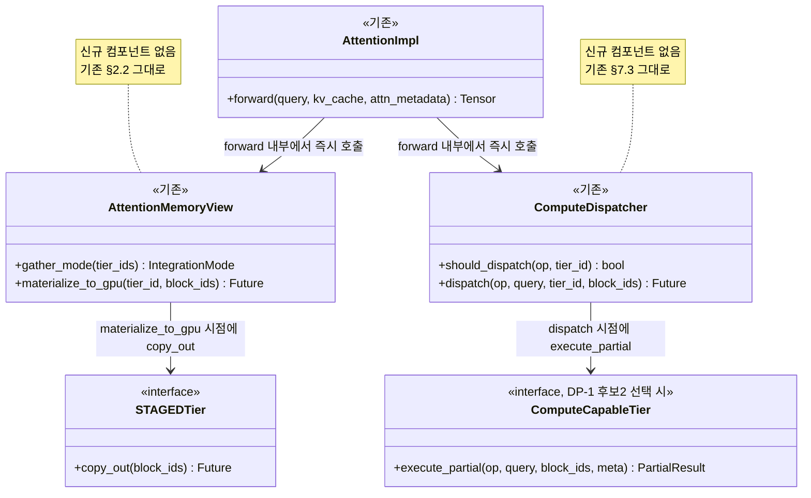
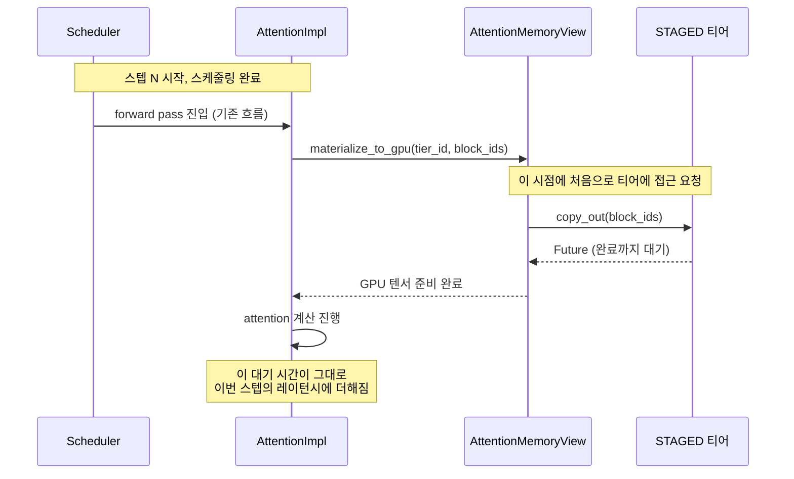
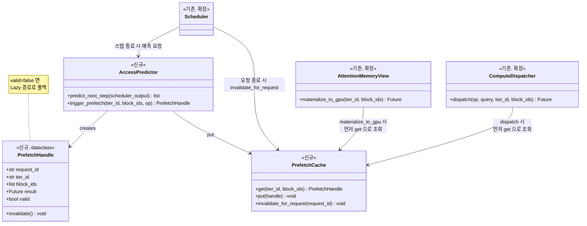
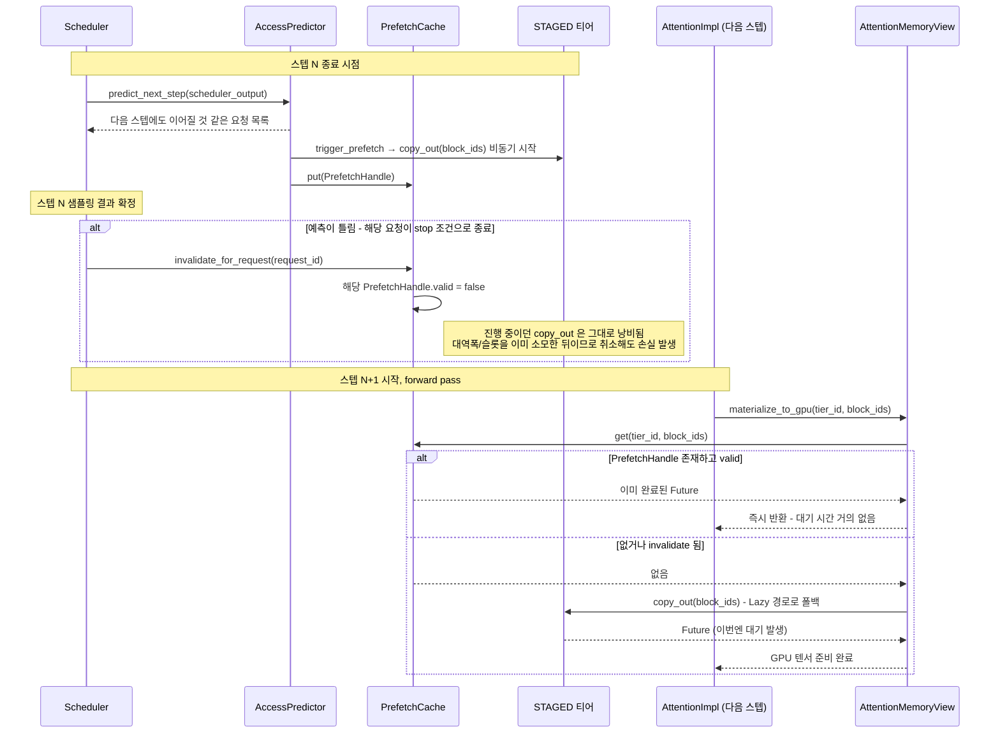

# 메모리 추상화 Layer — 티어 접근/연산 트리거 시점(DP-3) 후보 구조

> 선행 문서: `doc-mk/vllm-memory-abstraction-level-candidates.md` (DP-1: 추상화
> 수준), `doc-mk/vllm-memory-coordination-locus-candidates.md` (DP-2: 조정
> 주체 위치)
>
> 이 문서는 DP-1 논의 중 발견된 설계쟁점을 정식화합니다: 원래 "ComputeDispatcher가
> Worker 실행과 어떻게 동기화되는가"로 구상했던 질문은 DP-1 후보2(확장 구조)를
> 이미 선택했다고 전제하는 질문이라 독립적인 설계쟁점이 아니었습니다. 이를
> **DP-1의 어느 후보를 고르든 성립하는 더 상위의 축**으로 재정의합니다.

## 0. 설계쟁점 정의

### 0.1 "위치를 아는 것" vs "접근/연산을 트리거하는 것" — 먼저 구분

`TieredBlockTable`에 `tier_id`가 기록되는 시점(할당 직후, 동기적)과 그걸
나중에 조회하는 것은 **설계쟁점이 아닙니다** — 할당 호출과 같은 흐름 안에서
바로 일어나야 하고, 실제로 그렇게 설계되어 있습니다(`vllm-memory-abstraction-level-candidates.md`
§4.4 10단계, §4.6 2단계). 여기엔 선택의 여지가 없습니다.

**DP-3이 실제로 묻는 건 그 다음 단계입니다**: 위치를 이미 알고 있는 상태에서,
**비용이 실제로 발생하는 동작**(STAGED 티어의 `copy_out()`, 또는
`ComputeCapableTier`의 `execute_partial()`)을 **언제 실행시킬지**입니다.

### 0.2 DP-3

> 티어에 대한 실제 데이터 이동/연산 실행을 언제 트리거할 것인가?
> — Lazy(요청 시점) vs Eager(사전 예측 기반 prefetch)

### 0.3 DP-1, DP-2와의 직교성

- **DP-1과 무관**: DP-1 후보1(범용)을 고르든 후보2(특화)를 고르든, STAGED
  티어의 `copy_out()` 타이밍 문제는 그대로 존재합니다. 다만 DP-1 후보2를
  고르면 이 축의 적용 범위가 "데이터 이동"뿐 아니라 "연산 위임"까지 넓어질
  뿐입니다 — DP-3의 선택지(Lazy/Eager) 자체는 DP-1의 결과에 좌우되지
  않습니다.
- **DP-2와 무관**: DP-2는 "이미 배치된 데이터를 재조정할 때 누가 결정하는가"
  (중앙집중 vs 분산)를 다룹니다. DP-3은 "이미 정해진 위치에 대해 언제 실제
  동작을 트리거하는가"를 다룹니다 — 재배치 여부와 무관하게, 지금 있는
  자리에서 접근/연산을 언제 시작할지의 문제입니다.

### 0.4 왜 자명해 보이는데 실제로는 트레이드오프가 있는가

"예측되면 미리 당기고, 안 되면 그때 가져온다"는 결론 자체는 자명합니다.
하지만 vLLM의 decode 특성상 "다음 스텝에도 이 블록이 필요할 것"이라는 예측은
**거의 항상 맞을 것처럼 보이는데도, 실제로는 자주 틀립니다** — 그 이유가
자명하지 않은 부분입니다.

- **stop 조건은 이번 스텝의 샘플링 결과에 달려 있습니다.** 어떤 요청이 다음
  스텝에도 이어질지는 이번 스텝이 끝나야(EOS 여부가 나와야) 확정됩니다.
  스케줄링 시점에 미리 트리거해두면, 그 요청이 이번 스텝에 끝나버리는 경우
  통째로 낭비됩니다.
- **티어의 대역폭/연산 슬롯은 공유 자원입니다.** Eager 트리거가 자원을 미리
  쓰는 동안, 그 순간 실제로 급한 다른 블록(Lazy 경로)과 경합합니다.
- **Eager는 구조적으로 공짜가 아닙니다.** Lazy는 기존 컴포넌트
  (`AttentionMemoryView`, `ComputeDispatcher`)를 그대로 쓰면 되지만, Eager는
  "몇 스텝 앞서 예측하는 컴포넌트"와 "미리 해둔 결과의 유효성을 확인/무효화
  하는 로직"이 **새로 필요**합니다.

---

## 1. 공통 전제

- 적용 대상: STAGED 티어의 `copy_out()` (DP-1 두 후보 모두 해당), 그리고
  DP-1 후보2를 골랐다면 `ComputeCapableTier`의 `execute_partial()`도 추가
  대상
- 평가 기준: ① 레이턴시 은닉 효과, ② 오예측 시 낭비 비용, ③ 구조적 복잡도
  (신규 컴포넌트 필요 여부), ④ 공유 자원 경합 관리, ⑤ 상위 모듈(Scheduler)
  결합도

---

## 2. 후보 1 — Lazy (요청 시점 트리거)

### 2.1 설계 철학

`copy_out()`/`execute_partial()`을 **attention이 실제로 그 데이터를 필요로
하는 순간**(critical path 안, forward pass 도중)에만 호출합니다. 예측 로직
자체가 없습니다 — **기존에 이미 설계된 `AttentionMemoryView`
(`vllm-kv-cache-memory-abstraction-layer.md` §2.2)와 `ComputeDispatcher`
(§7.3)를 그대로 사용**하며, 신규 컴포넌트가 필요 없습니다.

### 2.2 Class Diagram

**이 다이어그램에 신규 클래스가 하나도 없다는 게 후보1의 핵심**입니다 —
Lazy는 "추가로 뭘 만드는" 설계가 아니라 "이미 만든 걸 그대로 쓰는" 설계입니다.

### 2.3 Sequence Diagram

### 2.4 장단점

| 항목 | 평가 |
|---|---|
| 레이턴시 은닉 | **없음** — 매번 그 순간의 왕복 레이턴시를 그대로 기다림 |
| 오예측 낭비 | **없음** — 애초에 예측을 안 함 |
| 구조적 복잡도 | **낮음** — 신규 컴포넌트 없음, 기존 §2.2/§7.3 그대로 재사용 |
| 공유 자원 경합 | **자연히 최소화** — "필요한 순서 = 자원을 쓰는 순서"라 우선순위 로직이 따로 필요 없음 |
| 상위 모듈 결합도 | **낮음** — `Scheduler`가 몇 스텝 앞을 예측할 필요가 없음 |

---

## 3. 후보 2 — Eager (예측 기반 Prefetch)

### 3.1 설계 철학

`Scheduler`가 이번 스텝 스케줄링 결과를 바탕으로 "다음 스텝에도 이어질 것
같은 요청들"을 골라, 실제로 필요해지기 **전에** `copy_out()`/`execute_partial()`을
미리 트리거해둡니다. 이걸 위해 **두 가지가 새로 필요**합니다 — 예측/트리거를
담당하는 컴포넌트, 그리고 예측이 틀렸을 때 무효화하는 메커니즘.

### 3.2 Class Diagram

### 3.3 Sequence Diagram — 예측 적중과 오예측을 함께 표시

**이 다이어그램의 두 `alt` 블록이 §0.4에서 설명한 트레이드오프 그 자체**입니다
— 첫 번째 `alt`(오예측 시 낭비)와 두 번째 `alt`(폴백 존재)가 Eager의 실질적
비용과 안전장치를 동시에 보여줍니다.

### 3.4 장단점

| 항목 | 평가 |
|---|---|
| 레이턴시 은닉 | **높음** — 예측 적중 시 대기 시간이 거의 0 |
| 오예측 낭비 | **있음** — stop 조건/preemption으로 인해 대역폭·연산 슬롯이 낭비될 수 있음 |
| 구조적 복잡도 | **높음** — `AccessPredictor`, `PrefetchHandle`, `PrefetchCache`, 무효화 로직이 전부 신규 |
| 공유 자원 경합 | **나쁨** — 예측이 실제 필요보다 먼저 자원을 선점해서, 그 순간 실제로 급한 Lazy 요청과 경합할 수 있음 |
| 상위 모듈 결합도 | **높음** — `Scheduler`가 몇 스텝 앞을 내다보는 예측 로직을 가져야 함 |

---

## 4. 두 후보 비교 및 다른 DP와의 상호작용

| 평가 기준 | 후보1: Lazy | 후보2: Eager |
|---|---|---|
| 레이턴시 은닉 | 없음 | 높음 (적중 시) |
| 오예측 낭비 | 없음 | 있음 |
| 구조적 복잡도 | 낮음 (신규 컴포넌트 없음) | 높음 (예측/캐시/무효화 3종 신규) |
| 공유 자원 경합 | 자연 최소화 | 우선순위 정책 별도 필요 |
| 상위 모듈 결합도 | 낮음 | 높음 |

### 4.1 DP-1과의 상호작용

DP-1 후보2(확장 구조)를 골랐다면, Eager의 적용 범위가 데이터 이동뿐 아니라
**연산 위임(`execute_partial`)까지 확장**됩니다. 이 경우 오예측 낭비가 단순
대역폭 낭비를 넘어 `ComputeCapableTier`의 **연산 슬롯**(`max_concurrent_ops`,
`vllm-kv-cache-memory-abstraction-layer.md` §7.6)까지 선점했다가 버리는
셈이라, Eager의 리스크가 DP-1 후보1일 때보다 커집니다. 즉 **"DP-1 후보2 +
DP-3 Eager"의 조합은 가장 공격적이지만 가장 위험한 조합**입니다.

### 4.2 DP-2와의 상호작용 — 새로운 하위 질문의 등장

Eager를 선택하는 순간, "이 예측 결정을 누가 내리는가"라는 **DP-2와 형태가
똑같은 질문이 예측 로직 안에서 다시 열립니다** — `AccessPredictor` 하나가
전역적으로 모든 요청의 예측을 도맡을지(중앙집중형), 아니면 각 티어가 자기
나름의 휴리스틱으로 예측할지(분산형)를 또 골라야 합니다. 이건 이 문서의
범위를 벗어나므로, Eager를 실제로 채택하게 되면 별도 검토가 필요하다는 점만
남겨둡니다.

---

## 5. 관련 문서

- `doc-mk/vllm-memory-abstraction-level-candidates.md` — DP-1, §4.5-4.6에
  Lazy 방식의 원형(`ComputeDispatcher`)이 이미 설계되어 있음
- `doc-mk/vllm-memory-coordination-locus-candidates.md` — DP-2, §4.2의
  "초기 배치는 중앙, 재조정은 분산" 절충안과 이 문서의 Lazy/Eager 축이 유사한
  형태의 트레이드오프를 공유함
- `doc-mk/vllm-kv-cache-memory-abstraction-layer.md` — §2.2(STAGED
  `materialize_to_gpu`), §7.3(Compute 축), §7.6(연산 슬롯 제약)
- `doc-mk/scenarios/03-mal-runtime-block-placement-gather.md`,
  `doc-mk/scenarios/08-dp1-candidate2-compute-dispatch.md` — 이 문서의
  후보1(Lazy)이 그대로 재사용하는 기존 시나리오
