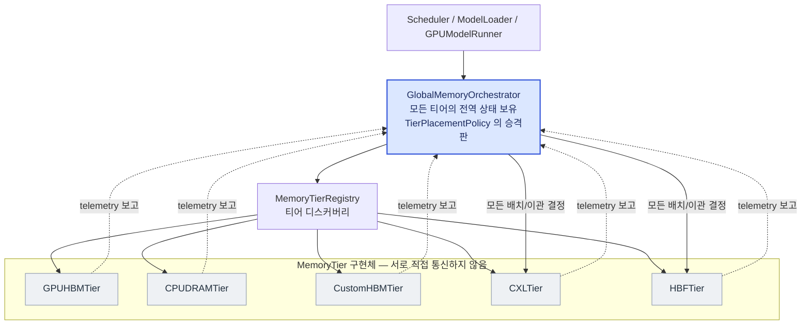
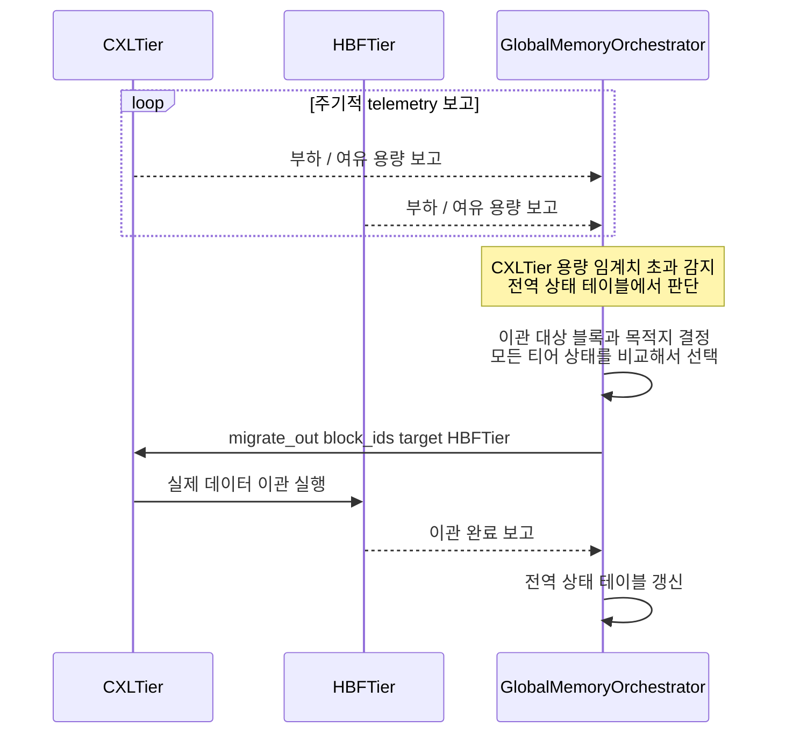
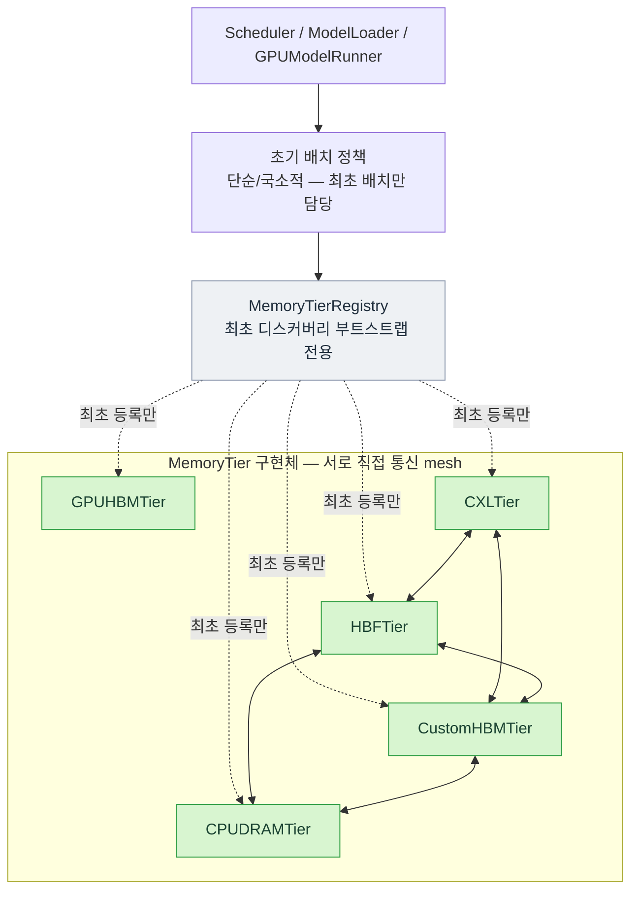
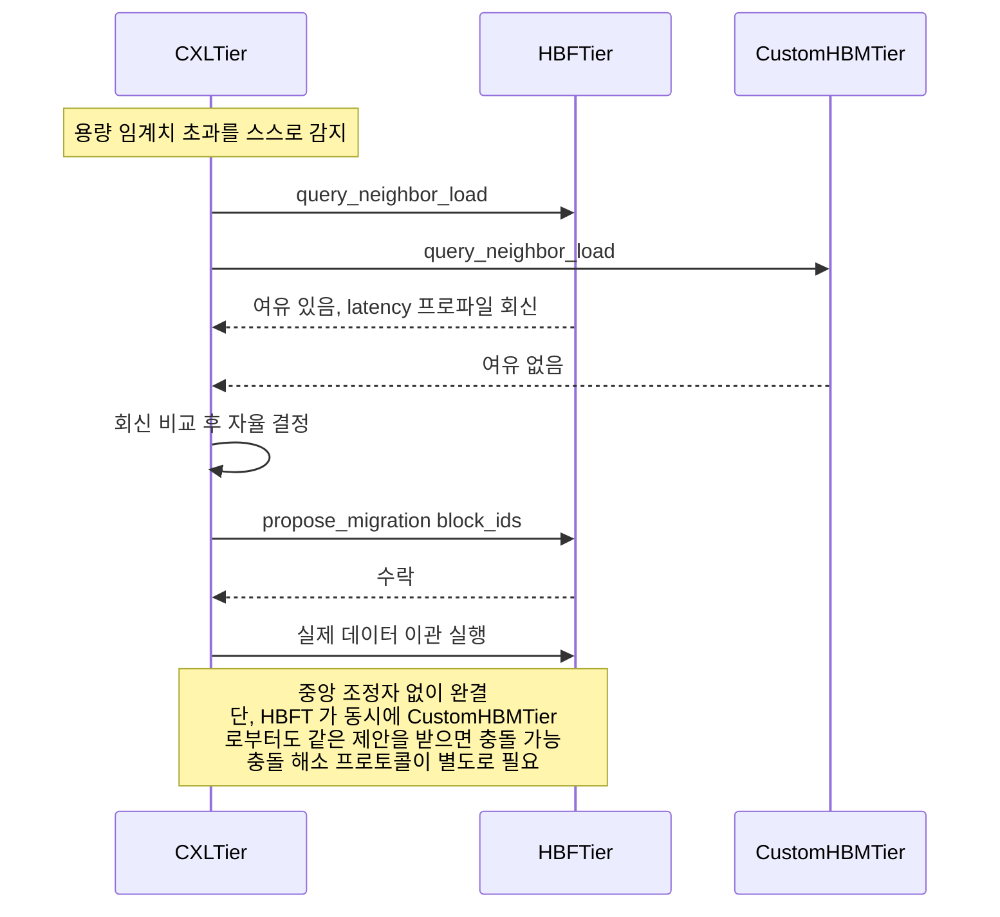

# 메모리 추상화 Layer — 자원 간 상호 인지 통합 관리의 조정 주체(DP-2) 후보 구조

> 선행 문서: `doc-mk/vllm-memory-abstraction-level-candidates.md` (DP-1: 추상화
> 수준 범용 vs 특화)
>
> DP-1 문서 §1.2에서 "자원 간 상호 인지 기반의 통합 관리"는 DP-1(추상화 수준)과는
> 독립적인 축이라고 짚었습니다. 본 문서는 그 축을 별도 설계쟁점(DP-2)으로 정식화하고,
> 두 후보 구조(중앙집중형 오케스트레이션 / 분산 자율 협상)를 설계·비교합니다.

## 0. 설계쟁점 정의

### 0.1 DP-2

> 이기종 메모리 티어 간 상호 인지 기반의 통합 관리를 **누가, 어디서** 수행할
> 것인가?

배경(`vllm-memory-abstraction-level-candidates.md` §0)의 목표를 다시 인용하면:

> 이기종 메모리가 혼재된 시스템에서 개별 자원만 관리하는 게 아니라 **자원 간
> 상호 인지 기반의 통합 관리**가 필요하다

이 문장이 실제로 요구하는 건 "티어 A가 가득 찼을 때, 티어 B의 상태를 고려해서
결정한다"는 능력입니다. 이 능력을 구현하는 방식은 크게 두 갈래로 갈립니다.

- **중앙집중형**: 모든 티어의 상태를 한 곳에 모아서, 그 한 곳이 전역적으로 최적의
  결정을 내림
- **분산 자율형**: 각 티어가 이웃 티어와 직접 정보를 주고받으며, 중앙 없이
  스스로 결정함

### 0.2 DP-1과의 관계

DP-1(추상화 수준: 범용 vs 특화)은 "**인터페이스에 무엇을 노출할지**"의 문제였고,
DP-2는 "**그 인터페이스로 얻은 정보를 누가 종합해서 판단할지**"의 문제입니다.
서로 다른 질문이라 원칙적으로 직교하지만, §4에서 다루듯 실제로는 서로 잘 맞는
조합과 마찰이 있는 조합이 있습니다.

---

## 1. 공통 전제

- `MemoryTierRegistry`/`MemoryTier`(DP-1 문서에서 정의)는 두 후보 모두에서 최소
  "티어 디스커버리"용으로는 유지됩니다 — 차이는 **디스커버리 이후의 조정 로직**이
  어디에 있는가입니다.
- 시나리오: CXL Memory 티어가 용량 임계치를 초과했을 때, 일부 블록을 다른 티어
  (예: HBF)로 이관해야 하는 상황을 두 후보 각각의 sequence diagram으로 그려서
  차이를 비교합니다.
- 평가 기준: ① 전역 최적성, ② 확장성/병목, ③ 장애 격리, ④ 결정 레이턴시,
  ⑤ 구현·운영 복잡도, ⑥ 관측성(디버깅 용이성)

---

## 2. 후보 A — 중앙집중형 오케스트레이션 (Centralized Orchestration)

### 2.1 설계 철학

`TierPlacementPolicy`를 `GlobalMemoryOrchestrator`로 승격시켜, **모든 티어의
상태(부하, 여유 용량, 레이턴시 프로파일)를 주기적으로 수집하는 단일 지점**으로
만듭니다. 티어들은 스스로 판단하지 않고, 오케스트레이터의 지시(`migrate_out`,
`evict`, `allocate`)를 받아 실행만 합니다 — DP-1 후보 1(범용성 강조)의 "티어는
얇고 수동적"이라는 철학과 자연스럽게 이어집니다.

### 2.2 Module View

별(star) 형태 토폴로지입니다 — 티어끼리 연결된 선이 하나도 없고, 모든 화살표가
오케스트레이터를 거칩니다.

### 2.3 Sequence Diagram — CXL 티어 용량 초과 시나리오

### 2.4 장단점

| 항목 | 평가 |
|---|---|
| 전역 최적성 | **높음** — 모든 정보가 한 곳에 모이므로 이론상 최적 결정 가능 |
| 확장성/병목 | **낮음** — 티어 수·요청 빈도가 늘수록 오케스트레이터가 병목이 됨. 특히 KV cache처럼 매 스텝 결정이 필요한 경우 부담 |
| 장애 격리 | **낮음** — 오케스트레이터가 단일 장애점(SPOF) |
| 결정 레이턴시 | **높음** — 모든 결정이 중앙을 왕복해야 함 |
| 구현/운영 복잡도 | **낮음** — 로직이 한 곳에 모여 있어 구현·테스트가 단순 |
| 관측성 | **높음** — "왜 이렇게 결정했는지"가 한 곳의 로그로 설명됨 |

---

## 3. 후보 B — 분산 자율 협상 (Distributed Autonomous Negotiation)

### 3.1 설계 철학

각 `MemoryTier`가 이웃 티어의 상태를 직접 조회/구독할 수 있는 **경량 peer-awareness
인터페이스**(`query_neighbor_load()`, `propose_migration()`)를 추가로 구현합니다.
`MemoryTierRegistry`는 최초 디스커버리(부트스트랩)에만 관여하고, 이후 재배치
결정은 티어들끼리 직접 협상합니다. DP-1 후보 2(하드웨어 특화)의 "티어마다 고유
로직을 가질 수 있다"는 철학과 자연스럽게 이어집니다.

### 3.2 Module View

메시(mesh) 형태 토폴로지입니다 — 티어들이 서로 직접 연결되어 있고, 중앙
(`MemoryTierRegistry`)은 점선(최초 등록 시에만 관여)으로만 연결됩니다.

### 3.3 Sequence Diagram — CXL 티어 용량 초과 시나리오

### 3.4 장단점

| 항목 | 평가 |
|---|---|
| 전역 최적성 | **낮음~중간** — 국소 정보만으로 판단하므로 전역 최적을 보장 못 함, 두 티어가 동시에 서로에게 떠넘기다 진동(thrashing)할 위험 |
| 확장성/병목 | **높음** — 중앙 병목이 없어 티어 수가 늘어도 선형적으로 확장 |
| 장애 격리 | **높음** — 한 티어가 느려지거나 죽어도 나머지는 계속 협상 가능 |
| 결정 레이턴시 | **낮음** — 이웃끼리 바로 협상, 중앙 왕복 없음 |
| 구현/운영 복잡도 | **높음** — 합의/충돌 해소 프로토콜(동시 제안 충돌, 순환 이관 방지 등)을 직접 설계해야 함 |
| 관측성 | **낮음** — 결정이 여러 티어에 분산되어 있어 "왜 이렇게 됐는지" 추적이 어려움 |

---

## 4. 두 후보 비교 및 DP-1과의 상호작용

| 평가 기준 | 후보 A: 중앙집중 | 후보 B: 분산 자율 |
|---|---|---|
| 전역 최적성 | 높음 | 낮음~중간 |
| 확장성/병목 | 낮음 | 높음 |
| 장애 격리 | 낮음 (SPOF) | 높음 |
| 결정 레이턴시 | 높음 | 낮음 |
| 구현/운영 복잡도 | 낮음 | 높음 (합의 프로토콜 필요) |
| 관측성 | 높음 | 낮음 |

### 4.1 DP-1과의 궁합 — "필요조건"이 아니라 "구현 복잡도"의 문제

먼저 분명히 해둘 것이 있습니다: 아래에서 다루는 "궁합"은 **DP-2의 어느
후보가 DP-1의 특정 선택 없이는 성립하지 않는다는 뜻이 아닙니다.**
후보A(`GlobalMemoryOrchestrator`)와 후보B(`query_neighbor_load`/
`propose_migration`)는 둘 다 `MemoryTier.capabilities()`라는 DP-1의 **base
인터페이스만으로 완전히 정의되고 동작**합니다 — §2.3/§3.3의 시나리오 어디에도
DP-1 후보2 전용 확장(`ComputeCapableTier` 등)은 등장하지 않습니다. DP-1이
어느 쪽으로 결정되든, DP-2의 두 후보는 그 자체로 독립적으로 선택 가능합니다.
DP-2는 DP-1의 단점을 보완하기 위해 존재하는 게 아니라, 배경(`vllm-memory-abstraction-level-candidates.md`
§1.2)에서 확인한 **DP-1과는 별개의 품질 속성**(전역 최적성/확장성/장애격리)을
다루는 독립된 축입니다.

아래는 그 위에 얹히는 부수적 관찰입니다 — 조합했을 때 **구현 복잡도가 늘거나
줄어드는 정도**의 문제이지, 어떤 조합은 되고 어떤 조합은 안 된다는 이야기가
아닙니다.

- **후보 A(중앙집중) + DP-1 후보 1(범용성)**: 구현이 가장 단순해지는
  조합입니다. 오케스트레이터가 모든 티어를 하나의 관점에서 봐야 하므로,
  티어 인터페이스가 범용적일수록 오케스트레이터 구현도 단순해집니다.
- **후보 A(중앙집중) + DP-1 후보 2(특화)**: 이 조합도 문제없이 동작합니다
  — 다만 오케스트레이터가 확장 정보까지 활용해서 더 정교한 결정을 내리려면
  모든 특화 인터페이스를 알아야 하므로, "다양한 하드웨어를 한 곳이 다
  이해해야 하는 비용"이 조정 로직 레이어로 옮겨와 다시 나타날 뿐입니다.
- **후보 B(분산 자율) + DP-1 후보 2(특화)**: 각 티어가 자기 하드웨어 고유
  정보(예: CXL의 pooling 정보)를 협상에 직접 반영할 수 있어, DP-1 후보2의
  이점을 재배치 로직까지 확장하는 조합입니다.
- **후보 B(분산 자율) + DP-1 후보 1(범용)**: 이 조합도 문제없이 동작합니다
  — 다만 협상에 쓸 수 있는 정보가 범용 필드로 제한되어, 분산 협상 특유의
  이점(하드웨어별 국소 판단)을 충분히 살리지 못할 뿐입니다.

정리하면 **"후보A + 후보1", "후보B + 후보2"는 구현이 가장 매끄러운
조합**이고, 반대 조합은 **여전히 유효하게 동작하지만 복잡도나 이점 활용도
면에서 덜 효율적인 조합**입니다 — 이는 두 설계쟁점이 서로의 결과를 전제하지
않고 각자 독립적으로 결정 가능하다는 사실과 완전히 양립합니다.

### 4.2 절충안 — 계층형(Hierarchical) 구조

전부 아니면 전무가 아니라, **초기 배치는 중앙에서, 사후 재조정(migration)은
분산으로** 나누는 절충도 가능합니다 — 신규 데이터가 처음 어느 티어로 갈지는
`TierPlacementPolicy`가 결정하되(후보 A의 예측가능성/관측성 유지), 이미 배치된
데이터를 부하에 따라 재조정하는 건 티어들끼리 국소적으로 처리(후보 B의 확장성
확보)하는 방식입니다. KV cache처럼 매 스텝 빈번한 신규 할당엔 후보 A의 결정
레이턴시 부담이 크므로, 실무적으로는 이 절충안이 출발점으로 더 현실적일 수
있습니다.

---

## 5. 관련 문서

- `doc-mk/vllm-memory-abstraction-level-candidates.md` — DP-1: 추상화 수준
  (범용 vs 특화), 본 문서 DP-2의 출발점
- `doc-mk/vllm-kv-cache-memory-abstraction-layer.md` — MAL 기본 설계
- `doc-mk/vllm-kv-cache-analysis.md` — 현재 KV cache 구조 (지금 vLLM은 사실상
  후보 A에 가까운 형태 — `KVCacheManager`/`BlockPool`이 단일 GPU HBM 안에서
  중앙집중적으로 블록을 관리)
